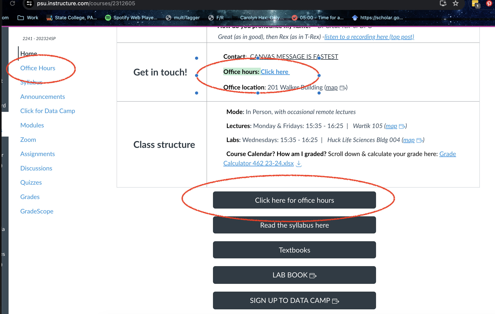

# (PART\*) [.]{style="color: white;"} {.unnumbered}
# (PART\*) **LAB INSTRUCTIONS** {.unnumbered}


```{=html}
<style>
details > *:not(summary){
  margin-left: 10em;
}
</style>
```

# HELP! {#Help .unnumbered}

<br>

If you are stuck, you have a few options:

1.  If your report won't knit, first try the suggestions below in [My Report won't knit!](#Help-Noknit)<br>

2.  You can submit your issue, with screenshots and an explanation of the problem on the course help forum: <https://github.com/psu-spatial/Stat462-2024/issues>\
    <br>

3.  You can attend office hours (after lab Wednesday, after class Friday, Tuesday on zoom) - more details on Canvas:

    {width="800"}

<br>

4.  If you are really stuck you can canvas message me, but I ezpect to see at least one of the github/office hour options tried first.

------------------------------------------------------------------------

<br><br>

## Github help portal {#Help-Github .unnumbered}

You can submit issues, with screenshots and an explanation of the problem on the course help forum: <https://github.com/psu-spatial/Stat462-2024/issues>\

------------------------------------------------------------------------

<br><br>

## My report won't knit! {#Help-Noknit .unnumbered}

<details>

<summary>[Click here for the answer]{style="color: #1388aa;"}</summary>

Don't panic! This is common. It normally means that you either have an issue with your code or your computer has run out of memory (especially using R-Studio Cloud).

Try these steps to diagnose the issue. Dr G can also help.

1.  Go to the Session menu at the VERY TOP of the screen. Click `Restart-R and clear all output`.
2.  Now go to the environment quadrant and click the little arrow by the pie-chart. Free unused R memory.
3.  Now go back to the Session menu. Click `Restart-R and run all code chunks`
4.  Carefully watch as your code runs. Does it reach the end without any errors or stopping?

<br>

<details id="error">

<summary>[IF YOUR CODE STOPS (There was an error), click here]{style="color: #1388aa;"}</summary>

5.  Read the error message really closely (try reading it out loud) and scroll to the code chunk it's referring to. See if you can fix the issue, starting with the first line that had an error.<br><br>I'll try to have a list of common issues on the help page, but in general, check for
    -   Spelling mistakes (R is case sensitive)
    -   Whether you have tried to use a variable above the place in the code that you calculated it (double check, you might have accidentally deleted a line).
    -   If you are running your project, or it won't be able to find your data/image files.

<br>

<details id="error_change">

<summary>. [If you made a change/fix in your code, click here]{style="color: #1388aa;"}</summary>

6.  Go to the Session menu at the VERY TOP of the screen. Click `Restart-R and run all code chunks`. See if you get to the end.

7.  Keep going, fixing errors as you go, until it all knits. If you still have issues, look at the next section.

<br>

</details>

<br>

<details id="error_nofix">

<summary>. [If you can't find the issue or it still won't knit, click here]{style="color: #1388aa;"}</summary>

6.  Read the error message carefully. See if you can find the problem code chunk(s).
7.  In the top part of any problem code chunks, type eval=FALSE (see screenshot below), then try pressing knit. You might find that you have to stop quite a few code chunks running. This will allow me to see your code and grade what you have.


<br>

</details>

<br><br>

</details>

<br>

<details id="no_error">

<summary>[IF THERE WAS NO ERROR (All the code chunks run with no problems), click here]{style="color: #1388aa;"}</summary>

5.  Make sure you are running your project. Go to the FILES tab. Delete all files EXCEPT your .RProj, your .Rmd, your data and any image files. Basically delete all the auto-created files.
6.  Try pressing knit again.
7.  If it still doesn't work, read the error message carefully and see if it make sense.
8.  If you still have no luck, take a screenshot of the entire screen (including the error message), then ask Dr G for help.

<br><br>

</details>

\
<br><br>

</details>

------------------------------------------------------------------------
