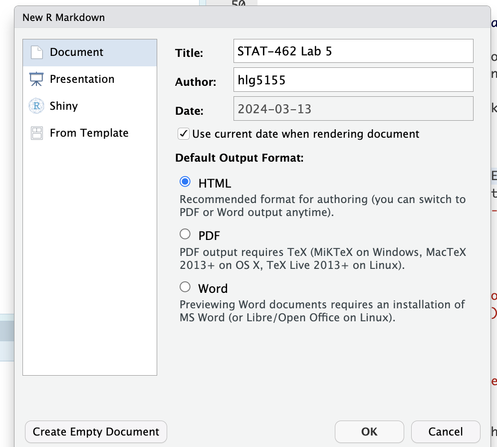
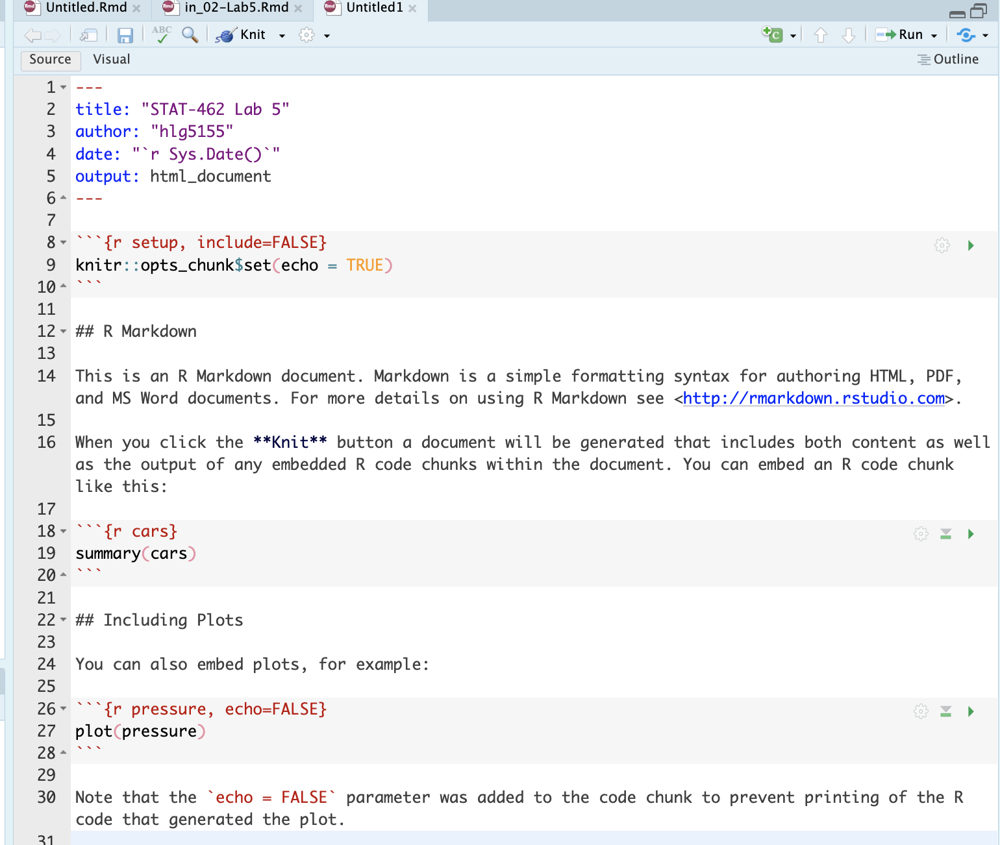

# Lab 5A {#Lab_5 .unnumbered}

## Aim {.unnumbered}

Welcome to lab 5. This is worth 4% (40 points), alongside 60 for Lab 5B next week (you can drop them together or neither)

By the end of this lab, you will be able to:

1.  Look in more detail at YAML themes.
2.  Understand & use regression diagnostics to assess LINE

This is a ONE WEEK LAB. You need to finish writing up by next Tuesday (23:59pm) e.g. just before Lab 5B starts.

<br>

### Need help?

REMEMBER THAT EVERY TIME YOU RE-OPEN R-STUDIO YOU NEED TO RE-RUN **ALL** YOUR CODE CHUNKS. The easiest way to do this is to press the "Run All" button (see the Run menu at the top right of your script)

**Code won't knit? Struggling? Have a question? See the help page here: [Help!](#Help)**

The maximum time this lab should take is about 4-5 hrs of your time.

<br>

------------------------------------------------------------------------

## 1. Set up (DON'T SKIP) {.unnumbered}

<br>

### **[Step 1.1] Create a project for Lab 5** {.unnumbered}

\*\* YOU WILL BE CONTINUING IN THE SAME PROJECT NEXT WEEK \*\*

-   If you are using the POSIT Cloud (AKA R-Studio online), log-in and make a new project using [Tutorial 1B](#T1_ProjectsCloud)

-   If you are using R-Studio on your own computer/laptop, log in and make a new project using [T1_ProjectsDesktop](#T1_ProjectsCloud). To open/re-open your project, look in the STAT462/Lab5 folder on your computer and double click the .RProj file (I often rename it something like OPENTHIS.RProj)

<br><br>

### **[Step 1.2] Create a markdown & edit YAML** {.unnumbered}

This week you will be creating your own reports from scratch rather than using a custom template. This gives you a load more options.

-   Go to the File menu and click New File/R-Markdown (same as before)

<br>

-   But this time, DON'T GO TO THE TEMPLATE MENU. Simply add the title and your name, then press OK.

    {width="70%"}

-   This will create a document that looks like this. Just so you can see the subheading structure, change line 12 so it reads `# R Markdown` (e.g. remove one of the hashtags)

    {width="70%"}

-   Press knit, then save as your Lab 5 report. You must save your lab report as STAT-462_Lab5_EMAILID.Rmd\*\* (e.g.STAT-462_Lab5_hlg5155.Rmd). You might need to press knit twice.

-   When it knits, you should see a html document explaining about the cars dataset (we'll remove this text in a bit). If you changed line 12, you can see that [*R-Markdown*]{.underline} comes up as a Header-1 (a chapter title), whereas [*Including Plots*]{.underline} appears as a header-2 (sub-heading title).

<br>

-   Now we are going to edit the options available in the YAML code at the top to create our own themes/tables of contents etc. **But BE CAREFUL -This is much easier to do in source mode and it's space sensitive and case sensitive.**

-   *Very carefully*, delete line 5: `output: html_document` then add in EXACTLY this text (e.g. copy/paste and make sure you use the same spacing)

```         
---
output:
  html_document:
    toc: true
    toc_depth: 4
    toc_float: 
      collapsed: false
    theme: default
---
```

-   Press knit again and see what changes. I have added in some options about a table of contents.

    <br>

-   Edit your YAML code to change the theme to any one of these (your choice) and press knit again. <https://rstudio4edu.github.io/rstudio4edu-book/rmd-themes.html>

    <br>

-   I also want you edit your YAML code to turn on section numbering, using this tutorial - <https://bookdown.org/yihui/rmarkdown/html-document.html> or type\
    `?html_document` into the console. Press knit and make sure it all works. You're welcome to add other options that interest you.\
    \

<br><br>

### **[Step 1.3] Document options & libraries** {.unnumbered}

-   Now, let's edit the first code chunk below the YAML code, which allows us to set the visualization options for your report. At the moment, it says

```         
knitr::opts_chunk$set(echo = TRUE)
```

-   Add in warning=FALSE and message=FALSE to suppress errors. Hint, Lab 4 and [Tutorial3,Markdown options](#T3_CodeChunkWholeDoc).

-   Finally, as you can see, the basic R-Markdown document includes a load of 'friendly welcome text' explaining what a markdown document is. We don't need this. So delete EVERYTHING below your first code chunk.

-   Create a header-1 chapter called "Set-Up".

    -   E.g. in the text, write the word Set-Up, then using visual mode, change it to 'header 1' (or in source mode, write `# Set-Up)`

<br>

-   Add a new code chunk and use this code to load the following libraries. If some don't exist on your computer or on the cloud, use [Tutorial 2](#T2_Libraries) to install/download them first from the app-store.<br>


```r
library("tidyverse") # Lots of data processing commands
library("knitr")     # Helps make good output files
library("ggplot2")   # Output plots
library("hrbrthemes") # ggplot options
library("rmarkdown") # Helps make good output files
library("lattice")   # Makes nice plots
library("RColorBrewer") # Makes nice color-scales
library("skimr")     # Summary statistics
library("Stat2Data") # Regression specific commands
library("corrplot")  # correlation plots
library("GGally")    # correlation plots
library("ggpubr")    # QQplots
library("olsrr")     # Regression specific commands
library("plotly")    # Interactive plots
library("readxl")    # Read from excel files
```

-   To make sure they loaded OK, run the code chunk TWICE. The second time any welcome text will disappear unless there are errors.

<br><br>

### **[Step 1.4] Check Progress** {.unnumbered}

-   OK - so by now, you should be in your project, you have created your lab report, the YAML code works and your libraries work. Press knit and check it all works. If not, STOP, go back and redo the tutorials or talk to Dr G.

<br><br>

------------------------------------------------------------------------

## 2. Challenge - Regression diagnostics {.unnumbered}

### **[Step 2.1] LINE** {.unnumbered}

-   Create a level 1 heading called LINE assumptions. From your notes and the online textbook (<https://online.stat.psu.edu/stat501/lesson/4/4.1>), explain in your report what the LINE assumptions are for linear regression.

<br><br>

### **[Step 2.2] Create Datasets** {.unnumbered}

-   Go to <https://stephenturner.github.io/drawmydata/>. You are going to create and save 3 datasets into your Lab 5 folder. Each should have *at minimum* 30 points.

    -   A dataset that meets all the assumptions of simple linear regression
    -   A dataset that breaks the assumption of linearity
    -   A dataset that breaks the assumption of equal variance/heteroskadisity

<br>

-   I strongly suggest opening the datasets in Excel first adding a new row at the top and adding in column names ([Tutorial here](https://support.microsoft.com/en-us/office/insert-or-delete-rows-and-columns-6f40e6e4-85af-45e0-b39d-65dd504a3246)). I also suggest naming your files sensible things so you don't go insane.

<br>

-   Read the three files into R and assign to sensible variable names.

<br>

### **[Step 2.3] Examine scatterplots** {.unnumbered}

-   Create a professional scatterplot of each of your three datasets. I suggest using this code for convenience - <https://psu-spatial.github.io/Stat462-2024/T6_plots.html#T6_PlotGGPlot>

<br>

-   Below each one, explain why you think it does/doesn't meet the linearity and equal variance LINE assumptions. See here for example wording - <https://online.stat.psu.edu/stat501/lesson/4/4.7>

<br><br>

### **[Step 2.4] Create a regression model** {.unnumbered}

-   For each dataset, create a linear regression model, making sure that your response (y-axis) and predictor are the correct way around [Tutorial here]<https://psu-spatial.github.io/Stat462-2024/T8_regression.html>). You do not need to write out the equation, but check against your scatterplot to make sure it all makes sense.

<br><br>

### **[Step 2.5] Residual vs fits** {.unnumbered}

As you will see in future labs, it's sometimes not very easy to see things like linearity and heteroscadisity by eye. Looking at plots of the residuals can help with this. This type of plot is also useful in identifying outliers, something we will do in Lab 6.

-   Create a sub-heading called regression diagnostics.

-   Create a sub-sub-heading called residuals vs fits (e.g. header 3)

-   Read <https://online.stat.psu.edu/stat501/lesson/4/4.2> and <https://online.stat.psu.edu/stat501/lesson/4/4.4>.

-   Then read through Tutorial 10 (menu on left), up to the end of equal variance to make standardised "Residual vs Fits" plots of your three datasets.

-   Underneath your plots and referring to the textbook reading, write at least 150 words (total) explaining in your own words

    -   What a residual vs fits plot is,
    -   Why it's useful compared to just looking at the scatterplot.\
    -   Referring to your plots to explain how each of your three datasets does/doesn't meet the LINE assumptions of linearity and equal variance.

-   For each of your three models, conduct a F-test for heteroscadisity (see tutorial 10). In the text, explain in general what your H0 and H1 are, and interpret the results of the three tests (e.g. what's the test statistic, what's the p-value, and does it suggest equal variances or not)

<br><br>

### **[Step 2.6] Residual normal analysis** {.unnumbered}

We also need to assess whether your residuals are normally distributed. For this, we have another set of diagnostic tools.

-   Create a sub-sub heading called Residual Normality

-   Read <https://online.stat.psu.edu/stat501/lesson/4/4.6> and tutorial 10 (<https://psu-spatial.github.io/Stat462-2024/T10_diagnostics.html>) continued

-   Use tutorial 10 to create residual histograms and residual QQ plots for each of your three datasets.

-   Underneath your plots and referring to the textbook reading, write at least 100 words (total) explaining in your own words

-   What the residual histograms and residual QQplots are showing you,

-   Why it's useful compared to just looking at the scatterplot.\

-   Referring to your plots to explain how each of your three datasets does/doesn't meet the LINE assumptions of normality.

-   For each of your three models, run the ols_test_normality() command to do all the normality datasets. What do they suggest? Hint - see here for the interpretation. <https://www.statology.org/shapiro-wilk-test-r/>. and <https://www.ncbi.nlm.nih.gov/pmc/articles/PMC3693611/>

-   Use google and the resources provided to explain the difference between the tests that your code outputs.

<br><br>

## 3. Submitting your Lab {.unnumbered}

Remember to save your work throughout and to spell check your writing (next to the save button). Now, press the knit button again. If you have not made any mistakes in the code then R should create a html file in your lab 4 folder which includes your answers.

**For R desktop users:**

-   If you look at your lab 5 folder ON YOUR COMPUTER, you should see your html and Rm there - complete with a very recent time-stamp.

-   In that folder, double click on the html file. This will open it in your web-browser.\
    CHECK THAT THIS IS WHAT YOU WANT TO SUBMIT.

-   Now go to Canvas and submit BOTH your html and your .Rmd file in Lab 5.

<br>

**If you are on posit cloud,**

-   go to the files tab, then click the check box by your html file. Click the "more" blue cogwheel in the file quadrant menu options, then click export. This will download the file

-   Uncheck the box and check the box by your .Rmd file. Click the "more" blue cogwheel in the file quadrant menu options, then click export. This will download the file.

-   Now go to Canvas and submit BOTH your html and your .Rmd file in Lab 5.

Congrats! You are done.
