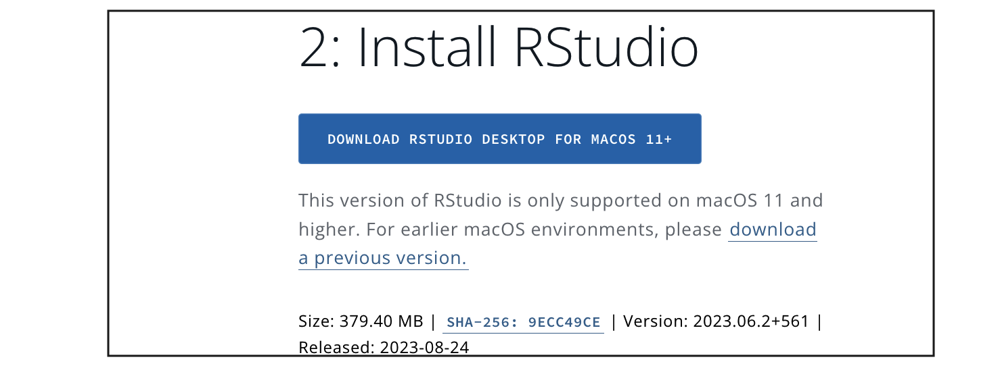
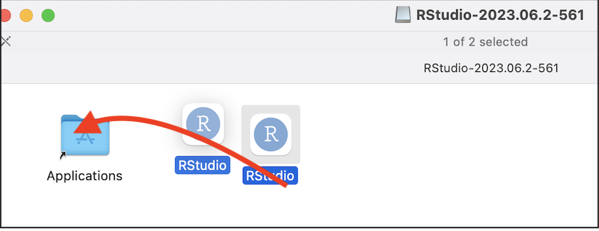

# (PART\*) **Set-Up** {.unnumbered}

# Click for R-Desktop {#Setup_1}

## Installing/Updating R and R-Studio

### Video instructions

Here's a video where I install R/R-Studio on my mac.  It should take less than 8 minutes to follow along & there are subtitles.

<iframe id="kaltura_player" src="https://cdnapisec.kaltura.com/p/2356971/sp/235697100/embedIframeJs/uiconf_id/41416911/partner_id/2356971?iframeembed=true&playerId=kaltura_player&entry_id=1_009n7kh8&flashvars[streamerType]=auto&amp;flashvars[localizationCode]=en&amp;flashvars[sideBarContainer.plugin]=true&amp;flashvars[sideBarContainer.position]=left&amp;flashvars[sideBarContainer.clickToClose]=true&amp;flashvars[chapters.plugin]=true&amp;flashvars[chapters.layout]=vertical&amp;flashvars[chapters.thumbnailRotator]=false&amp;flashvars[streamSelector.plugin]=true&amp;flashvars[EmbedPlayer.SpinnerTarget]=videoHolder&amp;flashvars[dualScreen.plugin]=true&amp;flashvars[hotspots.plugin]=1&amp;flashvars[Kaltura.addCrossoriginToIframe]=true&amp;&wid=1_i392r73r" width="640" height="640" allowfullscreen webkitallowfullscreen mozAllowFullScreen allow="autoplay *; fullscreen *; encrypted-media *" sandbox="allow-downloads allow-forms allow-same-origin allow-scripts allow-top-navigation allow-pointer-lock allow-popups allow-modals allow-orientation-lock allow-popups-to-escape-sandbox allow-presentation allow-top-navigation-by-user-activation" frameborder="0" title="R-Tutorials Video 1. Installing R and R studio on a mac" style="position:absolute;top:0;left:0;width:100%;height:100%;border:0"></iframe>

 

### Written Instructions

If you're not a video sort of person, then here are some instructions:

Here need to do two things.  

-   First, teach the computer to 'speak R'.

-   Secondly download the RStudio software.  

 

#### 1. Installing R.

First, we teach the computer to 'speak R'.

Go here: <https://posit.co/download/rstudio-desktop/>. Click the Install R button  

(\#fig:Tut_Fig3)Click here!

  

Click the link and you will go to a terrifying website called CRAN R.

(\#fig:Tut_Fig4)*Choose your computer type*

  

#### If you are on a WINDOWS/PC computer

(\#fig:Tut_Fig4a)*Choose your computer type*

Click the "install for the first time" link and follow through to install R - EVEN IF YOU ALREADY HAVE R AND R STUDIO INSTALLED.   

Say yes to all the default options. Harman is an R Windows user if you need help.   **Now, move to part 4 to install R studio.**

   

#### If you are on a MAC/AppleMac

If you are a MAC user, you will need [EITHER]{.underline} one of these two files. If your computer is new, try the top one, if it's older try the second - the wrong one simply won't work.

(\#fig:Tut_Fig4b)*Choose your computer type*

1.  Click the filename to download   
2.  MOVE THE DOWNLOAD OUTSIDE YOUR DOWNLOAD FOLDER (they have a weird bug.) Put it on your desktop   
3.  Open the download and follow the instructions.   
4.  **Now, move to part 4 to install R studio.**

   

### 2. Installing R studio

Go back here: <https://posit.co/download/rstudio-desktop/>. Click the Install R-Studio button

   

**If you are on a WINDOWS computer**, install the same way you install any new software

   

If you are on a MAC:

-   Download the dmg file, click to open, then DRAG it over to applications.

-   If it asks to overwrite, say yes.

-   It might get angry at this stage if your mac is very out of date.

(\#fig:Tut_Fig5b)*Will look different for windows*

