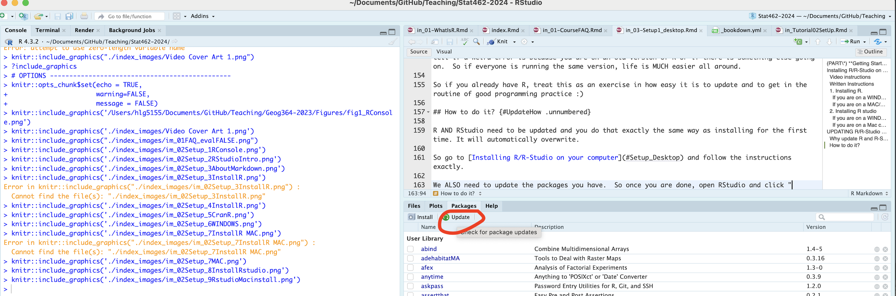

# UPDATING R/R-Studio {#Setup_UpdateDesktop .unnumbered}

## Exceptions {#Setup_UpdateExceptions .unnumbered}

You do not *have* to update in the following situations, but know that any weird issues might be because of the version of R you are running.

1. If you are working in a lab and need a specific version of R, you do not have to update.

2. If you KNOW your computer is going to hate this, then as long as you installed after June 2023, you don't *have* to update, but give it a go if you can.

## Why update R and R-Studio? I took a course using them last semester {#Setup_WhyUpdate .unnumbered}

When R updates, it can sometimes cause weird issues with an individual package (or vica versa if the package is updated but you are running on an old version of R). This is more likely this semester because in November 2023, R went through a huge update that had been planned for years.

It's good programming practice to use the most recent version but normally, people tend to update when they can but take their chances. In our case, I don't have a TA and there are 50 of you. So if half of you are on an old version of R and half are on a new version, it's really hard for me to tell if a weird error is because you are on an old version of R or if there is something else going on. So if everyone is running the same version, life is MUCH easier all around.

So if you already have R, treat this as an exercise in how easy it is to update and to get in the routine of good programming practice.

And because if you get stuck and you're using an old version of R or R-Studio, I'm not going to help you debug until you update, so you may as well...

 

------------------------------------------------------------------------

## How to update? {#Setup_UpdateHow .unnumbered}

R AND RStudio need to be updated and you do that exactly the same way as installing for the first time. It will automatically overwrite.

So go to [Installing R/R-Studio on your computer](#Setup_Desktop) and follow the instructions exactly.

### Then update your packages.

We ALSO need to update the packages you have. So once you are done, make sure you are connected to the internet, then open RStudio and click "Update/Update all". Go for a coffee.

R might also need to reinstall some packages, so don't panic if you see the little yellow "install banner", just click yes.

(\#fig:Setup_Fig7)*Click this to update the packages*

