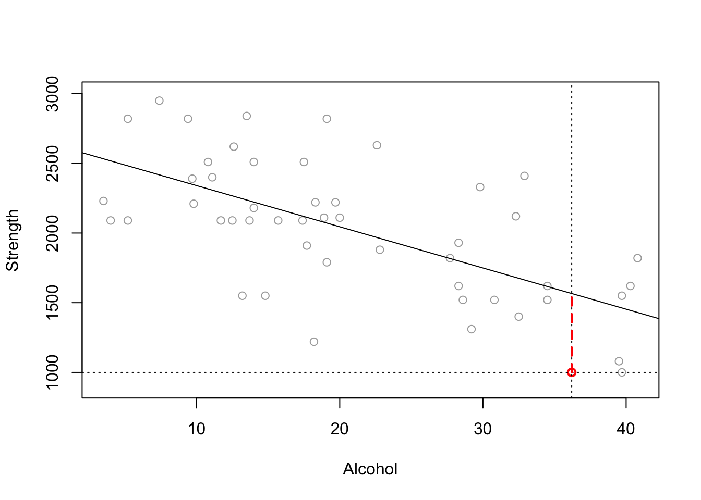
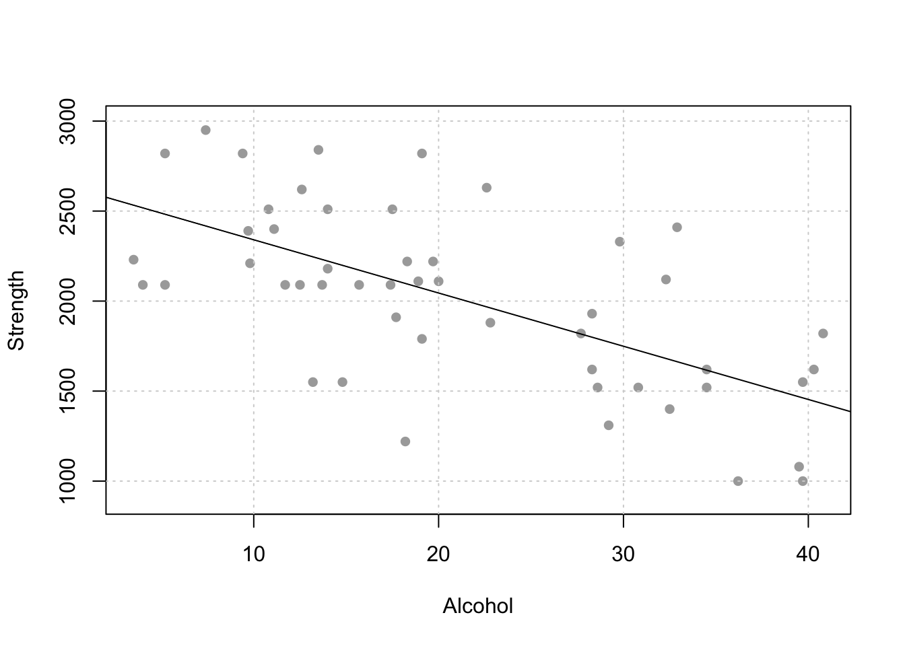
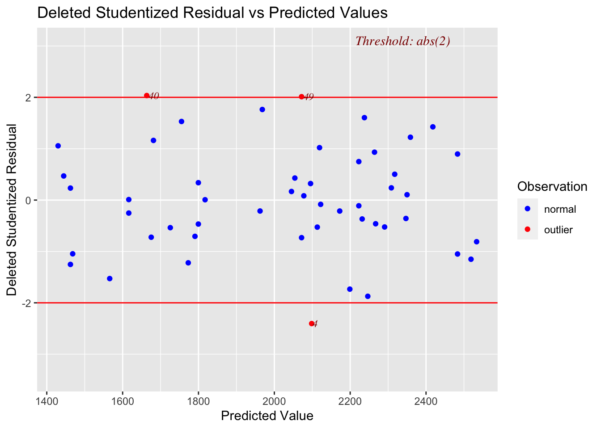
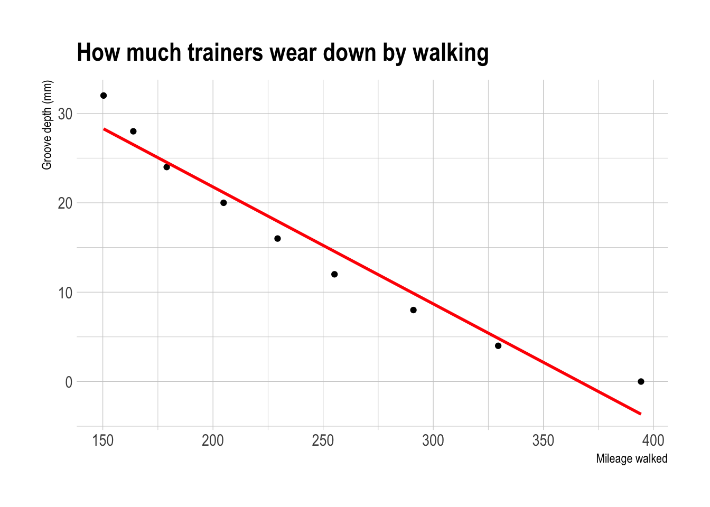

# Assessing LINE {#T10_diagnostics}

We know from the lectures that there are multiple assumptions underpinning whether a regression is a good model or not - especially LINE assumptions (as described in [Online STAT-462 - Lesson 4](https://online.stat.psu.edu/stat501/lesson/4/)). Regression diagnostics are a set of tools we can use to assess these assumptions. All the example datasets are from the online textbook and can be downloaded there.

<br><br>

## What are residuals? {#T10_residuals}

It can be difficult looking at the raw data to assess whether many of the assumptions are true or not. So in this case we can look at residual plots.

{width="800"}

{width="500"}

Still confused? See

-   <https://www.khanacademy.org/math/ap-statistics/bivariate-data-ap/xfb5d8e68:residuals/v/regression-residual-intro>)

-   or <https://www.displayr.com/learn-what-are-residuals/>

<br><br>

### Printing out residuals

We can extract these from the model.

Imagine you are interested in determining whether or not alcohol consumption was linearly related to muscle strength. You measured the total lifetime consumption of alcohol (x) on a random sample of n = 50 alcoholic men. They also measured the strength (y) of the deltoid muscle in each person's left arm, then created a linear model to forecast strength.

The predicted value is the y-value at the line for each point, strength is the actual measured strength and residual is the difference between the two.


```r
alcoholdata <- read.csv("alcoholstrength.csv")
mymodel <- lm(strength~alcohol,data=alcoholdata)

# now add in the predicted and residual values
alcoholdata$strength_predicted <- mymodel$fitted.values
alcoholdata$residuals          <- mymodel$residuals
head(alcoholdata)
```

```
##   alcohol strength strength_predicted residuals
## 1    36.2     1000           1565.911 -565.9109
## 2    39.7     1000           1462.357 -462.3570
## 3    39.5     1080           1468.274 -388.2744
## 4    18.2     1220           2098.474 -878.4739
## 5    29.2     1310           1773.019 -463.0187
## 6    32.5     1400           1675.382 -275.3822
```

See if you can match the point in red to the first value above and understand the numbers.


```r
# and make a quick plot
plot(alcoholdata$strength ~ alcoholdata$alcohol,xlab="Alcohol",ylab="Strength",col="dark grey",ylim=c(900,3000))
# plot the first point in red
lines(alcoholdata$strength[1] ~ alcoholdata$alcohol[1],col="red",type="p",lwd=2)
# add the line of best fit
abline(mymodel)

abline(h=alcoholdata$strength[1],lty="dotted")
abline(v=alcoholdata$alcohol[1],lty="dotted")
lines(c(alcoholdata$alcohol[1],alcoholdata$alcohol[1]),
      c(alcoholdata$strength[1],alcoholdata$strength_predicted[1]),
      lty="dashed",col="red",lwd=2)
```



<br><br>

## Checking linearity {#T10.Linearity}

**THE AIM HERE IS TO SEE IF A CURVE (or pattern) WOULD FIT THE DATA BETTER THAN A LINE. JUST RANDOM POINTS IS OK, A CURVE/DINOSAUR IS BAD.**


<br>

The goal of data-science is often to find the 'best' model that fits your data AKA the one with the smallest residuals. If your underlying dataset is not linear, then we probably want to choose a different model than linear data.

However, in real life, it can often be difficult to assess whether the fit is linear by looking at the scatterplot alone. For example, using another dataset from the textbook, your mind might think this is linear.


```r
treadwear <- read.csv("treadwear.csv")

# make a linear model
tread_model <- lm(mileage~groove,data=treadwear)

# and make a plot, using ggplot this time
ggplot(treadwear, aes(x=groove, y=mileage)) + 
    geom_point() + 
    ggtitle("How much trainers wear down by walking") +
    xlab("Mileage walked") + ylab("Groove depth (mm)")+
    geom_smooth(method=lm , color="red", se=FALSE) +
    theme_ipsum()
```

<div class="figure">

<p class="caption">(\#fig:unnamed-chunk-3)This looks relatively linear, but....</p>
</div>

<br><br>

### Residual vs fits plot for linearity

Instead, we plot at the *residuals* vs the fitted values, which often show a pattern much more clearly. If you're not sure what I mean by these words, go back and read from "what are residuals"


```r
# using the olsrr package
ols_plot_resid_fit(tread_model)
```

<div class="figure">

<p class="caption">(\#fig:unnamed-chunk-4)A parabola would clearly fit the data better than a straight line</p>
</div>

Let's compare this residual plot to the strength/alcohol example from the section above (I include all the code for completeness). You can see in the treadwear data, the residuals depart from 0 in a very systematic manner. They are clearly positive for small x values, negative for medium x values, and positive again for large x values. Clearly, a non-linear model would better describe the relationship between the two variables. In future classes we will touch upon polynomial models that you might use to deal with this.


```r
par(mfrow = c(2, 2))

ggplot(alcoholdata, aes(x=alcohol, y=strength)) + 
    geom_point() + 
    xlab("Alcohol consumed") + ylab("Strength")+
    geom_smooth(method=lm , color="red", se=FALSE) +
    theme_ipsum()
```



```r
alcohol_model <- lm(strength~alcohol,data=alcoholdata)
ols_plot_resid_fit(alcohol_model)
```


```r
ggplot(treadwear, aes(x=groove, y=mileage)) + 
    geom_point() + 
    xlab("Mileage walked") + ylab("Groove depth (mm)")+
    geom_smooth(method=lm , color="red", se=FALSE) +
    theme_ipsum()
```


```r
tread_model <- lm(mileage~groove,data=treadwear)
ols_plot_resid_fit(tread_model)
```


\*\*IF IT'S LINEAR, WE SHOULD SEE A GENERAL CLOUD OF POINTS WITH NO CLEAR PATTERN. IF IT'S NOT LINEAR, YOU MIGHT SEE A CURVE OR A PATTERN (or a dinosaur..)

<br><br>

## Checking Equal Variance/homoscadisity {#T10.Variance}

**Look at the cloud of points - they should stay roughly the same distance away either side of your line**


<br>

### Residual vs fits plots for equal variance checks

This can also be hard to see in the raw scatterplot, so again we use the residual vs fits plot. Look for the dots "fanning out" or bow-tie shapes vs a random cloud.

Heres how some data appears in the raw scatterplot and the residual fits plot.


```r
alphapluto <- read.table("alphapluto.txt",sep="\t",header=TRUE)

# make a linear model
alpha_model <- lm(alpha~pluto,data=alphapluto)

# and make a plot, using ggplot this time
ggplot(alphapluto, aes(x=pluto, y=alpha)) + 
    geom_point() + 
    xlab("alpha") + ylab("pluto")+
    geom_smooth(method=lm , color="red", se=FALSE) 
```

<div class="figure">

<p class="caption">(\#fig:unnamed-chunk-6)This data breaks equal variance</p>
</div>


```r
ols_plot_resid_fit(alpha_model)
```


You can clearly see here that for low values of the fitted data, there is not much variance - but there is a lot of variance as the data expands.

### Statistical Tests for non-equal variance

You can also run statistical tests, explained in more detail here: <https://rpubs.com/tskam/Session06>


```r
# F test - assumes residuals are  independent and identically distributed (i.i.d.)
ols_test_f(alpha_model)
```

```
## 
##  F Test for Heteroskedasticity
##  -----------------------------
##  Ho: Variance is homogenous
##  Ha: Variance is not homogenous
## 
##  Variables: fitted values of alpha 
## 
##         Test Summary         
##  ----------------------------
##  Num DF     =    1 
##  Den DF     =    21 
##  F          =    16.37716 
##  Prob > F   =    0.0005808712
```

In this case, we can see that perhaps we need to worry less about unequal variance,

There is also another test available, the Breusch Pagan Test - but this relies on the residuals being normally distributed.

<br><br>

## Checking Normality {#T10.Normality}

**Again, we are testing whether the RESIDUALS are normal around the regression line**


To get the best estimates of parameters such as B0 and B1, the residuals must be normally distributed around the regression line. However, this has a much smaller effect typically than non-linearity or breaking assumptions of independence.

Breaking normality is only important in the calculation of p values for significance testing and confidence intervals, but this is only a problem when the sample size is small. When the sample size is larger (\>200), the Central Limit Theorem ensures that the distribution of residuals will approximate normality when calculating parameters.

So never throw away your data if it breaks normality. But it's good to take a look.

First, read this to see how the different tests look:  https://online.stat.psu.edu/stat501/lesson/4/4.6 

Let's go back to our original test data:


```r
mymodel <- lm(strength~alcohol,data=alcoholdata)
plot(alcoholdata$alcohol,alcoholdata$strength,xlab="Alcohol",ylab="Strength",pch=16)
abline(mymodel)
```


To test normality, we can use OLSRR to:


```r
#Create a QQ plot of the residuals
ols_plot_resid_qq(mymodel)
```


```r
#Create a histogram of the residuals
ols_plot_resid_hist(mymodel)
```


```r
#Run a Wilks-Shapiro test for normality
ols_test_normality(mymodel)
```

```
## -----------------------------------------------
##        Test             Statistic       pvalue  
## -----------------------------------------------
## Shapiro-Wilk              0.9877         0.8767 
## Kolmogorov-Smirnov        0.0502         0.9990 
## Cramer-von Mises          4.1667         0.0000 
## Anderson-Darling          0.1699         0.9289 
## -----------------------------------------------
```

In this case, our residuals look very normal.

There are several tests available, look at papers such as these to understand why and which is best - https://www.ncbi.nlm.nih.gov/pmc/articles/PMC3693611/ 

<br><br>

## Testing for independence

To come in Lab 5B

<br><br>

## Tests for outliers

To come in Lab 5B
