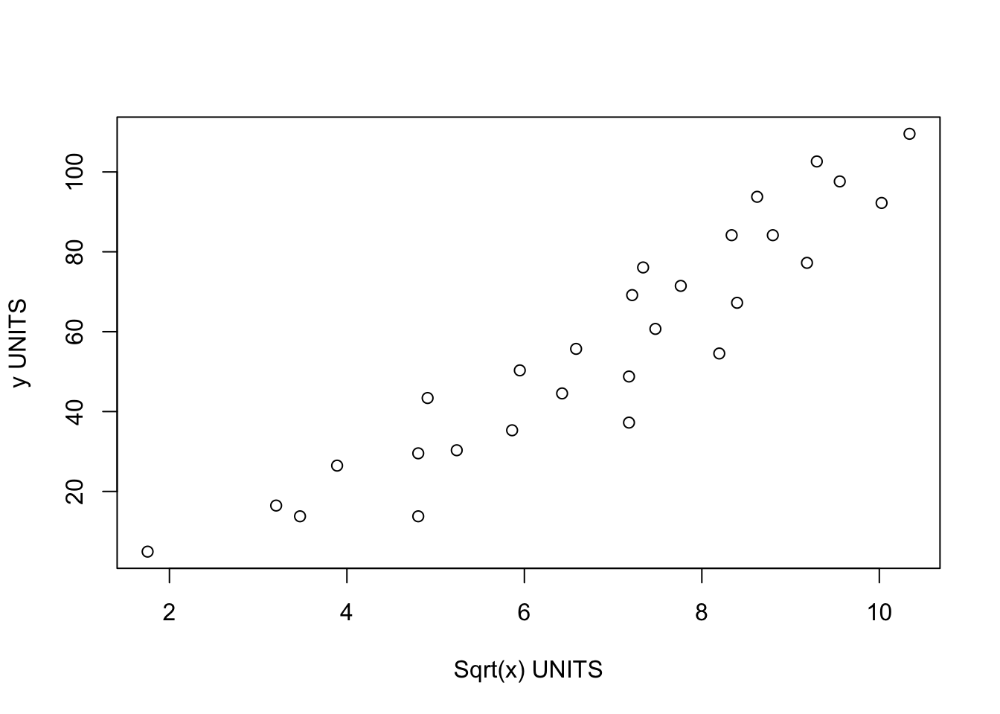

# Transformations {#S.Tutorial_Transformations}

We will talk in the class (or read here! https://online.stat.psu.edu/stat501/lesson/9 ) about *why* to apply transformations.  Here I will simply show you how.

We simply make a new column and use maths to fill in the value.

For example. Here is some data.


```r
# read the data
data <- read.csv("neither.csv")
head(data)
```

```
##         x       y
## 1 10.2564 16.4663
## 2  3.0769  4.9279
## 3 15.1282 26.4663
## 4 27.4359 30.3125
## 5 12.0513 13.7740
## 6 23.0769 13.7740
```

To make a column with $\frac{1}{x}$ as the predictor, I would use the $ to create a new column a and on the other side of the arrow, take the fraction.


```r
# Note I am trying to avoid spaces  or special characters in my data
data$transform_1overx <- 1/data$x
```


To make a column with $x^2$ as the predictor, we do


```r
# Note I am trying to avoid spaces  or special characters in my data
data$transform_xsquare <- data$x^2
```

To make a column with $\log(x)$ as the predictor, we do (this is the NATURAL LOG)


```r
# Note I am trying to avoid spaces  or special characters in my data
data$transform_lnx <- log(data$x)
```

To make a column with $\log_{10}(x)$ as the predictor, we do 


```r
# Note I am trying to avoid spaces  or special characters in my data
data$transform_logx <- log(data$x,base=10)
```

To make a column with $\sqrt{x}$ as the predictor, we do 


```r
# Note I am trying to avoid spaces  or special characters in my data
data$transform_sqrtx <- sqrt(data$x)
```

And let's see the output


```r
head(data)
```

```
##         x       y transform_1overx transform_xsquare transform_lnx
## 1 10.2564 16.4663       0.09750010        105.193741      2.327902
## 2  3.0769  4.9279       0.32500244          9.467314      1.123923
## 3 15.1282 26.4663       0.06610172        228.862435      2.716561
## 4 27.4359 30.3125       0.03644859        752.728609      3.311852
## 5 12.0513 13.7740       0.08297860        145.233832      2.489173
## 6 23.0769 13.7740       0.04333338        532.543314      3.138832
##   transform_logx transform_sqrtx
## 1      1.0109950        3.202561
## 2      0.4881134        1.754109
## 3      1.1797873        3.889499
## 4      1.4383192        5.237929
## 5      1.0810339        3.471498
## 6      1.3631775        4.803842
```

We could now perform our linear regression with any of these as our predictor.  For example


```r
newmodel <- lm(y~transform_sqrtx,data=data)
plot(data$y~data$transform_sqrtx,xlab="Sqrt(x) UNITS",ylab="y UNITS")
```



You don't *have* to make a new column in advance, you can do the maths within the regression itself:


```r
newmodel2 <- lm(y~sqrt(x),data=data)

# For Polynomial regression you can use the poly command e.g. X+X^2 

newmodel3 <- lm(y ~ poly(x,2),data=data)
```


```r
summary(newmodel3)
```

```
## 
## Call:
## lm(formula = y ~ poly(x, 2), data = data)
## 
## Residuals:
##     Min      1Q  Median      3Q     Max 
## -20.945  -6.344   1.280   6.887  15.652 
## 
## Coefficients:
##             Estimate Std. Error t value Pr(>|t|)    
## (Intercept)   56.823      1.936  29.352  < 2e-16 ***
## poly(x, 2)1  144.687     10.244  14.124 2.03e-13 ***
## poly(x, 2)2   -7.937     10.244  -0.775    0.446    
## ---
## Signif. codes:  0 '***' 0.001 '**' 0.01 '*' 0.05 '.' 0.1 ' ' 1
## 
## Residual standard error: 10.24 on 25 degrees of freedom
## Multiple R-squared:  0.8889,	Adjusted R-squared:  0.8801 
## F-statistic:   100 on 2 and 25 DF,  p-value: 1.174e-12
```


```r
equatiomatic::extract_eq(newmodel3)
```

$$
\operatorname{y} = \alpha + \beta_{1}(\operatorname{x}) + \beta_{2}(\operatorname{x^2}) + \epsilon
$$

