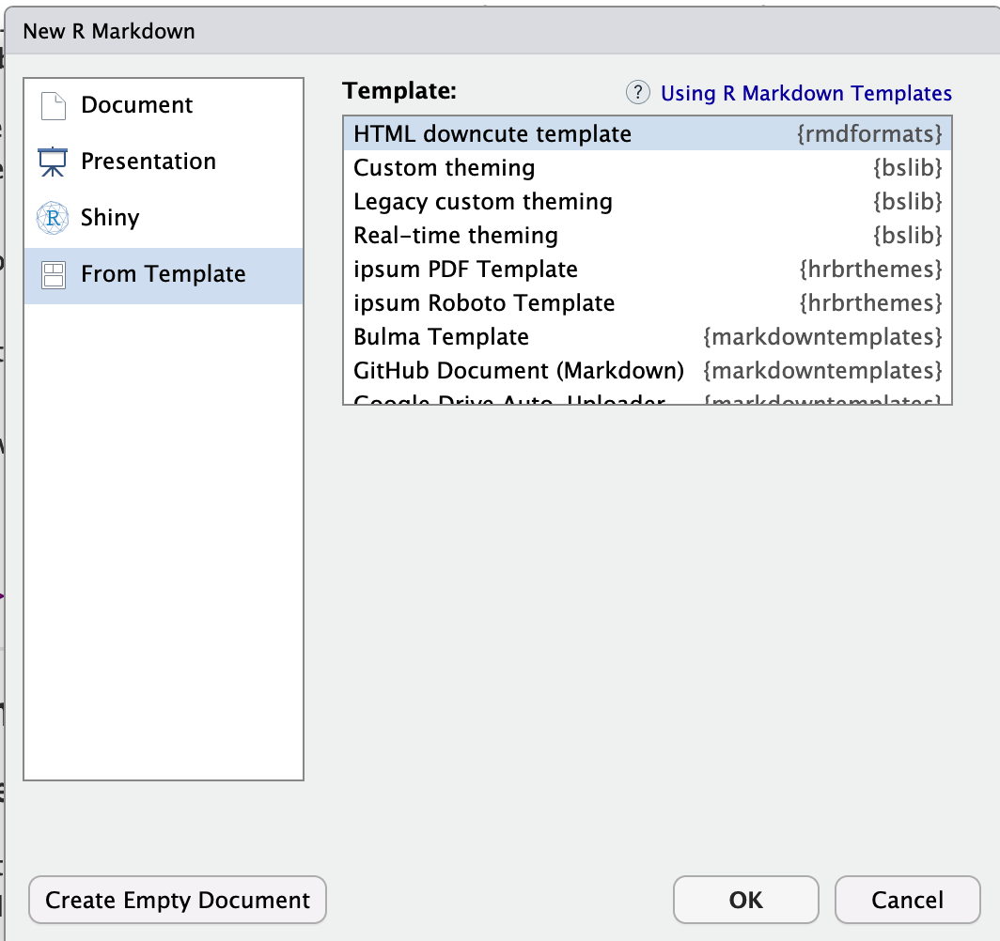
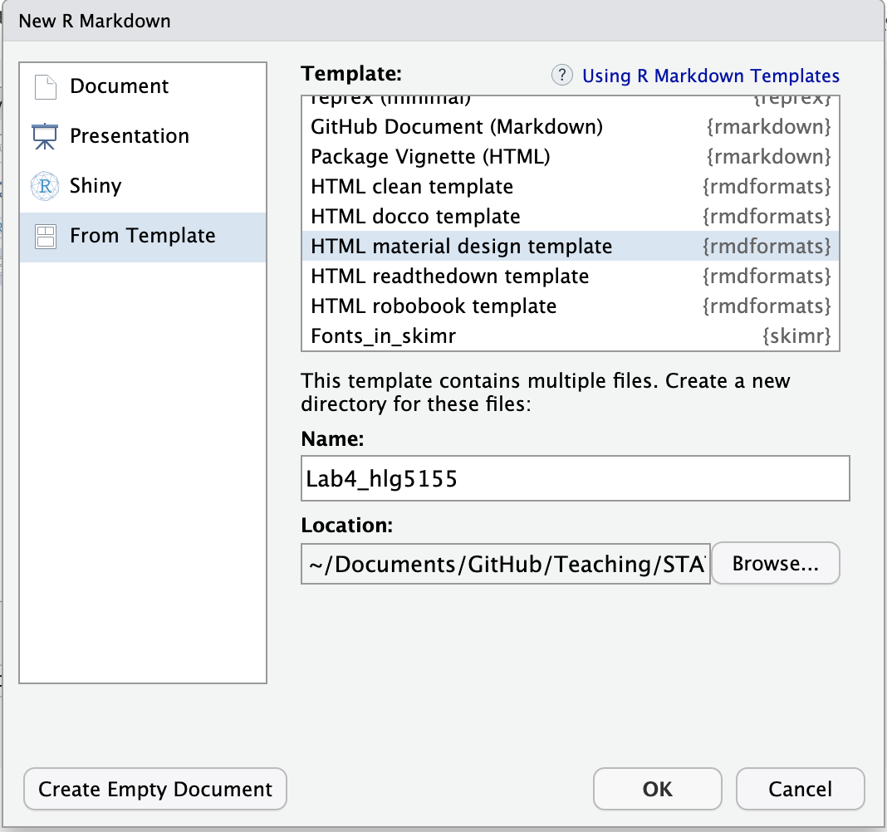
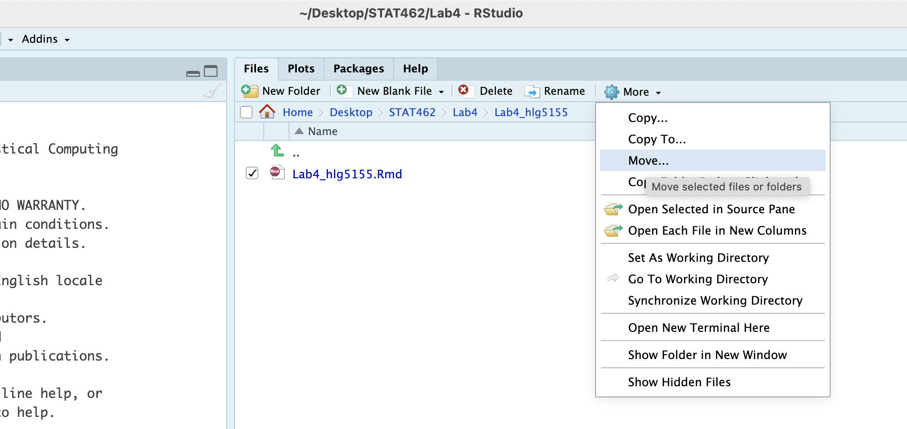
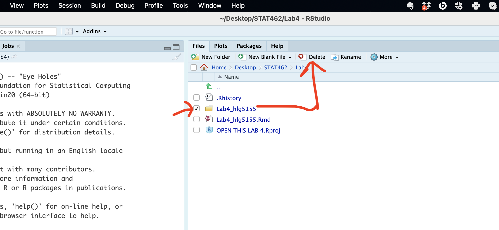

# R-Markdown {#T3_Markdown}

## What is markdown? {#T31_Whatisit}

Remind yourself of what Rmarkdown is here <https://rmarkdown.rstudio.com>, or via this short video


```{=html}
<div class="vembedr">
<div>
<iframe class="vimeo-embed" src="https://player.vimeo.com/video/178485416" width="533" height="300" frameborder="0" webkitallowfullscreen="" mozallowfullscreen="" allowfullscreen="" data-external="1"></iframe>
</div>
</div>
```

<br> All markdown documents have three components.

-   There is a space at the top of the file where we can add information about themes/styles etc called "YAML". This determines what type/style of document your work will become <br>
-   There is space to add text (white), <br>
-   And you can add code in 'mini consoles' called 'code chunks'. (Grey) <br>


<br>

------------------------------------------------------------------------

## Important things to know {#T32_MarkdownImportant}

### Visual mode {#T32A_visualmode}

It is MUCH easier to edit markdown documents in the new visual mode. Essentially instead of having to remember text short cuts like \* for bold, you can edit the text part as though you were using a word processor. NOTE HEADERS where it says "Normal", this allows you to make auto tables of contents.


<br>

------------------------------------------------------------------------

### Inserting images/tables and formatting {#T32B_formatting}

In visual mode, look at the menu at the top. It's very easy to insert images, tables and other formatting. Pay special attention to the Normal/Heading 1/Heading 2 buttons..

For what I mean by this, see this link: <https://zsmith27.github.io/rmarkdown_crash-course/lesson-3-basic-syntax.html>

Note, because of visual mode, you can click a button instead of learning the syntax.

<br>

------------------------------------------------------------------------

### Code chunks {#T32D_CodeChunks}

Code chunks are mini consoles where you can run R commands. We will talk more about them in the next tutorial.


<br>

On the top right there are a suite of buttons for adding a new code chunk, running code etc. The green one adds a new code chunk. To run an individual code chunk you will press the green arrow on its top right e.g.


<br>

------------------------------------------------------------------------

### Knitting {#T32E_Knitting}


The file on your screen isn't the finished article. To see how it will look as a final version, we need to "knit" it. Go to the top of the .Rmd file, find the `knit` button. Press it (you might have to first save your script if you haven't already, then press it again)

You should see that the Markdown tab "builds" your document and you get an output as a website. The html should also be saved into your project folder.

**Yours will not knit if you haven't yet installed the rmdformats package**

For example, here is a file with markdown and knitted output.


<br><br>

------------------------------------------------------------------------

## YAML Code and templates {#T3_YAML}

For Lab 1-3, you will be using a custom template that I made using the package `rmdformats`.[\^in_04-tutorial3_markdown-1] This outputs a html file in a special html format called 'downcute'. From lab 4 onwards, you will be making your own markdown documents. Here's how

1.  Make sure that you have installed the `rmdformats` package. If you're on posit cloud, you will need to install it every time.<br>

2.  MAKE SURE YOU ARE RUNNING YOUR PROJECT\
    <br>

3.  Go to File/New File/[**R-Markdown**]{.underline} (it's the 5th menu option down)\
    <br>

4.  Don't be tempted to fill in the title. Instead IMMEDIATELY click on the template button on the left.\
    <br>

5.  This will bring up a list of templates. Choose one you like. If you're not sure, have a look here: <https://github.com/juba/rmdformats?tab=readme-ov-file#readme>

    <br>

Now there are two things you might see (I'm not sure why - Mac vs PC?)

**OPTION A:** If you see something like this, where the bottom bit is blank.

-   {width="400"}

-   Choose your template, press OK and it will make a file called untitled.RmD. Click either knit or save and save it as your labnumber_emailID.RmD.

<br>

**OPTION B:** On some computers (including mine), it says that these files need to be put into a new directory.

-   {width="400"}

-   In that case, name the file here as your labnumber_emailID.Rm and click OK.

-   It will make a new file named correctly. BUT there's a (mini) issue. It puts the file in a subfolder inside your lab folder. Close the file.

-   You can either close Rstudio and on your computer, move the RmD up a level to the main lab folder and delete the subfolder. OR.. you can do it inside R studio.

    -   And now, go to the files quadrant. If you are running your project, you should see a new subfolder named whatever you named your RmD file. Click on its name to open.

    -   Then click on the tickbox by your lab report file, click on the cogwheel on the right (this gets hidden if your R-Studio isn't full screen) and click move. Move it up one-level to your main lab folder.\
        \

    -   Then move up a level to your main lab 4, click the tickbox by the sub-folder and press delete.

    -   

Now reopen the RmD file and carry on with your lab.

<br><br>

------------------------------------------------------------------------

## Writing Maths equations in R-Markdown {#T3_MathsEquations}

### Double dollar signs

It is relatively easy to write equations in R markdown. They use the "Latex" format and you put them between double dollar signs.

For example, try typing `$$x=2$$` on a new line of the white text area in your repprt ( NOT INTO A CODE CHUNK), then pressing knit. You should see:

$$x=2$$

But how do you write all the fancy equation stuff? We cheat.

Create the equation you want in one of these generators, then copy the code into your script and put it between double dollar signs:

-   <https://latex.codecogs.com/eqneditor/editor.php>
-   <https://www.tutorialspoint.com/latex_equation_editor.htm>

For example

`$$\widehat{y} = b_{0}+b_{1}x$$`

Shows up as $$\widehat{y} = b_{0}+b_{1}x$$

<br><br>

### Single dollar signs

Essentially this is the same, but the equation is part of the text and you only see the output when you press knit. For example including `$x=2$` in this sentence shows $x=2$ as an output.

<br><br>

### Using Equatiomatic {#S.Tutorial.4C.2}

There's also a package called `equatiomatic` that we can use to directly make equations from our linear models. Full tutorial here: <https://github.com/datalorax/equatiomatic>

#### Installing it

It's no longer in the official app-store, so to install it, FIRST, install a package called '`remotes`'.

Then run this code to install from github:

`remotes::install_github("datalorax/equatiomatic")`

Then add the library command in the library code chunk. Note, as discussed here, this might not work for some people and to be honest, I think this package might be more effort than it's worth.

#### Using it

Equatiomatic allows us to extract an equation from any linear model using `extract_eq()`. For example, let's create a linear model:


```r
data(starwars)
mymodel <- lm(mass~height,data=starwars)
```

Then extract_eq allows you to see the LateX version of the equation.


```r
extract_eq(mymodel)
```

If you run it in the console, the command returns the LaTeX code you need to add it into the text yourself. If you want to use the actual numbers, simply turn on use_coefs=TRUE.


```r
extract_eq(mymodel, use_coefs = TRUE)
```

Let's say our data is a sample, not the population, then we want to use lower case names for our sample statistics (b0 & b1).

There is no easy way to do this in the command, so I run the command in the console, then copy the command over to the TEXT part of the report as an equation and change the betas to 'b's.

More examples here:


<br><br>

------------------------------------------------------------------------

## Code Chunk options {#T3_CodeChunkOptions}

What are they? Essentially, instructions that you tell the computer when you press knit.

### Creating them in Source mode

Click source mode and have a look at a code chunk. You will see it starts with three little back-ticks and the {r} sign. For code chunk options, we will be focusing on the top line with the {r}

{width="600"}

At the moment, the code chunk tells us that the code inside is written in R.

We can also add other options, **separated using commas.**

{width="600"}

In fact, you have often seen me add message=FALSE and warning=FALSE to prevent any spurious messages appearing when you press knit. Keep reading to see the many other things you can add.

<br>

### Creating them in View mode

You can also edit code chunk options in view mode. Create a new code chunk, then click on the little (almost invisible) cogwheel near the run triangle

{width="700"}

This will open a menu where you can choose many of the common options

{width="400"}

<br>

### Setting the default for the whole document

Many templates already include this for you to edit.

If not, you can put a code chunk at the top of your document (below the YAML code) containing `knitr::opts_chunk$set()` to change the default values of chunk options in a document.

For example, you may put this in the first code chunk of your document to stop it showing messages on knit.

```{{r, include=FALSE}}
knitr::opts_chunk$set(warning=FALSE, message=FALSE)
```

<br>

### Common options

Here are the common options we typically need:

-   `message = TRUE/FALSE`. Don't show friendly R messages on knitting. I use this so often that I put it in that knitr code chunk at the top of my scripts. <br>

-   `warning = TRUE/FALSE` . Don't show R warnings on knitting. It will still show errors, so this is another good one to use. <br>

-   `include = TRUE/FALSE.` Show or Hide the code AND output in the final document. Really useful with inline code (next section) <br>

-   `echo = TRUE/FALSE.` Show or Hide the code chunk code in the final document. The output will still be shown. <br>

-   `eval = TRUE/FALSE`. This option determines whether the code is evaluated or executed. If **`eval = TRUE`**, the code is executed. If **`eval = FALSE`**, the code is not executed, but the code chunk is still displayed. This can be useful for showing example code without actually running it.

-   Or for example, if you can't knit because of an error, you can add eval=FALSE to the problem code chunk so I can see what you did but you can still knit.

<br><br>

------------------------------------------------------------------------

## Inline Code

There are two types of code you can write in your reports: code chunks and inline R code.

#### Code chunks

Click source mode and have a look at a code chunk. You will see it starts with three little back-ticks and the {r} sign.

{width="600"}

#### .. vs Inline Code


Inline R code is embedded in the TEXT/NARRATIVE of your document using single back-ticks. For example, writing

My value of y is `` `r y` `` and x-squared is `` `r x^2` ``

Will output:

My value of y is 10 and x-squared is 49.

If this doesn't make sense, follow these tutorial to see how to add inline code.

-   <https://bookdown.org/yihui/rmarkdown-cookbook/r-code.html>
-   <https://www.njtierney.com/post/2019/07/10/jq-verbatim-inline-r/>
-   <https://rmarkdown.rstudio.com/lesson-4.html>

<br><br>

### Tips for adding inline code

Inline code is GREAT. Imagine writing your 100 page thesis, but then you realise that your dataset was wrong. If all the numbers in your report are added using inline code, then it will automatically update your entire report.

The easiest way to do this is to run your commands in a "silent" code chunk with the echo=FALSE and include=FALSE options. Then in the text, I just put the variable name I want to print, sometimes rounding to a better number of decimal places[^in_04-tutorial3_markdown-1].

[^in_04-tutorial3_markdown-1]: You can round in the inline code or the code chunk. Both are fine


For example here's how I typed that the mean height of the starwars data is 174.6 cm:

{width="700"}

You don't actually need echo AND include. I can simply never remember which one is which and use them both :).
