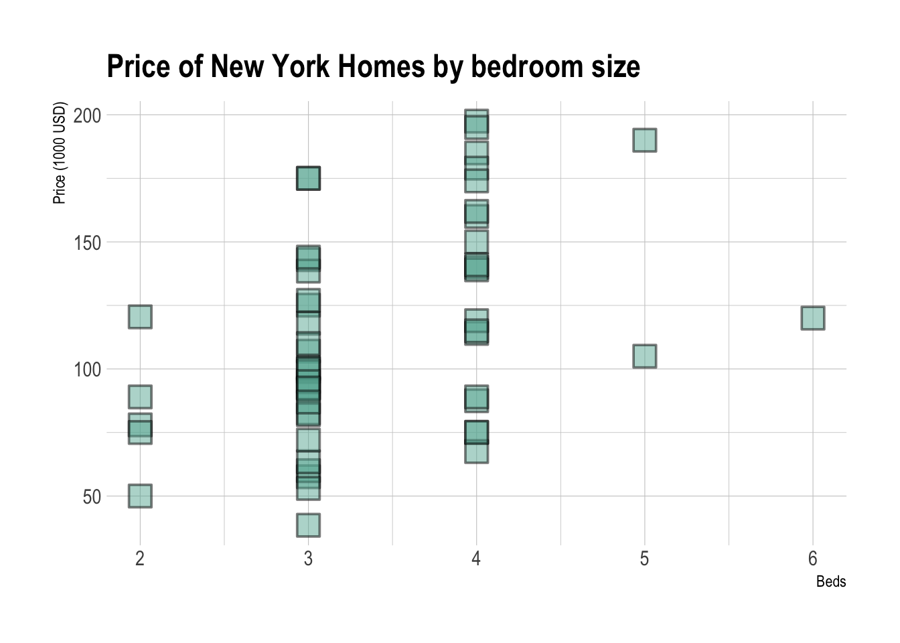
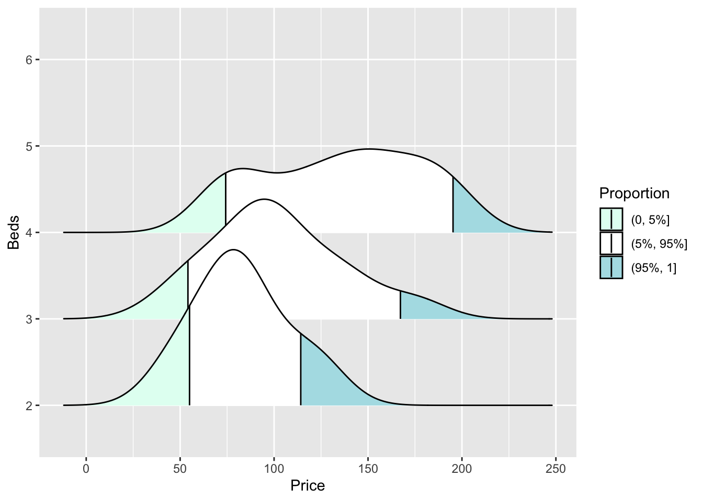

# Plots {#T6_plots}

Plots are designed to do two things, allow you to see something in the data that you couldn't see in the numbers, plus communicate output in a compelling way.

Going beyond the basics or knowing the limitations of a plot will help you do this, so in these examples I have provided a range of complexity. You will see tutorials for all the plots I mention in this section. If in doubt, try the ggstatsplot versions.

<br>

### What to choose?

-   If you are looking at a single variable, try histograms, boxplots and violin plots

-   If you think your histogram changes by some category, try grouped boxplots and grouped violin plots (easy violin plot here)

-   If you think your histogram changes numerically, try ridgeline plots

-   If you are comparing two variables, try scatterplots and correlation plots.

<br>

### Where to find worked examples

There are three places I visit constantly:

-   <https://www.r-graph-gallery.com/>
-   <https://indrajeetpatil.github.io/ggstatsplot/>
-   <https://r-charts.com/distribution/>
-   <https://flowingdata.com/>

If you are new to data visualisation, read these two articles

-   <https://flowingdata.com/2014/10/23/moving-past-default-charts/>
-   <https://flowingdata.com/2012/05/15/how-to-visualize-and-compare-distributions/>

------------------------------------------------------------------------

<br><br> {#T6_ExampleData}

## Example dataset

Throughout this tutorial, I will use an example dataset on houses in New York. This has the columns:

-   `Price`: Estimated price (in \$1,000's)
-   `Beds`: Number of bedrooms
-   `Baths`: Number of bathrooms
-   `Size`: Floor area of the house (in 1,000 square feet)
-   `Lot`: Size of the lot (in acres)


```r
data("HousesNY", package = "Stat2Data")

head(HousesNY)
```

```
##   Price Beds Baths  Size  Lot
## 1  57.6    3     2 0.960 1.30
## 2 120.0    6     2 2.786 0.23
## 3 150.0    4     2 1.704 0.27
## 4 143.0    3     2 1.200 0.80
## 5  92.5    3     1 1.329 0.42
## 6  50.0    2     1 0.974 0.34
```


------------------------------------------------------------------------

<br><br>

## Scatterplots {#T6_PlotsScatter}

<br>

### Basic plot (no line of best fit)

Here is the absolute basic scatterplot. This should not be the one you submit in your reports (e.g. either choose a more professional one or adjust the options below)


```r
# you can either do plot(x, y)
# OR (recommended), use the ~ to say plot(y~x) 
# e.g. y depends on x
plot(HousesNY$Price ~ HousesNY$Beds,
     xlab="Beds",ylab="Price (USD")
```


There are many things we can change, see the help file for the `par` command for more. For example, here is an ugly plot showing as many as I can think!


```r
plot(HousesNY$Price ~ HousesNY$Beds,
     xlim=c(0,7), #xlimits
     ylim=c(40,220), #ylimits
     xlab=list("Beds",cex=.8,col="red",font=2), # play with x-label
     ylab=list("Price",cex=1.2,col="blue",font=3), # play with x-label
     main="Ugly feature plot",
     cex=1.2, #point size
     pch=16, # symbol shape (try plot(1:24,1:24,pch=1:24 to see them all))
     tcl=-.25, # smaller tick marks
     mgp=c(1.75,.5,0)) # move the x/y labels around

grid() #  add a grid

# lines means "add points on top"
lines(HousesNY$Price ~ HousesNY$Beds, 
     type="p", # p for points, "l" for lines, "o" for both, "h for bars
     xlim=c(0,7), #xlimits
     ylim=c(40,220), #ylimits
     col="yellow",
     cex=.5, #point size
     pch=4) # move the x/y labels around
```


<br>

### Basic plot WITH a line of best fit

To add a line, you can use the `abline` command IN THE SAME CODE CHUNK:


```r
# Create the plot
plot(HousesNY$Price ~ HousesNY$Beds,
     xlab="Beds", ylab="Price (1000 USD)", main="", 
     cex=1.2, pch=16) 

# add vertical line at 3.5
# # add horizontal line at the mean of price
abline(v=5.5,col="red")
abline(h=mean(HousesNY$Price),col="blue",lty="dotted")

# add line of best fit from a linear model
mymodel <- lm(Price ~ Beds, HousesNY)
abline(mymodel,col="purple",lty="dotted",lwd=3) 
```


<br>

### GGplot2 scatterplots

GGPlot2 also has basic and advanced options, but you need to install/run the ggplot2 package.

Again, I am using the HousesNY example dataset that I discussed earlier with the bed and price column names. You can see that each command is joined by a "+".


```r
# Normally this goes in your library code chunk
library(ggplot2)

# ggplot (TABLENAME, aes(x=XCOLUMN_NAME, y=YCOLUMN_NAME)
ggplot(HousesNY, aes(x=Beds, y=Price)) + 
    geom_point() + 
    ggtitle("Price of New York Homes by bedroom size") +
    xlab("Beds") + ylab("Price (1000 USD)")
```


To more advanced:


```r
# Library. Put these at the top!
library(ggplot2)
library(hrbrthemes)

ggplot(HousesNY, aes(x=Beds, y=Price)) + 
    geom_point(
        color="black",
        fill="#69b3a2",
        shape=22,
        alpha=0.5,
        size=6,
        stroke = 1
        ) +
    theme_ipsum() +   
   ggtitle("Price of New York Homes by bedroom size") +
   xlab("Beds") + ylab("Price (1000 USD)")
```



<br><br>

### GGplot2 adding a line of best fit. {#T6_PlotGGPlot}

Adding a line of best fit is easy, but it takes a bit of getting used to. The ggplotly command makes it interactive


```r
# Library. Put these at the top if they're 
# not already in your library code chunk
library(ggplot2)
library(hrbrthemes)
library(plotly)


# Add linear trend WITHOUT confidence intervals
# HousesNY is the variable/table name.  
# Beds and Price are the columns I want to plot

myplot <- ggplot(HousesNY, aes(x=Beds, y=Price)) + 
    geom_point() + 
    ggtitle("Price of New York Homes by bedroom size") +
    xlab("Beds") + ylab("Price (1000 USD)")+
    geom_smooth(method=lm , color="red", se=FALSE) +
    theme_ipsum()

# ggplotly makes it interactive, but you could just type myplot
ggplotly(myplot)
```

```{=html}
<div class="plotly html-widget html-fill-item" id="htmlwidget-91b246a1d5016726a1a9" style="width:672px;height:480px;"></div>
<script type="application/json" data-for="htmlwidget-91b246a1d5016726a1a9">{"x":{"data":[{"x":[3,6,4,3,3,2,2,4,4,3,3,3,3,4,3,3,4,3,4,3,4,4,5,4,3,2,3,3,4,3,3,3,3,3,3,2,3,3,3,4,2,4,4,4,4,3,4,3,4,4,5,4,3],"y":[57.600000000000001,120,150,143,92.5,50,89,140,197.5,125.09999999999999,175,60,138.5,160,63.5,107,185,82.700000000000003,75,118,87.5,67.5,105,114,100.5,78,99,144,179,110,175,100,53,92,127,120.5,72,95,38.5,139,75,174,119,89,75.099999999999994,92.5,141,82,162,195,190,115,87],"text":["Beds: 3<br />Price:  57.6","Beds: 6<br />Price: 120.0","Beds: 4<br />Price: 150.0","Beds: 3<br />Price: 143.0","Beds: 3<br />Price:  92.5","Beds: 2<br />Price:  50.0","Beds: 2<br />Price:  89.0","Beds: 4<br />Price: 140.0","Beds: 4<br />Price: 197.5","Beds: 3<br />Price: 125.1","Beds: 3<br />Price: 175.0","Beds: 3<br />Price:  60.0","Beds: 3<br />Price: 138.5","Beds: 4<br />Price: 160.0","Beds: 3<br />Price:  63.5","Beds: 3<br />Price: 107.0","Beds: 4<br />Price: 185.0","Beds: 3<br />Price:  82.7","Beds: 4<br />Price:  75.0","Beds: 3<br />Price: 118.0","Beds: 4<br />Price:  87.5","Beds: 4<br />Price:  67.5","Beds: 5<br />Price: 105.0","Beds: 4<br />Price: 114.0","Beds: 3<br />Price: 100.5","Beds: 2<br />Price:  78.0","Beds: 3<br />Price:  99.0","Beds: 3<br />Price: 144.0","Beds: 4<br />Price: 179.0","Beds: 3<br />Price: 110.0","Beds: 3<br />Price: 175.0","Beds: 3<br />Price: 100.0","Beds: 3<br />Price:  53.0","Beds: 3<br />Price:  92.0","Beds: 3<br />Price: 127.0","Beds: 2<br />Price: 120.5","Beds: 3<br />Price:  72.0","Beds: 3<br />Price:  95.0","Beds: 3<br />Price:  38.5","Beds: 4<br />Price: 139.0","Beds: 2<br />Price:  75.0","Beds: 4<br />Price: 174.0","Beds: 4<br />Price: 119.0","Beds: 4<br />Price:  89.0","Beds: 4<br />Price:  75.1","Beds: 3<br />Price:  92.5","Beds: 4<br />Price: 141.0","Beds: 3<br />Price:  82.0","Beds: 4<br />Price: 162.0","Beds: 4<br />Price: 195.0","Beds: 5<br />Price: 190.0","Beds: 4<br />Price: 115.0","Beds: 3<br />Price:  87.0"],"type":"scatter","mode":"markers","marker":{"autocolorscale":false,"color":"rgba(0,0,0,1)","opacity":1,"size":5.6692913385826778,"symbol":"circle","line":{"width":1.8897637795275593,"color":"rgba(0,0,0,1)"}},"hoveron":"points","showlegend":false,"xaxis":"x","yaxis":"y","hoverinfo":"text","frame":null},{"x":[2,2.0506329113924049,2.1012658227848102,2.1518987341772151,2.2025316455696204,2.2531645569620253,2.3037974683544302,2.3544303797468356,2.4050632911392404,2.4556962025316453,2.5063291139240507,2.5569620253164556,2.6075949367088609,2.6582278481012658,2.7088607594936711,2.759493670886076,2.8101265822784809,2.8607594936708862,2.9113924050632911,2.962025316455696,3.0126582278481013,3.0632911392405062,3.1139240506329111,3.1645569620253164,3.2151898734177218,3.2658227848101267,3.3164556962025316,3.3670886075949369,3.4177215189873418,3.4683544303797467,3.518987341772152,3.5696202531645569,3.6202531645569618,3.6708860759493671,3.7215189873417724,3.7721518987341769,3.8227848101265822,3.8734177215189876,3.9240506329113924,3.9746835443037973,4.0253164556962027,4.075949367088608,4.1265822784810124,4.1772151898734178,4.2278481012658222,4.2784810126582276,4.3291139240506329,4.3797468354430382,4.4303797468354436,4.481012658227848,4.5316455696202533,4.5822784810126578,4.6329113924050631,4.6835443037974684,4.7341772151898738,4.7848101265822782,4.8354430379746836,4.886075949367088,4.9367088607594933,4.9873417721518987,5.037974683544304,5.0886075949367093,5.1392405063291138,5.1898734177215191,5.2405063291139236,5.2911392405063289,5.3417721518987342,5.3924050632911396,5.4430379746835449,5.4936708860759493,5.5443037974683538,5.5949367088607591,5.6455696202531644,5.6962025316455698,5.7468354430379751,5.7974683544303796,5.8481012658227849,5.8987341772151893,5.9493670886075947,6],"y":[83.048267898383415,84.157362528137554,85.266457157891722,86.375551787645861,87.4846464174,88.59374104715414,89.702835676908279,90.811930306662447,91.921024936416586,93.030119566170725,94.139214195924865,95.248308825679004,96.357403455433172,97.466498085187311,98.57559271494145,99.68468734469559,100.79378197444973,101.9028766042039,103.01197123395804,104.12106586371218,105.23016049346631,106.33925512322047,107.44834975297461,108.55744438272876,109.6665390124829,110.77563364223704,111.88472827199119,112.99382290174533,114.10291753149947,115.21201216125363,116.32110679100776,117.43020142076192,118.53929605051606,119.6483906802702,120.75748531002435,121.86657993977849,122.97567456953264,124.08476919928678,125.19386382904092,126.30295845879508,127.41205308854921,128.52114771830338,129.63024234805749,130.73933697781166,131.84843160756577,132.95752623731994,134.06662086707411,135.17571549682822,136.28481012658239,137.39390475633652,138.50299938609066,139.6120940158448,140.72118864559894,141.83028327535311,142.93937790510725,144.04847253486139,145.15756716461553,146.26666179436967,147.37575642412384,148.48485105387797,149.59394568363211,150.70304031338628,151.81213494314039,152.92122957289456,154.03032420264867,155.13941883240284,156.24851346215698,157.35760809191112,158.46670272166529,159.57579735141942,160.68489198117356,161.7939866109277,162.90308124068184,164.01217587043601,165.12127050019015,166.23036512994429,167.33945975969843,168.44855438945257,169.55764901920671,170.66674364896087],"text":["Beds: 2.000000<br />Price:  83.04827","Beds: 2.050633<br />Price:  84.15736","Beds: 2.101266<br />Price:  85.26646","Beds: 2.151899<br />Price:  86.37555","Beds: 2.202532<br />Price:  87.48465","Beds: 2.253165<br />Price:  88.59374","Beds: 2.303797<br />Price:  89.70284","Beds: 2.354430<br />Price:  90.81193","Beds: 2.405063<br />Price:  91.92102","Beds: 2.455696<br />Price:  93.03012","Beds: 2.506329<br />Price:  94.13921","Beds: 2.556962<br />Price:  95.24831","Beds: 2.607595<br />Price:  96.35740","Beds: 2.658228<br />Price:  97.46650","Beds: 2.708861<br />Price:  98.57559","Beds: 2.759494<br />Price:  99.68469","Beds: 2.810127<br />Price: 100.79378","Beds: 2.860759<br />Price: 101.90288","Beds: 2.911392<br />Price: 103.01197","Beds: 2.962025<br />Price: 104.12107","Beds: 3.012658<br />Price: 105.23016","Beds: 3.063291<br />Price: 106.33926","Beds: 3.113924<br />Price: 107.44835","Beds: 3.164557<br />Price: 108.55744","Beds: 3.215190<br />Price: 109.66654","Beds: 3.265823<br />Price: 110.77563","Beds: 3.316456<br />Price: 111.88473","Beds: 3.367089<br />Price: 112.99382","Beds: 3.417722<br />Price: 114.10292","Beds: 3.468354<br />Price: 115.21201","Beds: 3.518987<br />Price: 116.32111","Beds: 3.569620<br />Price: 117.43020","Beds: 3.620253<br />Price: 118.53930","Beds: 3.670886<br />Price: 119.64839","Beds: 3.721519<br />Price: 120.75749","Beds: 3.772152<br />Price: 121.86658","Beds: 3.822785<br />Price: 122.97567","Beds: 3.873418<br />Price: 124.08477","Beds: 3.924051<br />Price: 125.19386","Beds: 3.974684<br />Price: 126.30296","Beds: 4.025316<br />Price: 127.41205","Beds: 4.075949<br />Price: 128.52115","Beds: 4.126582<br />Price: 129.63024","Beds: 4.177215<br />Price: 130.73934","Beds: 4.227848<br />Price: 131.84843","Beds: 4.278481<br />Price: 132.95753","Beds: 4.329114<br />Price: 134.06662","Beds: 4.379747<br />Price: 135.17572","Beds: 4.430380<br />Price: 136.28481","Beds: 4.481013<br />Price: 137.39390","Beds: 4.531646<br />Price: 138.50300","Beds: 4.582278<br />Price: 139.61209","Beds: 4.632911<br />Price: 140.72119","Beds: 4.683544<br />Price: 141.83028","Beds: 4.734177<br />Price: 142.93938","Beds: 4.784810<br />Price: 144.04847","Beds: 4.835443<br />Price: 145.15757","Beds: 4.886076<br />Price: 146.26666","Beds: 4.936709<br />Price: 147.37576","Beds: 4.987342<br />Price: 148.48485","Beds: 5.037975<br />Price: 149.59395","Beds: 5.088608<br />Price: 150.70304","Beds: 5.139241<br />Price: 151.81213","Beds: 5.189873<br />Price: 152.92123","Beds: 5.240506<br />Price: 154.03032","Beds: 5.291139<br />Price: 155.13942","Beds: 5.341772<br />Price: 156.24851","Beds: 5.392405<br />Price: 157.35761","Beds: 5.443038<br />Price: 158.46670","Beds: 5.493671<br />Price: 159.57580","Beds: 5.544304<br />Price: 160.68489","Beds: 5.594937<br />Price: 161.79399","Beds: 5.645570<br />Price: 162.90308","Beds: 5.696203<br />Price: 164.01218","Beds: 5.746835<br />Price: 165.12127","Beds: 5.797468<br />Price: 166.23037","Beds: 5.848101<br />Price: 167.33946","Beds: 5.898734<br />Price: 168.44855","Beds: 5.949367<br />Price: 169.55765","Beds: 6.000000<br />Price: 170.66674"],"type":"scatter","mode":"lines","name":"fitted values","line":{"width":3.7795275590551185,"color":"rgba(255,0,0,1)","dash":"solid"},"hoveron":"points","showlegend":false,"xaxis":"x","yaxis":"y","hoverinfo":"text","frame":null}],"layout":{"margin":{"t":95.701120797011214,"r":39.850560398505614,"b":86.841012868410147,"l":78.538812785388146},"font":{"color":"rgba(0,0,0,1)","family":"Arial Narrow","size":15.276048152760483},"title":{"text":"<b> Price of New York Homes by bedroom size <\/b>","font":{"color":"rgba(0,0,0,1)","family":"Arial Narrow","size":23.910336239103362},"x":0,"xref":"paper"},"xaxis":{"domain":[0,1],"automargin":true,"type":"linear","autorange":false,"range":[1.8,6.2000000000000002],"tickmode":"array","ticktext":["2","3","4","5","6"],"tickvals":[2,3,4,5,6],"categoryorder":"array","categoryarray":["2","3","4","5","6"],"nticks":null,"ticks":"","tickcolor":null,"ticklen":3.8190120381901207,"tickwidth":0,"showticklabels":true,"tickfont":{"color":"rgba(77,77,77,1)","family":"Arial Narrow","size":15.276048152760483},"tickangle":-0,"showline":false,"linecolor":null,"linewidth":0,"showgrid":true,"gridcolor":"rgba(204,204,204,1)","gridwidth":0.26567040265670405,"zeroline":false,"anchor":"y","title":{"text":"Beds","font":{"color":"rgba(0,0,0,1)","family":"Arial Narrow","size":11.955168119551681}},"hoverformat":".2f"},"yaxis":{"domain":[0,1],"automargin":true,"type":"linear","autorange":false,"range":[30.550000000000001,205.44999999999999],"tickmode":"array","ticktext":["50","100","150","200"],"tickvals":[50,100,150,200],"categoryorder":"array","categoryarray":["50","100","150","200"],"nticks":null,"ticks":"","tickcolor":null,"ticklen":3.8190120381901207,"tickwidth":0,"showticklabels":true,"tickfont":{"color":"rgba(77,77,77,1)","family":"Arial Narrow","size":15.276048152760483},"tickangle":-0,"showline":false,"linecolor":null,"linewidth":0,"showgrid":true,"gridcolor":"rgba(204,204,204,1)","gridwidth":0.26567040265670405,"zeroline":false,"anchor":"x","title":{"text":"Price (1000 USD)","font":{"color":"rgba(0,0,0,1)","family":"Arial Narrow","size":11.955168119551681}},"hoverformat":".2f"},"shapes":[{"type":"rect","fillcolor":null,"line":{"color":null,"width":0,"linetype":[]},"yref":"paper","xref":"paper","x0":0,"x1":1,"y0":0,"y1":1}],"showlegend":false,"legend":{"bgcolor":null,"bordercolor":null,"borderwidth":0,"font":{"color":"rgba(0,0,0,1)","family":"Arial Narrow","size":12.220838522208387}},"hovermode":"closest","barmode":"relative"},"config":{"doubleClick":"reset","modeBarButtonsToAdd":["hoverclosest","hovercompare"],"showSendToCloud":false},"source":"A","attrs":{"9bff7065fb7d":{"x":{},"y":{},"type":"scatter"},"9bff37620531":{"x":{},"y":{}}},"cur_data":"9bff7065fb7d","visdat":{"9bff7065fb7d":["function (y) ","x"],"9bff37620531":["function (y) ","x"]},"highlight":{"on":"plotly_click","persistent":false,"dynamic":false,"selectize":false,"opacityDim":0.20000000000000001,"selected":{"opacity":1},"debounce":0},"shinyEvents":["plotly_hover","plotly_click","plotly_selected","plotly_relayout","plotly_brushed","plotly_brushing","plotly_clickannotation","plotly_doubleclick","plotly_deselect","plotly_afterplot","plotly_sunburstclick"],"base_url":"https://plot.ly"},"evals":[],"jsHooks":[]}</script>
```

### GGplot2 adding a line of best fit and confidence intervals

We can also add confidence intervals on our line of best fit.


```r
# Add linear trend + confidence interval
ggplot(HousesNY, aes(x=Beds, y=Price)) + 
    geom_point() + 
    ggtitle("Price of New York Homes by bedroom size") +
    xlab("Beds") + ylab("Price (1000 USD)")+
    geom_smooth(method=lm , color="blue", fill="#69b3a2", se=TRUE) +
    theme_ipsum()
```


<br>

### Plotly Interactive scatterplots! {#T6_ScatterPlotly}

You can use the plotly library to make ANY ggplot2 plot interactive

This is really useful, try zooming in or clicking on a few points. If you don't want the line of best fit, simply remove the geom_smooth line.


```r
# create the plot, save it as a variable rather than print immediately
myplot <-   ggplot(HousesNY, aes(x=Beds, y=Price)) + 
               geom_point() + 
               geom_smooth(method=lm , color="red", se=FALSE) +
               ggtitle("Price of New York Homes by bedroom size") +
               xlab("Beds") + ylab("Price (1000 USD)")
            
# and plot interactively
ggplotly(myplot)
```

```{=html}
<div class="plotly html-widget html-fill-item" id="htmlwidget-46c4a3a2cf6000768a31" style="width:672px;height:480px;"></div>
<script type="application/json" data-for="htmlwidget-46c4a3a2cf6000768a31">{"x":{"data":[{"x":[3,6,4,3,3,2,2,4,4,3,3,3,3,4,3,3,4,3,4,3,4,4,5,4,3,2,3,3,4,3,3,3,3,3,3,2,3,3,3,4,2,4,4,4,4,3,4,3,4,4,5,4,3],"y":[57.600000000000001,120,150,143,92.5,50,89,140,197.5,125.09999999999999,175,60,138.5,160,63.5,107,185,82.700000000000003,75,118,87.5,67.5,105,114,100.5,78,99,144,179,110,175,100,53,92,127,120.5,72,95,38.5,139,75,174,119,89,75.099999999999994,92.5,141,82,162,195,190,115,87],"text":["Beds: 3<br />Price:  57.6","Beds: 6<br />Price: 120.0","Beds: 4<br />Price: 150.0","Beds: 3<br />Price: 143.0","Beds: 3<br />Price:  92.5","Beds: 2<br />Price:  50.0","Beds: 2<br />Price:  89.0","Beds: 4<br />Price: 140.0","Beds: 4<br />Price: 197.5","Beds: 3<br />Price: 125.1","Beds: 3<br />Price: 175.0","Beds: 3<br />Price:  60.0","Beds: 3<br />Price: 138.5","Beds: 4<br />Price: 160.0","Beds: 3<br />Price:  63.5","Beds: 3<br />Price: 107.0","Beds: 4<br />Price: 185.0","Beds: 3<br />Price:  82.7","Beds: 4<br />Price:  75.0","Beds: 3<br />Price: 118.0","Beds: 4<br />Price:  87.5","Beds: 4<br />Price:  67.5","Beds: 5<br />Price: 105.0","Beds: 4<br />Price: 114.0","Beds: 3<br />Price: 100.5","Beds: 2<br />Price:  78.0","Beds: 3<br />Price:  99.0","Beds: 3<br />Price: 144.0","Beds: 4<br />Price: 179.0","Beds: 3<br />Price: 110.0","Beds: 3<br />Price: 175.0","Beds: 3<br />Price: 100.0","Beds: 3<br />Price:  53.0","Beds: 3<br />Price:  92.0","Beds: 3<br />Price: 127.0","Beds: 2<br />Price: 120.5","Beds: 3<br />Price:  72.0","Beds: 3<br />Price:  95.0","Beds: 3<br />Price:  38.5","Beds: 4<br />Price: 139.0","Beds: 2<br />Price:  75.0","Beds: 4<br />Price: 174.0","Beds: 4<br />Price: 119.0","Beds: 4<br />Price:  89.0","Beds: 4<br />Price:  75.1","Beds: 3<br />Price:  92.5","Beds: 4<br />Price: 141.0","Beds: 3<br />Price:  82.0","Beds: 4<br />Price: 162.0","Beds: 4<br />Price: 195.0","Beds: 5<br />Price: 190.0","Beds: 4<br />Price: 115.0","Beds: 3<br />Price:  87.0"],"type":"scatter","mode":"markers","marker":{"autocolorscale":false,"color":"rgba(0,0,0,1)","opacity":1,"size":5.6692913385826778,"symbol":"circle","line":{"width":1.8897637795275593,"color":"rgba(0,0,0,1)"}},"hoveron":"points","showlegend":false,"xaxis":"x","yaxis":"y","hoverinfo":"text","frame":null},{"x":[2,2.0506329113924049,2.1012658227848102,2.1518987341772151,2.2025316455696204,2.2531645569620253,2.3037974683544302,2.3544303797468356,2.4050632911392404,2.4556962025316453,2.5063291139240507,2.5569620253164556,2.6075949367088609,2.6582278481012658,2.7088607594936711,2.759493670886076,2.8101265822784809,2.8607594936708862,2.9113924050632911,2.962025316455696,3.0126582278481013,3.0632911392405062,3.1139240506329111,3.1645569620253164,3.2151898734177218,3.2658227848101267,3.3164556962025316,3.3670886075949369,3.4177215189873418,3.4683544303797467,3.518987341772152,3.5696202531645569,3.6202531645569618,3.6708860759493671,3.7215189873417724,3.7721518987341769,3.8227848101265822,3.8734177215189876,3.9240506329113924,3.9746835443037973,4.0253164556962027,4.075949367088608,4.1265822784810124,4.1772151898734178,4.2278481012658222,4.2784810126582276,4.3291139240506329,4.3797468354430382,4.4303797468354436,4.481012658227848,4.5316455696202533,4.5822784810126578,4.6329113924050631,4.6835443037974684,4.7341772151898738,4.7848101265822782,4.8354430379746836,4.886075949367088,4.9367088607594933,4.9873417721518987,5.037974683544304,5.0886075949367093,5.1392405063291138,5.1898734177215191,5.2405063291139236,5.2911392405063289,5.3417721518987342,5.3924050632911396,5.4430379746835449,5.4936708860759493,5.5443037974683538,5.5949367088607591,5.6455696202531644,5.6962025316455698,5.7468354430379751,5.7974683544303796,5.8481012658227849,5.8987341772151893,5.9493670886075947,6],"y":[83.048267898383415,84.157362528137554,85.266457157891722,86.375551787645861,87.4846464174,88.59374104715414,89.702835676908279,90.811930306662447,91.921024936416586,93.030119566170725,94.139214195924865,95.248308825679004,96.357403455433172,97.466498085187311,98.57559271494145,99.68468734469559,100.79378197444973,101.9028766042039,103.01197123395804,104.12106586371218,105.23016049346631,106.33925512322047,107.44834975297461,108.55744438272876,109.6665390124829,110.77563364223704,111.88472827199119,112.99382290174533,114.10291753149947,115.21201216125363,116.32110679100776,117.43020142076192,118.53929605051606,119.6483906802702,120.75748531002435,121.86657993977849,122.97567456953264,124.08476919928678,125.19386382904092,126.30295845879508,127.41205308854921,128.52114771830338,129.63024234805749,130.73933697781166,131.84843160756577,132.95752623731994,134.06662086707411,135.17571549682822,136.28481012658239,137.39390475633652,138.50299938609066,139.6120940158448,140.72118864559894,141.83028327535311,142.93937790510725,144.04847253486139,145.15756716461553,146.26666179436967,147.37575642412384,148.48485105387797,149.59394568363211,150.70304031338628,151.81213494314039,152.92122957289456,154.03032420264867,155.13941883240284,156.24851346215698,157.35760809191112,158.46670272166529,159.57579735141942,160.68489198117356,161.7939866109277,162.90308124068184,164.01217587043601,165.12127050019015,166.23036512994429,167.33945975969843,168.44855438945257,169.55764901920671,170.66674364896087],"text":["Beds: 2.000000<br />Price:  83.04827","Beds: 2.050633<br />Price:  84.15736","Beds: 2.101266<br />Price:  85.26646","Beds: 2.151899<br />Price:  86.37555","Beds: 2.202532<br />Price:  87.48465","Beds: 2.253165<br />Price:  88.59374","Beds: 2.303797<br />Price:  89.70284","Beds: 2.354430<br />Price:  90.81193","Beds: 2.405063<br />Price:  91.92102","Beds: 2.455696<br />Price:  93.03012","Beds: 2.506329<br />Price:  94.13921","Beds: 2.556962<br />Price:  95.24831","Beds: 2.607595<br />Price:  96.35740","Beds: 2.658228<br />Price:  97.46650","Beds: 2.708861<br />Price:  98.57559","Beds: 2.759494<br />Price:  99.68469","Beds: 2.810127<br />Price: 100.79378","Beds: 2.860759<br />Price: 101.90288","Beds: 2.911392<br />Price: 103.01197","Beds: 2.962025<br />Price: 104.12107","Beds: 3.012658<br />Price: 105.23016","Beds: 3.063291<br />Price: 106.33926","Beds: 3.113924<br />Price: 107.44835","Beds: 3.164557<br />Price: 108.55744","Beds: 3.215190<br />Price: 109.66654","Beds: 3.265823<br />Price: 110.77563","Beds: 3.316456<br />Price: 111.88473","Beds: 3.367089<br />Price: 112.99382","Beds: 3.417722<br />Price: 114.10292","Beds: 3.468354<br />Price: 115.21201","Beds: 3.518987<br />Price: 116.32111","Beds: 3.569620<br />Price: 117.43020","Beds: 3.620253<br />Price: 118.53930","Beds: 3.670886<br />Price: 119.64839","Beds: 3.721519<br />Price: 120.75749","Beds: 3.772152<br />Price: 121.86658","Beds: 3.822785<br />Price: 122.97567","Beds: 3.873418<br />Price: 124.08477","Beds: 3.924051<br />Price: 125.19386","Beds: 3.974684<br />Price: 126.30296","Beds: 4.025316<br />Price: 127.41205","Beds: 4.075949<br />Price: 128.52115","Beds: 4.126582<br />Price: 129.63024","Beds: 4.177215<br />Price: 130.73934","Beds: 4.227848<br />Price: 131.84843","Beds: 4.278481<br />Price: 132.95753","Beds: 4.329114<br />Price: 134.06662","Beds: 4.379747<br />Price: 135.17572","Beds: 4.430380<br />Price: 136.28481","Beds: 4.481013<br />Price: 137.39390","Beds: 4.531646<br />Price: 138.50300","Beds: 4.582278<br />Price: 139.61209","Beds: 4.632911<br />Price: 140.72119","Beds: 4.683544<br />Price: 141.83028","Beds: 4.734177<br />Price: 142.93938","Beds: 4.784810<br />Price: 144.04847","Beds: 4.835443<br />Price: 145.15757","Beds: 4.886076<br />Price: 146.26666","Beds: 4.936709<br />Price: 147.37576","Beds: 4.987342<br />Price: 148.48485","Beds: 5.037975<br />Price: 149.59395","Beds: 5.088608<br />Price: 150.70304","Beds: 5.139241<br />Price: 151.81213","Beds: 5.189873<br />Price: 152.92123","Beds: 5.240506<br />Price: 154.03032","Beds: 5.291139<br />Price: 155.13942","Beds: 5.341772<br />Price: 156.24851","Beds: 5.392405<br />Price: 157.35761","Beds: 5.443038<br />Price: 158.46670","Beds: 5.493671<br />Price: 159.57580","Beds: 5.544304<br />Price: 160.68489","Beds: 5.594937<br />Price: 161.79399","Beds: 5.645570<br />Price: 162.90308","Beds: 5.696203<br />Price: 164.01218","Beds: 5.746835<br />Price: 165.12127","Beds: 5.797468<br />Price: 166.23037","Beds: 5.848101<br />Price: 167.33946","Beds: 5.898734<br />Price: 168.44855","Beds: 5.949367<br />Price: 169.55765","Beds: 6.000000<br />Price: 170.66674"],"type":"scatter","mode":"lines","name":"fitted values","line":{"width":3.7795275590551185,"color":"rgba(255,0,0,1)","dash":"solid"},"hoveron":"points","showlegend":false,"xaxis":"x","yaxis":"y","hoverinfo":"text","frame":null}],"layout":{"margin":{"t":43.762557077625573,"r":7.3059360730593621,"b":40.182648401826498,"l":43.105022831050235},"plot_bgcolor":"rgba(235,235,235,1)","paper_bgcolor":"rgba(255,255,255,1)","font":{"color":"rgba(0,0,0,1)","family":"","size":14.611872146118724},"title":{"text":"Price of New York Homes by bedroom size","font":{"color":"rgba(0,0,0,1)","family":"","size":17.534246575342465},"x":0,"xref":"paper"},"xaxis":{"domain":[0,1],"automargin":true,"type":"linear","autorange":false,"range":[1.8,6.2000000000000002],"tickmode":"array","ticktext":["2","3","4","5","6"],"tickvals":[2,3,4,5,6],"categoryorder":"array","categoryarray":["2","3","4","5","6"],"nticks":null,"ticks":"outside","tickcolor":"rgba(51,51,51,1)","ticklen":3.6529680365296811,"tickwidth":0.66417600664176002,"showticklabels":true,"tickfont":{"color":"rgba(77,77,77,1)","family":"","size":11.68949771689498},"tickangle":-0,"showline":false,"linecolor":null,"linewidth":0,"showgrid":true,"gridcolor":"rgba(255,255,255,1)","gridwidth":0.66417600664176002,"zeroline":false,"anchor":"y","title":{"text":"Beds","font":{"color":"rgba(0,0,0,1)","family":"","size":14.611872146118724}},"hoverformat":".2f"},"yaxis":{"domain":[0,1],"automargin":true,"type":"linear","autorange":false,"range":[30.550000000000001,205.44999999999999],"tickmode":"array","ticktext":["50","100","150","200"],"tickvals":[50,100,150,200],"categoryorder":"array","categoryarray":["50","100","150","200"],"nticks":null,"ticks":"outside","tickcolor":"rgba(51,51,51,1)","ticklen":3.6529680365296811,"tickwidth":0.66417600664176002,"showticklabels":true,"tickfont":{"color":"rgba(77,77,77,1)","family":"","size":11.68949771689498},"tickangle":-0,"showline":false,"linecolor":null,"linewidth":0,"showgrid":true,"gridcolor":"rgba(255,255,255,1)","gridwidth":0.66417600664176002,"zeroline":false,"anchor":"x","title":{"text":"Price (1000 USD)","font":{"color":"rgba(0,0,0,1)","family":"","size":14.611872146118724}},"hoverformat":".2f"},"shapes":[{"type":"rect","fillcolor":null,"line":{"color":null,"width":0,"linetype":[]},"yref":"paper","xref":"paper","x0":0,"x1":1,"y0":0,"y1":1}],"showlegend":false,"legend":{"bgcolor":"rgba(255,255,255,1)","bordercolor":"transparent","borderwidth":1.8897637795275593,"font":{"color":"rgba(0,0,0,1)","family":"","size":11.68949771689498}},"hovermode":"closest","barmode":"relative"},"config":{"doubleClick":"reset","modeBarButtonsToAdd":["hoverclosest","hovercompare"],"showSendToCloud":false},"source":"A","attrs":{"9bff444630ac":{"x":{},"y":{},"type":"scatter"},"9bff5c258f38":{"x":{},"y":{}}},"cur_data":"9bff444630ac","visdat":{"9bff444630ac":["function (y) ","x"],"9bff5c258f38":["function (y) ","x"]},"highlight":{"on":"plotly_click","persistent":false,"dynamic":false,"selectize":false,"opacityDim":0.20000000000000001,"selected":{"opacity":1},"debounce":0},"shinyEvents":["plotly_hover","plotly_click","plotly_selected","plotly_relayout","plotly_brushed","plotly_brushing","plotly_clickannotation","plotly_doubleclick","plotly_deselect","plotly_afterplot","plotly_sunburstclick"],"base_url":"https://plot.ly"},"evals":[],"jsHooks":[]}</script>
```

It's also very easy to add in color to see another variable. For example, here I also add in the lot size.


```r
# create the plot, save it as "p" rather than print immediately
myplot2 <-   ggplot(HousesNY, aes(x=Beds, y=Price,color=Lot)) + 
               geom_point(alpha=.5) +
               scale_color_gradient(low="blue", high="red")+
               ggtitle("New York Homes price by bedrooms and lot size (acres)") +
               xlab("Beds") + 
               ylab("Price (1000 USD)")

# and plot interactively
ggplotly(myplot2)
```

```{=html}
<div class="plotly html-widget html-fill-item" id="htmlwidget-8c69a85ab3a6d4437b20" style="width:672px;height:480px;"></div>
<script type="application/json" data-for="htmlwidget-8c69a85ab3a6d4437b20">{"x":{"data":[{"x":[3,6,4,3,3,2,2,4,4,3,3,3,3,4,3,3,4,3,4,3,4,4,5,4,3,2,3,3,4,3,3,3,3,3,3,2,3,3,3,4,2,4,4,4,4,3,4,3,4,4,5,4,3],"y":[57.600000000000001,120,150,143,92.5,50,89,140,197.5,125.09999999999999,175,60,138.5,160,63.5,107,185,82.700000000000003,75,118,87.5,67.5,105,114,100.5,78,99,144,179,110,175,100,53,92,127,120.5,72,95,38.5,139,75,174,119,89,75.099999999999994,92.5,141,82,162,195,190,115,87],"text":["Beds: 3<br />Price:  57.6<br />Lot: 1.30","Beds: 6<br />Price: 120.0<br />Lot: 0.23","Beds: 4<br />Price: 150.0<br />Lot: 0.27","Beds: 3<br />Price: 143.0<br />Lot: 0.80","Beds: 3<br />Price:  92.5<br />Lot: 0.42","Beds: 2<br />Price:  50.0<br />Lot: 0.34","Beds: 2<br />Price:  89.0<br />Lot: 0.29","Beds: 4<br />Price: 140.0<br />Lot: 0.21","Beds: 4<br />Price: 197.5<br />Lot: 1.00","Beds: 3<br />Price: 125.1<br />Lot: 0.30","Beds: 3<br />Price: 175.0<br />Lot: 1.30","Beds: 3<br />Price:  60.0<br />Lot: 1.00","Beds: 3<br />Price: 138.5<br />Lot: 0.70","Beds: 4<br />Price: 160.0<br />Lot: 0.60","Beds: 3<br />Price:  63.5<br />Lot: 0.20","Beds: 3<br />Price: 107.0<br />Lot: 2.00","Beds: 4<br />Price: 185.0<br />Lot: 0.12","Beds: 3<br />Price:  82.7<br />Lot: 2.07","Beds: 4<br />Price:  75.0<br />Lot: 0.15","Beds: 3<br />Price: 118.0<br />Lot: 0.50","Beds: 4<br />Price:  87.5<br />Lot: 0.33","Beds: 4<br />Price:  67.5<br />Lot: 0.22","Beds: 5<br />Price: 105.0<br />Lot: 0.37","Beds: 4<br />Price: 114.0<br />Lot: 2.50","Beds: 3<br />Price: 100.5<br />Lot: 0.58","Beds: 2<br />Price:  78.0<br />Lot: 1.17","Beds: 3<br />Price:  99.0<br />Lot: 1.66","Beds: 3<br />Price: 144.0<br />Lot: 0.34","Beds: 4<br />Price: 179.0<br />Lot: 0.28","Beds: 3<br />Price: 110.0<br />Lot: 0.21","Beds: 3<br />Price: 175.0<br />Lot: 1.80","Beds: 3<br />Price: 100.0<br />Lot: 3.50","Beds: 3<br />Price:  53.0<br />Lot: 0.25","Beds: 3<br />Price:  92.0<br />Lot: 0.00","Beds: 3<br />Price: 127.0<br />Lot: 0.34","Beds: 2<br />Price: 120.5<br />Lot: 2.00","Beds: 3<br />Price:  72.0<br />Lot: 0.22","Beds: 3<br />Price:  95.0<br />Lot: 1.03","Beds: 3<br />Price:  38.5<br />Lot: 1.42","Beds: 4<br />Price: 139.0<br />Lot: 0.12","Beds: 2<br />Price:  75.0<br />Lot: 0.15","Beds: 4<br />Price: 174.0<br />Lot: 0.48","Beds: 4<br />Price: 119.0<br />Lot: 0.34","Beds: 4<br />Price:  89.0<br />Lot: 1.00","Beds: 4<br />Price:  75.1<br />Lot: 0.35","Beds: 3<br />Price:  92.5<br />Lot: 0.73","Beds: 4<br />Price: 141.0<br />Lot: 0.28","Beds: 3<br />Price:  82.0<br />Lot: 2.50","Beds: 4<br />Price: 162.0<br />Lot: 0.85","Beds: 4<br />Price: 195.0<br />Lot: 1.84","Beds: 5<br />Price: 190.0<br />Lot: 0.31","Beds: 4<br />Price: 115.0<br />Lot: 1.10","Beds: 3<br />Price:  87.0<br />Lot: 0.25"],"type":"scatter","mode":"markers","marker":{"autocolorscale":false,"color":["rgba(180,0,166,1)","rgba(86,0,239,1)","rgba(92,0,236,1)","rgba(149,0,200,1)","rgba(113,0,226,1)","rgba(103,0,231,1)","rgba(95,0,235,1)","rgba(82,0,240,1)","rgba(163,0,186,1)","rgba(97,0,234,1)","rgba(180,0,166,1)","rgba(163,0,186,1)","rgba(141,0,206,1)","rgba(132,0,213,1)","rgba(80,0,241,1)","rgba(211,0,120,1)","rgba(62,0,247,1)","rgba(214,0,116,1)","rgba(70,0,244,1)","rgba(122,0,220,1)","rgba(101,0,232,1)","rgba(84,0,240,1)","rgba(107,0,229,1)","rgba(228,0,88,1)","rgba(130,0,215,1)","rgba(173,0,175,1)","rgba(198,0,142,1)","rgba(103,0,231,1)","rgba(94,0,235,1)","rgba(82,0,240,1)","rgba(204,0,133,1)","rgba(255,0,0,1)","rgba(89,0,237,1)","rgba(0,0,255,1)","rgba(103,0,231,1)","rgba(211,0,120,1)","rgba(84,0,240,1)","rgba(165,0,184,1)","rgba(187,0,158,1)","rgba(62,0,247,1)","rgba(70,0,244,1)","rgba(120,0,222,1)","rgba(103,0,231,1)","rgba(163,0,186,1)","rgba(104,0,231,1)","rgba(143,0,204,1)","rgba(94,0,235,1)","rgba(228,0,88,1)","rgba(152,0,196,1)","rgba(205,0,131,1)","rgba(98,0,233,1)","rgba(169,0,179,1)","rgba(89,0,237,1)"],"opacity":0.5,"size":5.6692913385826778,"symbol":"circle","line":{"width":1.8897637795275593,"color":["rgba(180,0,166,1)","rgba(86,0,239,1)","rgba(92,0,236,1)","rgba(149,0,200,1)","rgba(113,0,226,1)","rgba(103,0,231,1)","rgba(95,0,235,1)","rgba(82,0,240,1)","rgba(163,0,186,1)","rgba(97,0,234,1)","rgba(180,0,166,1)","rgba(163,0,186,1)","rgba(141,0,206,1)","rgba(132,0,213,1)","rgba(80,0,241,1)","rgba(211,0,120,1)","rgba(62,0,247,1)","rgba(214,0,116,1)","rgba(70,0,244,1)","rgba(122,0,220,1)","rgba(101,0,232,1)","rgba(84,0,240,1)","rgba(107,0,229,1)","rgba(228,0,88,1)","rgba(130,0,215,1)","rgba(173,0,175,1)","rgba(198,0,142,1)","rgba(103,0,231,1)","rgba(94,0,235,1)","rgba(82,0,240,1)","rgba(204,0,133,1)","rgba(255,0,0,1)","rgba(89,0,237,1)","rgba(0,0,255,1)","rgba(103,0,231,1)","rgba(211,0,120,1)","rgba(84,0,240,1)","rgba(165,0,184,1)","rgba(187,0,158,1)","rgba(62,0,247,1)","rgba(70,0,244,1)","rgba(120,0,222,1)","rgba(103,0,231,1)","rgba(163,0,186,1)","rgba(104,0,231,1)","rgba(143,0,204,1)","rgba(94,0,235,1)","rgba(228,0,88,1)","rgba(152,0,196,1)","rgba(205,0,131,1)","rgba(98,0,233,1)","rgba(169,0,179,1)","rgba(89,0,237,1)"]}},"hoveron":"points","showlegend":false,"xaxis":"x","yaxis":"y","hoverinfo":"text","frame":null},{"x":[2],"y":[50],"name":"99_6bf6e8854bdef0a4a329a16656388560","type":"scatter","mode":"markers","opacity":0,"hoverinfo":"skip","showlegend":false,"marker":{"color":[0,1],"colorscale":[[0,"#0000FF"],[0.0033444816053511705,"#0F00FE"],[0.006688963210702341,"#1900FD"],[0.01003344481605351,"#2000FD"],[0.013377926421404682,"#2600FC"],[0.016722408026755852,"#2B00FB"],[0.02006688963210702,"#2F00FA"],[0.023411371237458196,"#3300F9"],[0.026755852842809364,"#3700F8"],[0.030100334448160532,"#3A00F8"],[0.033444816053511704,"#3E00F7"],[0.036789297658862873,"#4100F6"],[0.040133779264214041,"#4400F5"],[0.043478260869565209,"#4600F4"],[0.046822742474916391,"#4900F3"],[0.05016722408026756,"#4B00F3"],[0.053511705685618728,"#4E00F2"],[0.056856187290969896,"#5000F1"],[0.060200668896321065,"#5200F0"],[0.06354515050167224,"#5400EF"],[0.066889632107023408,"#5600EF"],[0.070234113712374577,"#5800EE"],[0.073578595317725745,"#5A00ED"],[0.076923076923076913,"#5C00EC"],[0.080267558528428082,"#5E00EB"],[0.08361204013377925,"#6000EB"],[0.086956521739130418,"#6200EA"],[0.090301003344481587,"#6300E9"],[0.093645484949832783,"#6500E8"],[0.096989966555183951,"#6700E7"],[0.10033444816053512,"#6800E6"],[0.10367892976588629,"#6A00E6"],[0.10702341137123746,"#6B00E5"],[0.11036789297658862,"#6D00E4"],[0.11371237458193979,"#6E00E3"],[0.11705685618729096,"#7000E2"],[0.12040133779264213,"#7100E2"],[0.12374581939799331,"#7200E1"],[0.12709030100334448,"#7400E0"],[0.13043478260869565,"#7500DF"],[0.13377926421404682,"#7600DE"],[0.13712374581939799,"#7800DE"],[0.14046822742474915,"#7900DD"],[0.14381270903010032,"#7A00DC"],[0.14715719063545149,"#7B00DB"],[0.15050167224080266,"#7D00DA"],[0.15384615384615383,"#7E00DA"],[0.157190635451505,"#7F00D9"],[0.16053511705685616,"#8000D8"],[0.16387959866220733,"#8100D7"],[0.1672240802675585,"#8200D6"],[0.17056856187290967,"#8400D5"],[0.17391304347826084,"#8500D5"],[0.17725752508361201,"#8600D4"],[0.18060200668896317,"#8700D3"],[0.18394648829431434,"#8800D2"],[0.18729096989966557,"#8900D1"],[0.19063545150501673,"#8A00D1"],[0.1939799331103679,"#8B00D0"],[0.19732441471571907,"#8C00CF"],[0.20066889632107024,"#8D00CE"],[0.20401337792642141,"#8E00CD"],[0.20735785953177258,"#8F00CD"],[0.21070234113712374,"#9000CC"],[0.21404682274247491,"#9100CB"],[0.21739130434782608,"#9200CA"],[0.22073578595317725,"#9300CA"],[0.22408026755852842,"#9400C9"],[0.22742474916387959,"#9400C8"],[0.23076923076923075,"#9500C7"],[0.23411371237458192,"#9600C6"],[0.23745819397993309,"#9700C6"],[0.24080267558528426,"#9800C5"],[0.24414715719063546,"#9900C4"],[0.24749163879598662,"#9A00C3"],[0.25083612040133779,"#9B00C2"],[0.25418060200668896,"#9B00C2"],[0.25752508361204013,"#9C00C1"],[0.2608695652173913,"#9D00C0"],[0.26421404682274247,"#9E00BF"],[0.26755852842809363,"#9F00BE"],[0.2709030100334448,"#9F00BE"],[0.27424749163879597,"#A000BD"],[0.27759197324414714,"#A100BC"],[0.28093645484949831,"#A200BB"],[0.28428093645484948,"#A300BA"],[0.28762541806020064,"#A300BA"],[0.29096989966555181,"#A400B9"],[0.29431438127090298,"#A500B8"],[0.29765886287625415,"#A600B7"],[0.30100334448160532,"#A600B7"],[0.30434782608695649,"#A700B6"],[0.30769230769230765,"#A800B5"],[0.31103678929765882,"#A800B4"],[0.31438127090300999,"#A900B3"],[0.31772575250836116,"#AA00B3"],[0.32107023411371233,"#AB00B2"],[0.32441471571906355,"#AB00B1"],[0.32775919732441466,"#AC00B0"],[0.33110367892976589,"#AD00AF"],[0.334448160535117,"#AD00AF"],[0.33779264214046822,"#AE00AE"],[0.34113712374581934,"#AF00AD"],[0.34448160535117056,"#AF00AC"],[0.34782608695652167,"#B000AC"],[0.3511705685618729,"#B100AB"],[0.35451505016722401,"#B100AA"],[0.35785953177257523,"#B200A9"],[0.36120401337792635,"#B300A8"],[0.36454849498327757,"#B300A8"],[0.36789297658862868,"#B400A7"],[0.37123745819397991,"#B400A6"],[0.37458193979933113,"#B500A5"],[0.37792642140468224,"#B600A5"],[0.38127090301003347,"#B600A4"],[0.38461538461538458,"#B700A3"],[0.38795986622073581,"#B700A2"],[0.39130434782608692,"#B800A1"],[0.39464882943143814,"#B900A1"],[0.39799331103678925,"#B900A0"],[0.40133779264214048,"#BA009F"],[0.40468227424749159,"#BA009E"],[0.40802675585284282,"#BB009E"],[0.41137123745819393,"#BC009D"],[0.41471571906354515,"#BC009C"],[0.41806020066889626,"#BD009B"],[0.42140468227424749,"#BD009B"],[0.4247491638795986,"#BE009A"],[0.42809364548494983,"#BE0099"],[0.43143812709030099,"#BF0098"],[0.43478260869565216,"#BF0097"],[0.43812709030100333,"#C00097"],[0.4414715719063545,"#C10096"],[0.44481605351170567,"#C10095"],[0.44816053511705684,"#C20094"],[0.451505016722408,"#C20094"],[0.45484949832775917,"#C30093"],[0.45819397993311034,"#C30092"],[0.46153846153846151,"#C40091"],[0.46488294314381268,"#C40091"],[0.46822742474916385,"#C50090"],[0.47157190635451501,"#C5008F"],[0.47491638795986618,"#C6008E"],[0.47826086956521735,"#C6008D"],[0.48160535117056852,"#C7008D"],[0.48494983277591969,"#C7008C"],[0.48829431438127091,"#C8008B"],[0.49163879598662202,"#C8008A"],[0.49498327759197325,"#C9008A"],[0.49832775919732436,"#C90089"],[0.50167224080267558,"#CA0088"],[0.50501672240802675,"#CA0087"],[0.50836120401337792,"#CB0087"],[0.51170568561872909,"#CB0086"],[0.51505016722408026,"#CC0085"],[0.51839464882943143,"#CC0084"],[0.52173913043478259,"#CD0084"],[0.52508361204013376,"#CD0083"],[0.52842809364548493,"#CE0082"],[0.5317725752508361,"#CE0081"],[0.53511705685618727,"#CE0080"],[0.53846153846153844,"#CF0080"],[0.5418060200668896,"#CF007F"],[0.54515050167224077,"#D0007E"],[0.54849498327759194,"#D0007D"],[0.55183946488294311,"#D1007D"],[0.55518394648829428,"#D1007C"],[0.55852842809364545,"#D2007B"],[0.56187290969899661,"#D2007A"],[0.56521739130434778,"#D3007A"],[0.56856187290969895,"#D30079"],[0.57190635451505012,"#D30078"],[0.57525083612040129,"#D40077"],[0.57859531772575246,"#D40077"],[0.58193979933110362,"#D50076"],[0.58528428093645479,"#D50075"],[0.58862876254180596,"#D60074"],[0.59197324414715713,"#D60074"],[0.5953177257525083,"#D60073"],[0.59866220735785958,"#D70072"],[0.60200668896321063,"#D70071"],[0.6053511705685618,"#D80071"],[0.60869565217391297,"#D80070"],[0.61204013377926425,"#D8006F"],[0.61538461538461531,"#D9006E"],[0.61872909698996648,"#D9006E"],[0.62207357859531764,"#DA006D"],[0.62541806020066892,"#DA006C"],[0.62876254180601998,"#DA006B"],[0.63210702341137115,"#DB006A"],[0.63545150501672232,"#DB006A"],[0.6387959866220736,"#DC0069"],[0.64214046822742465,"#DC0068"],[0.64548494983277582,"#DC0067"],[0.6488294314381271,"#DD0067"],[0.65217391304347827,"#DD0066"],[0.65551839464882933,"#DE0065"],[0.6588628762541805,"#DE0064"],[0.66220735785953178,"#DE0064"],[0.66555183946488294,"#DF0063"],[0.668896321070234,"#DF0062"],[0.67224080267558517,"#E00061"],[0.67558528428093645,"#E00061"],[0.67892976588628762,"#E00060"],[0.68227424749163867,"#E1005F"],[0.68561872909698984,"#E1005E"],[0.68896321070234112,"#E1005E"],[0.69230769230769229,"#E2005D"],[0.69565217391304335,"#E2005C"],[0.69899665551839463,"#E3005B"],[0.7023411371237458,"#E3005B"],[0.70568561872909696,"#E3005A"],[0.70903010033444802,"#E40059"],[0.7123745819397993,"#E40058"],[0.71571906354515047,"#E40057"],[0.71906354515050164,"#E50057"],[0.72240802675585269,"#E50056"],[0.72575250836120397,"#E50055"],[0.72909698996655514,"#E60054"],[0.73244147157190631,"#E60054"],[0.73578595317725737,"#E60053"],[0.73913043478260865,"#E70052"],[0.74247491638795982,"#E70051"],[0.74581939799331098,"#E80050"],[0.74916387959866226,"#E80050"],[0.75250836120401332,"#E8004F"],[0.75585284280936449,"#E9004E"],[0.75919732441471566,"#E9004D"],[0.76254180602006694,"#E9004D"],[0.76588628762541799,"#EA004C"],[0.76923076923076916,"#EA004B"],[0.77257525083612033,"#EA004A"],[0.77591973244147161,"#EB0049"],[0.77926421404682267,"#EB0049"],[0.78260869565217384,"#EB0048"],[0.785953177257525,"#EC0047"],[0.78929765886287628,"#EC0046"],[0.79264214046822734,"#EC0046"],[0.79598662207357851,"#ED0045"],[0.79933110367892968,"#ED0044"],[0.80267558528428096,"#ED0043"],[0.80602006688963201,"#EE0042"],[0.80936454849498318,"#EE0042"],[0.81270903010033446,"#EE0041"],[0.81605351170568563,"#EF0040"],[0.81939799331103669,"#EF003F"],[0.82274247491638786,"#EF003E"],[0.82608695652173914,"#F0003D"],[0.8294314381270903,"#F0003D"],[0.83277591973244136,"#F0003C"],[0.83612040133779253,"#F0003B"],[0.83946488294314381,"#F1003A"],[0.84280936454849498,"#F10039"],[0.84615384615384603,"#F10038"],[0.8494983277591972,"#F20038"],[0.85284280936454848,"#F20037"],[0.85618729096989965,"#F20036"],[0.85953177257525071,"#F30035"],[0.86287625418060199,"#F30034"],[0.86622073578595316,"#F30033"],[0.86956521739130432,"#F40032"],[0.87290969899665538,"#F40032"],[0.87625418060200666,"#F40031"],[0.87959866220735783,"#F50030"],[0.882943143812709,"#F5002F"],[0.88628762541806005,"#F5002E"],[0.88963210702341133,"#F5002D"],[0.8929765886287625,"#F6002C"],[0.89632107023411367,"#F6002B"],[0.89966555183946473,"#F6002A"],[0.90301003344481601,"#F70029"],[0.90635451505016718,"#F70028"],[0.90969899665551834,"#F70027"],[0.91304347826086951,"#F80026"],[0.91638795986622068,"#F80025"],[0.91973244147157185,"#F80024"],[0.92307692307692302,"#F80023"],[0.92642140468227419,"#F90022"],[0.92976588628762535,"#F90021"],[0.93311036789297652,"#F90020"],[0.93645484949832769,"#FA001F"],[0.93979933110367886,"#FA001E"],[0.94314381270903003,"#FA001D"],[0.9464882943143812,"#FA001B"],[0.94983277591973236,"#FB001A"],[0.95317725752508353,"#FB0019"],[0.9565217391304347,"#FB0018"],[0.95986622073578587,"#FC0016"],[0.96321070234113704,"#FC0015"],[0.96655518394648821,"#FC0013"],[0.96989966555183937,"#FC0012"],[0.97324414715719054,"#FD0010"],[0.97658862876254182,"#FD000F"],[0.97993311036789288,"#FD000D"],[0.98327759197324405,"#FE000B"],[0.98662207357859522,"#FE0008"],[0.98996655518394649,"#FE0006"],[0.99331103678929755,"#FE0004"],[0.99665551839464872,"#FF0002"],[1,"#FF0000"]],"colorbar":{"bgcolor":"rgba(255,255,255,1)","bordercolor":"transparent","borderwidth":1.8897637795275593,"thickness":23.039999999999996,"title":"Lot","titlefont":{"color":"rgba(0,0,0,1)","family":"","size":14.611872146118724},"tickmode":"array","ticktext":["0","1","2","3"],"tickvals":[0,0.2857142857142857,0.5714285714285714,0.8571428571428571],"tickfont":{"color":"rgba(0,0,0,1)","family":"","size":11.68949771689498},"ticklen":2,"len":0.5}},"xaxis":"x","yaxis":"y","frame":null}],"layout":{"margin":{"t":43.762557077625573,"r":7.3059360730593621,"b":40.182648401826498,"l":43.105022831050235},"plot_bgcolor":"rgba(235,235,235,1)","paper_bgcolor":"rgba(255,255,255,1)","font":{"color":"rgba(0,0,0,1)","family":"","size":14.611872146118724},"title":{"text":"New York Homes price by bedrooms and lot size (acres)","font":{"color":"rgba(0,0,0,1)","family":"","size":17.534246575342465},"x":0,"xref":"paper"},"xaxis":{"domain":[0,1],"automargin":true,"type":"linear","autorange":false,"range":[1.8,6.2000000000000002],"tickmode":"array","ticktext":["2","3","4","5","6"],"tickvals":[2,3,4,5,6],"categoryorder":"array","categoryarray":["2","3","4","5","6"],"nticks":null,"ticks":"outside","tickcolor":"rgba(51,51,51,1)","ticklen":3.6529680365296811,"tickwidth":0.66417600664176002,"showticklabels":true,"tickfont":{"color":"rgba(77,77,77,1)","family":"","size":11.68949771689498},"tickangle":-0,"showline":false,"linecolor":null,"linewidth":0,"showgrid":true,"gridcolor":"rgba(255,255,255,1)","gridwidth":0.66417600664176002,"zeroline":false,"anchor":"y","title":{"text":"Beds","font":{"color":"rgba(0,0,0,1)","family":"","size":14.611872146118724}},"hoverformat":".2f"},"yaxis":{"domain":[0,1],"automargin":true,"type":"linear","autorange":false,"range":[30.550000000000001,205.44999999999999],"tickmode":"array","ticktext":["50","100","150","200"],"tickvals":[50,100,150,200],"categoryorder":"array","categoryarray":["50","100","150","200"],"nticks":null,"ticks":"outside","tickcolor":"rgba(51,51,51,1)","ticklen":3.6529680365296811,"tickwidth":0.66417600664176002,"showticklabels":true,"tickfont":{"color":"rgba(77,77,77,1)","family":"","size":11.68949771689498},"tickangle":-0,"showline":false,"linecolor":null,"linewidth":0,"showgrid":true,"gridcolor":"rgba(255,255,255,1)","gridwidth":0.66417600664176002,"zeroline":false,"anchor":"x","title":{"text":"Price (1000 USD)","font":{"color":"rgba(0,0,0,1)","family":"","size":14.611872146118724}},"hoverformat":".2f"},"shapes":[{"type":"rect","fillcolor":null,"line":{"color":null,"width":0,"linetype":[]},"yref":"paper","xref":"paper","x0":0,"x1":1,"y0":0,"y1":1}],"showlegend":false,"legend":{"bgcolor":"rgba(255,255,255,1)","bordercolor":"transparent","borderwidth":1.8897637795275593,"font":{"color":"rgba(0,0,0,1)","family":"","size":11.68949771689498},"title":{"text":"","font":{"color":"rgba(0,0,0,1)","family":"","size":14.611872146118724}}},"hovermode":"closest","barmode":"relative"},"config":{"doubleClick":"reset","modeBarButtonsToAdd":["hoverclosest","hovercompare"],"showSendToCloud":false},"source":"A","attrs":{"9bff7dbb79f3":{"x":{},"y":{},"colour":{},"type":"scatter"}},"cur_data":"9bff7dbb79f3","visdat":{"9bff7dbb79f3":["function (y) ","x"]},"highlight":{"on":"plotly_click","persistent":false,"dynamic":false,"selectize":false,"opacityDim":0.20000000000000001,"selected":{"opacity":1},"debounce":0},"shinyEvents":["plotly_hover","plotly_click","plotly_selected","plotly_relayout","plotly_brushed","plotly_brushing","plotly_clickannotation","plotly_doubleclick","plotly_deselect","plotly_afterplot","plotly_sunburstclick"],"base_url":"https://plot.ly"},"evals":[],"jsHooks":[]}</script>
```

If you get this error, go to the Session menu at the very top of the screen and click "Restart R and run all code chunks".

```         
Error in file(file, ifelse(append, "a", "w")) : 
  cannot open the connection
```

Many more interactive options in this tutorial: <https://plotly.com/r/line-and-scatter/>

------------------------------------------------------------------------

<br><br>

## Histograms

Especially just looking at a single response variable, it's useful to look immediately at the distribution itself. Histograms are great for this, although you must be careful that the bin size doesn't impact your perception of results. Adding in a boxplot is often useful

### Basics

Here is the absolute basic histogram, again on our HousesNY price data.


```r
hist(HousesNY$Price, 
     xlab="Price (USD)",main="")
```


Or changing the bin size. You can also specify exact bin sizes using br. - see ?hist


```r
hist(HousesNY$Price,
     br=40,
     xlab="Price (USD)")
```


### ggplot2 histograms

In GGPlot 2, it's also easy. Remember to install the ggplot2 package. Check google for how to add your x label


```r
ggplot(data=HousesNY, aes(x=Price)) + 
  geom_histogram(bins=20) 
```


#### Adding a boxplot and histogram

Often, a boxplot AND a histogram is useful as it allows you to see a sense of the data shape and its underlying symmetry. For example, in base R


```r
# Layout to split the screen
graphics::layout(matrix(c(1,2),2,1, byrow=TRUE),  
       height = c(2,7))
 
# Draw the boxplot and the histogram 
par(mar=c(0, 3.1, .5, 2.1))

data_to_plot <- HousesNY$Price

rangeplot <- pretty(data_to_plot,10)

boxplot(data_to_plot,col = "light blue",
        border = "dark blue",xaxt="n",frame=FALSE,xlim=c(0.75,1.25),
        horizontal = TRUE,notch = TRUE,ylim=c(min(rangeplot),max(rangeplot)))

par(mar=c(3, 3.1, .5, 2.1))
hist(data_to_plot , breaks=20 , 
     col=grey(0.3) , border=F , 
     tcl=-.25,mgp=c(1.75,.5,0),
     main="" , xlab="Price of houses in Canton NY", 
     xlim=c(min(rangeplot),max(rangeplot)))
box();grid();
hist(data_to_plot , breaks=20 , add=TRUE,
     col=grey(0.3) , border=F , axis=FALSE,
     xlim=c(min(rangeplot),max(rangeplot)))
```


And the same with ggplot2:


```r
library(ggExtra)

p <- ggplot(data=HousesNY, aes(x=Price)) + 
  geom_point(aes(y = 0.01), alpha = 0) +
  geom_histogram(bins=20) +
  geom_density(na.rm=T)

ggMarginal(p, type="boxplot", margins = "x")
```


### ggstatsplot histograms

I also love the ggstatplot version

Or their version that includes a lot of associated statistics. You can turn many of these on and off


```r
library(ggstatsplot)

## plot
gghistostats(
  data       = HousesNY, 
  x          = Price, 
  title      = "Price of sampled houses in Canton NY", 
  caption    = "Source: Zillow",
  results.subtitle = FALSE,
  xlab = "Price (USD)")
```


#### Adding a density function

Sometimes seeing a smoothed line helps draw the eye to distributions


```r
hist(HousesNY$Price, prob = TRUE,
     main = "Canton Prices with density curve")
lines(density(HousesNY$Price), col = 4, lwd = 2)
box()
```


#### Adding a distribution

Let's say you want to make plots similar to the ones in the lectures where there is your chosen distribution on top.

If you know the distribution, you can simply add it on top as a line


```r
mysample <- HousesNY$Price

plotmin <- mean(mysample) - sd(mysample)*3
plotmax <-  mean(mysample) + sd(mysample)*3

# Points for the normal equation line
NormCurve_x <- seq(plotmin,plotmax, length = 40)

# Normal curve calculation for each point
NormCurve_y <- dnorm(NormCurve_x, mean = mean(mysample), sd = sd(mysample))

# make sure this is density not raw frequency
hist(mysample , breaks=20 , freq=FALSE,
     col=grey(0.5) , border=F , 
     xlim=c(plotmin,plotmax),
     tcl=-.25,mgp=c(1.75,.5,0),
     main="" , xlab="Price of houses in Canton NY")
# add the normal curve (THIS NEEDS TO BE IN THE SAME CODE CHUNK)
lines(NormCurve_x, NormCurve_y, col = 2, lwd = 2)
box()
```


We could plot any old curve this way, it doesn't have to be "fit" to our data. For example here is a random gamma function


```r
mysample <- HousesNY$Price

# Points for the normal equation line
GammaCurve_x <- seq(plotmin,plotmax, length = 60)
GammaCurve_y <- dgamma(GammaCurve_x,shape = 2)

# make sure this is density not raw frequency
hist(mysample , breaks=20 , freq=FALSE,
     col=grey(0.5) , border=F , 
     xlim=c(plotmin,plotmax),
     tcl=-.25,mgp=c(1.75,.5,0),
     main="" , xlab="Price of houses in Canton NY")
# add the normal curve (THIS NEEDS TO BE IN THE SAME CODE CHUNK)
lines(GammaCurve_x, GammaCurve_y, col = 2, lwd = 2)
box()
```


#### Mulitple histograms

Or you can easily compare two datasets, tutorial for this plot here: <https://www.r-graph-gallery.com/histogram_several_group.html>

See also ridgeline plots below.

<br><br>

## Boxplots {#T6_boxplots}

Boxplots have been around over 40 years! See their history and evolution here: <http://vita.had.co.nz/papers/boxplots.pdf>

In terms of your reports, you need to think of 3 things: - Why you are making the plot (quick look vs publication worthy final graphic) - What aspects of the data do you want to highlight (lots of data, comparing groups, weird distributions..) - What are your final requirements and personal style (colorblind friendly, you're drawn to a certain type of plot..)

So for boxplots.. they are especially good at allowing you to compare different groups of things or to look for multiple groups in a single response variable. Here is a beautiful example made by Marcus Beckman on dissertation lengths.

[https://beckmw.wordpress.com/2014/07/15/average-dissertation-and-thesis-length-take-two/ and code here: https://github.com/fawda123/diss_proc](https://beckmw.wordpress.com/2014/07/15/average-dissertation-and-thesis-length-take-two/%20and%20code%20here:%20https://github.com/fawda123/diss_proc) )

If there are only one or two variables, I often jump to the violin or histogram plots as they show more detail.

So.. how to make these yourselves. You have a range of options!

### Basics (single boxplot)

Here is the most basic boxplot you can make. I often start with this for my own use when exploring the data, then later decide which plots to "make pretty".


```r
boxplot(HousesNY$Price)
```


We can make better boxplots in base R (e.g. using no special packages/libraries). See this tutorial for all the details: <https://www.datamentor.io/r-programming/box-plot/> which goes through exactly what each line means.


```r
# one big command on separate lines
boxplot(HousesNY$Price,
        main = "House prices of Canton NY sample",
        xlab = "Price (Thousand USD)",
        col = "light blue",
        border = "dark blue",
        horizontal = TRUE,
        notch = TRUE)
```


There are specific plotting packages, the most famous being ggplot2 (there are data camp courses on it). The absolute basics. Here x is blank because we just want to look at the price column alone.


```r
library(ggplot2)

ggplot(HousesNY, aes(x ="", y = Price)) +    ## this loads the data
   geom_boxplot()                            ## and we choose a boxplot
```


Note for now, think of the %\>% symbol and + symbol also as "one command on multiple lines..". They allow you to build up layers of the plot. Data camp has more on this.

But with these we can easily do more sophisticated things. For example, here's how to see the underlying data, which allows us to see something of the background distribution

<https://r-charts.com/distribution/box-plot-jitter-ggplot2/>


```r
# Basic box plot
ggplot(HousesNY, aes(x = "", y = Price)) + 
  geom_boxplot() +
  geom_jitter()
```


### Comparing groups

The basic code to see a boxplot split by group, in this case the price per number of beds:


```r
boxplot(HousesNY$Price ~ HousesNY$Beds)
```


The advantage of this is that you can be sure that you really did plot your columns of choice (e.g. you didn't mistakenly label anything). Note, if you use a comma, rather than the "\~" symbol, you will make one for each column - which is normally not useful!


```r
boxplot(HousesNY$Price,  HousesNY$Beds)
```


<br>

In GGplot comparing different groups:


```r
# Libraries
library(tidyverse)
library(hrbrthemes)
library(viridis)

# tell R that the beds column is categorical
HousesNY$Beds <- factor(HousesNY$Beds,
                     levels=c(min(HousesNY$Beds):max(HousesNY$Beds)))

# Plot
  ggplot(HousesNY, aes(x=Beds, y=Price)) +
    geom_boxplot() 
```


Or getting more complex


```r
# Libraries
library(tidyverse)
library(hrbrthemes)
library(viridis)

# tell R that the beds column is categorical
# I already did this in the table section
#HousesNY$Beds <- as.factor(HousesNY$Beds)

# Plot
HousesNY %>%
  ggplot( aes(x=Beds, y=Price, fill=Beds) )+
    geom_boxplot() +
    scale_fill_viridis(discrete = TRUE, alpha=0.6) +
    geom_jitter(color="black", size=0.5, alpha=0.8) +
    ggtitle("") +
    xlab("Beds")
```


or dotplots..


```r
ggplot(HousesNY,  aes(x=Beds, y=Price, fill=Beds)) +
  geom_boxplot() +
  geom_dotplot(binaxis = "y", stackdir = "center", dotsize = 0.5,binwidth=7)
```


There are MANY more options, plus code here: <https://www.r-graph-gallery.com/boxplot.html>

and a delightful tutorial here: <https://www.r-bloggers.com/2021/11/how-to-make-stunning-boxplots-in-r-a-complete-guide-with-ggplot2/>

### Sophisticated

Finally, we *can* get super fancy in base R - it's often a good way to learn how to code. I like this example because it shows many different aspects/useful commands in R programming. <http://www.opiniomics.org/beautiful-boxplots-in-base-r/>


```r
library(RColorBrewer)

# create colours and colour matrix (for points)
m     <- as.matrix(HousesNY$Price)

col_main   <- colorRampPalette(brewer.pal(12, "Set3"), alpha=TRUE)(ncol(m))
col_transp <- colorspace::adjust_transparency(col_main, alpha = .3)

colsm   <-matrix(rep(col_main, each=nrow(m)), ncol=ncol(m))
colsm_tr <-matrix(rep(col_transp, each=nrow(m)), ncol=ncol(m))


# create some random data for jitter
r <-  (matrix(runif(nrow(m)*ncol(m)), nrow=nrow(m), ncol=ncol(m)) / 2) - 0.25

# get the greys (stolen from https://github.com/zonination/perceptions/blob/master/percept.R)
palette <- brewer.pal("Greys", n=9)
color.background = palette[2]
color.grid.major = palette[5]

# set graphical area
par(bty="n", bg=palette[2], mar=c(5,8,3,1))

# plot initial boxplot
boxplot(m~col(m), horizontal=TRUE, outline=FALSE, lty=1, 
        staplewex=0, boxwex=0.8, boxlwd=1, medlwd=1, 
        col=colsm_tr, xaxt="n", yaxt="n",xlab="",ylab="")

# plot gridlines
for (i in pretty(m,10)) {
	lines(c(i,i), c(0,20), col=palette[4])
}

# plot points
points(m, col(m)+r, col=colsm, pch=16)

# overlay boxplot
boxplot(m~col(m), horizontal=TRUE, outline=FALSE, lty=1, 
        staplewex=0, boxwex=0.8, boxlwd=1, medlwd=1, col=colsm_tr, 
        add=TRUE, xaxt="n", yaxt="n")

# add axes and title
axis(side=1, at=pretty(m,10), col.axis=palette[7], 
     cex.axis=0.8, lty=0, tick=NA, line=-1)
axis(side=1, at=50, labels="Price (Thousand USD)", 
     lty=0, tick=NA, col.axis=palette[7])
axis(side=2, at=1, col.axis=palette[7], cex.axis=0.8, 
     lty=0, tick=NA, labels="Sample 1", las=2)
axis(side=2, at=17/2, labels="Phrase", col.axis=palette[7], 
     lty=0, tick=NA, las=3, line=6)
title("House Prices in Canton NY")
```


Or if you wish to do the rainbow many group boxplot at the beginning, the code is here : <https://github.com/fawda123/diss_proc/blob/master/diss_plot.R>

<br> <br>

## Violin plots

Violin plots combine the simplicity of a boxplot with a sense of the underlying distribution. This is useful when you want a sense of both the symmetry of the data and the underlying distribution. Highly recommended! For a single variable, consider a box-plot-with-histogram (see below).

There are MANY on R graph gallery with code you can copy/edit: <https://www.r-graph-gallery.com/violin.html>

For example, for our data:


```r
# fill=name allow to automatically dedicate a color for each group
ggplot(HousesNY, aes(x=Beds, y=Price, fill=Beds)) + 
   geom_violin()
```


There's also a *beautiful* package called `ggstatsplot` which allows a lot of detail (<https://indrajeetpatil.github.io/ggstatsplot/>)

For example, I love the plot below because it shows how much data in each group.


```r
# you might need to first install this.
library(ggstatsplot)

# i'm changing the middle mean point to be dark blue

ggbetweenstats(data = HousesNY,x = Beds,y = Price, 
               centrality.point.args=list(color = "darkblue"))
```


Or we can customise it even more using this tutorial to get results like this (<https://www.r-graph-gallery.com/web-violinplot-with-ggstatsplot.html>)

<br> <br>

## Ridgeline plots

These are another way of looking at histograms for different groups. They work especially when your grouping data is ORDINAL (has some inherent order). So bedrooms would be a good example

Two great pages here:

-   <https://www.data-to-viz.com/graph/ridgeline.html>

-   <https://r-charts.com/distribution/ggridges/>

We can use histograms or smoothed density lines <https://www.data-to-viz.com/graph/ridgeline.html>


```r
library(ggridges)
library(ggplot2)

HousesNY %>%
  ggplot( aes(y=Beds, x=Price,  fill=Beds)) +
    geom_density_ridges(alpha=0.6, stat="binline") +
    scale_fill_viridis(discrete=TRUE) +
    scale_color_viridis(discrete=TRUE) +
    theme_ipsum() +
    theme(
      legend.position="none",
      panel.spacing = unit(0.1, "lines"),
      strip.text.x = element_text(size = 8)
    ) +
    xlab("") +
    ylab("Number of Bedrooms")
```


All of these are from <https://r-charts.com/distribution/ggridges/>


```r
library(ggridges)
library(ggplot2)

ggplot(HousesNY, aes(x = Price, y = Beds, fill = stat(x))) +
  geom_density_ridges_gradient() +
  scale_fill_viridis_c(name = "Depth", option = "C") +
  coord_cartesian(clip = "off") + # To avoid cut off
  theme_minimal()
```


We can also make the colours more meaningful, for example adding quantiles to show the median and interquartile range


```r
ggplot(HousesNY, aes(x = Price, y = Beds, fill = stat(quantile))) +
  stat_density_ridges(quantile_lines = FALSE,
                      calc_ecdf = TRUE,
                      geom = "density_ridges_gradient") +
  scale_fill_brewer(name = "")
```


or highlighting tails


```r
ggplot(HousesNY, aes(x = Price, y = Beds, fill = stat(quantile))) +
  stat_density_ridges(quantile_lines = TRUE,
                      calc_ecdf = TRUE,
                      geom = "density_ridges_gradient",
                      quantiles = c(0.05, 0.95)) +
  scale_fill_manual(name = "Proportion", 
                    values = c("#E2FFF2", "white", "#B0E0E6"),
                    labels = c("(0, 5%]", "(5%, 95%]", "(95%, 1]"))
```



## Beeswarm plots

These are cool. As described here:

[https://www.rhoworld.com/i-swarm-you-swarm-we-all-swarm-for-beeswarm-plots-0/#:\~:text=What%20is%20a%20beeswarm%20plot%3F&text=A%20beeswarm%20plot%20improves%20upon,bees%20buzzing%20about%20their%20hive.](https://www.rhoworld.com/i-swarm-you-swarm-we-all-swarm-for-beeswarm-plots-0/#:~:text=What%20is%20a%20beeswarm%20plot%3F&text=A%20beeswarm%20plot%20improves%20upon,bees%20buzzing%20about%20their%20hive)

"But what is a beeswarm plot? ... A beeswarm plot improves upon the random jittering approach to move data points the minimum distance away from one another to avoid overlays. The result is a plot where you can see each distinct data point, like so: It looks a bit like a friendly swarm of bees buzzing about their hive."

It's often used for professional visualisation, see here for many examples: <https://flowingdata.com/charttype/beeswarm>

Especially for the first, you can see the distribution clearly, also with the amount of data. With the second, you can see the mitigating impact of a second variable.

To make easy ones you can install a new packages "beeswarm"


```r
library("beeswarm")

beeswarm(HousesNY$Price,
         vertical = FALSE, method = "hex")
```


This is a little boring for my 58 data points! (although perhaps it does show that 58 points is barely a big enough sample to know an underlying model..)
