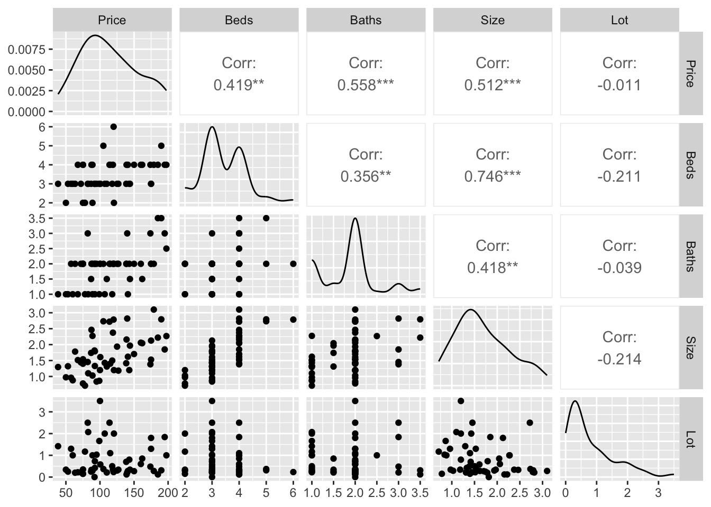
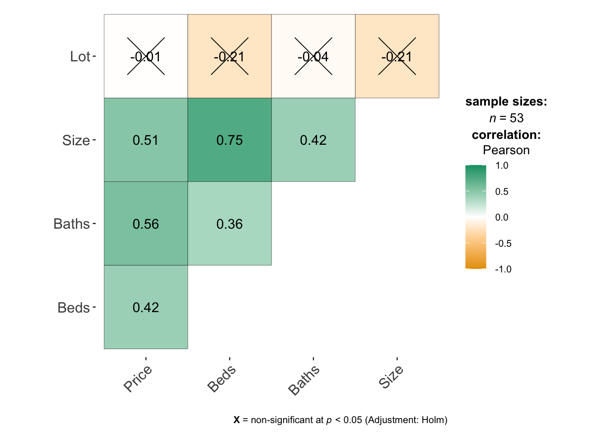

# Correlation

## Basics

To find the correlation between two variables, you can simply use the cor function e.g.


```r
cor(HousesNY$Price,HousesNY$Beds)
```

```
## [1] 0.4191355
```

To see the correlation between ALL columns we can make a "correlation matrix"

## Covariance/Correlation matrix plots 

Looking at correlations is a quick (but often misleading) way to assess what is happening. Essentially we can look at the correlation between each column of data.


```r
# Choose column names - let's say I don't care about location
colnames(HousesNY)
```

```
## [1] "Price" "Beds"  "Baths" "Size"  "Lot"
```

```r
# Create plot - note I have message=TRUE and warning=TRUE turned on at the top of my code chunk
ggpairs(HousesNY[,c("Price","Beds" ,"Baths","Size" , "Lot"   )])
```



You can simply look at the correlations of any NUMERIC columns using the corrplot code.


```r
library(corrplot)
house.numeric.columns <- HousesNY[ , sapply(HousesNY,is.numeric)]

corrplot(cor(house.numeric.columns),method="ellipse",type="lower")
```



There are LOADS of other ways to run correlation plots here: https://www.r-graph-gallery.com/correlogram.html Feel free to choose a favourite.

Importantly, remember back to this website - https://www.tylervigen.com/spurious-correlations. Just because another variable is correlated with our response does not mean it HAS to be in the model. It simply means that you might want to consider whether there is a reason for that correlation.

<br> <br>


