{width="80%"}

# FINAL PROJECT EXAMPLE: Movie Ratings {.unnumbered}

## Introduction {.unnumbered}

In the film industry, predictive modeling and machine learning are increasingly used to help studios make data-driven decisions and predict the success of films. From forecasting box office revenue to optimizing marketing campaigns, these models provide insights that can significantly influence a film's profitability. Additionally, machine learning algorithms can analyze viewer preferences and behaviors, enabling studios to tailor content to specific audiences.

A key data source for the film industry is the Rotten Tomatoes website, an online aggregator that compiles critic and audience reviews into a "Tomatometer" score. This score, distinguishing films as "Fresh" or "Rotten," heavily influences viewer perceptions and can drive box office success, as many potential viewers consult these ratings before choosing to see a film.

The aim is to assess how different factors, including the rotten tomatoes score, influences the domestic gross profit of a MAINSTREAM film (not a pilot run) for Lion Studios, using a training dataset based on 116 movies released in 2011. This dataset includes the following variables.

+-------------------------------+--------------------------------------------------------------------------------------------------------------------------------------------------------------------------------------------+
| Variable Name                 | Description                                                                                                                                                                                |
+===============================+============================================================================================================================================================================================+
| *Name*                        | Film Name                                                                                                                                                                                  |
+-------------------------------+--------------------------------------------------------------------------------------------------------------------------------------------------------------------------------------------+
| *DomesticGross (million USD)* | Gross revenue in the US by the end of 2011, in millions of dollars                                                                                                                         |
+-------------------------------+--------------------------------------------------------------------------------------------------------------------------------------------------------------------------------------------+
| *RottenTomatoes (%)*          | Percentage rating from critics reviews on Rotten Tomatoes                                                                                                                                  |
+-------------------------------+--------------------------------------------------------------------------------------------------------------------------------------------------------------------------------------------+
| *AudienceScore (%)*           | Percentage audience rating from opening weekend surveys                                                                                                                                    |
+-------------------------------+--------------------------------------------------------------------------------------------------------------------------------------------------------------------------------------------+
| *TheatersOpenWeek*            | Number of cinemas showing the movie on opening weekend. *Films that were shown in less than 1000 cinemas are considered 'pilot/test' showings that should not be included in the analysis* |
+-------------------------------+--------------------------------------------------------------------------------------------------------------------------------------------------------------------------------------------+
| *BOAverageOpenWeek (USD)*     | Average box office revenue per theater opening weekend, in dollars                                                                                                                         |
+-------------------------------+--------------------------------------------------------------------------------------------------------------------------------------------------------------------------------------------+
| *Profitability (categorical)* | **Loss**: The film cost more to make than it gained as profit. \                                                                                                                           |
|                               | **Average**: 100-300% of the budget spent was gained as profit. \                                                                                                                          |
|                               | **High**: Greater than 300% of the budget spent was gained as profit.                                                                                                                      |
+-------------------------------+--------------------------------------------------------------------------------------------------------------------------------------------------------------------------------------------+

A sample of the data can be seen here.


```r
head(as.data.frame(movies))
```

```
##                    Name DomesticGross RottenTomatoes AudienceScore
## 1           The Dilemma          0.03              6            53
## 2                 Hanna          0.97             62            57
## 3 Friends With Benefits          4.40             66            55
## 4              Scream 4          4.46             46            66
## 5          Dolphin Tale          5.31             83            84
## 6               One Day          6.93             28            46
##   TheatersOpenWeek BOAverageOpenWeek Profitability
## 1                3              2972          Loss
## 2               22              4890          Loss
## 3              106              6111          Loss
## 4              265              3856          Loss
## 5              247              7174          Loss
## 6             2003              1730          Loss
```

<br><br>

## Exploratory data analysis {.unnumbered}

The training data for this project includes information on 116 movies released in 2011:

-   **Object of analysis:** An individual film

-   **Population:** All films released by Lion Studios from 2011-present

-   **Response variable:** *DomesticGross (millions of USD)*

It is difficult in this case to assess whether the dataset is truly representative of the film industry now. With the rise of digital technology, streaming and COVID, the situation at present may look very different. Equally, there have been concerns about whether rotten tomatoes is gender neutral (as many more men than women appear to vote, further skewing the results towards films men are likely to watch). That said, this is the data available for this study, so we shall continue as requested.

<br><br>

### Data wrangling {.unnumbered}


```r
movies$Profitability <- as.factor(movies$Profitability)
summary(movies)
```

```
##      Name           DomesticGross    RottenTomatoes  AudienceScore  
##  Length:117         Min.   :  0.03   Min.   : 4.00   Min.   :25.00  
##  Class :character   1st Qu.: 24.82   1st Qu.:30.00   1st Qu.:49.00  
##  Mode  :character   Median : 43.85   Median :49.00   Median :59.00  
##                     Mean   : 71.57   Mean   :52.45   Mean   :61.44  
##                     3rd Qu.: 98.80   3rd Qu.:76.00   3rd Qu.:76.00  
##                     Max.   :381.01   Max.   :97.00   Max.   :93.00  
##  TheatersOpenWeek BOAverageOpenWeek Profitability
##  Min.   :   3     Min.   : 1513     Average:58   
##  1st Qu.:2555     1st Qu.: 3782     High   :40   
##  Median :2996     Median : 5715     Loss   :19   
##  Mean   :2839     Mean   : 8407                  
##  3rd Qu.:3417     3rd Qu.: 8995                  
##  Max.   :4375     Max.   :93230
```

The studio (Dr G), asked for me to only assess mainstream movies rather than pilot or test showings. They defined this as films shown in over 1000 theatres in their opening week and it is clear from the summary that there are pilot films in the dataset. This means I am filtering down to the correct,mainstream-film sub-set.


```r
movies <- filter(movies,TheatersOpenWeek > 1000)
```

<br><br>

### Response Variable Analysis {.unnumbered}


```r
gghistostats(DomesticGross,data=movies,results.subtitle=FALSE)
```

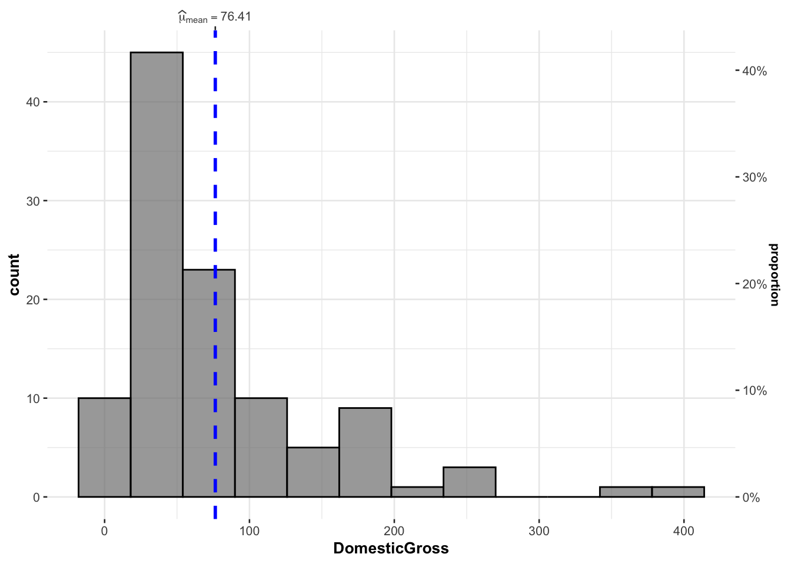

As shown in the summary above, the domestic gross of films in the sample ranges from \$400,000 (Friends with Benefits) to \$381 million USD (Harry Potter and the Deathly Hallows II) with a mean domestic gross profit of \$76.41 million and a median value of \$51.93 million USD. As shown in the histogram, the data is highly skewed, with the films Harry Potter and 30 Minutes or Less making substantially more money than other films released in 2011.

<br><br>

### Correlation Matrix {.unnumbered}

Correlation matrices are a quick and easy way of assessing whether there is a linear relationship between many sets of variables. However it is important to note that it will only "see" linear relationships, a complex pattern such as a curve will not be reflected in the statistics.


```r
# remove the name column and the factor column

movies.numeric <- movies[ , sapply(movies,is.numeric)]
corrplot(cor(movies.numeric), type = "lower", tl.col = "black", tl.srt = 45)
```

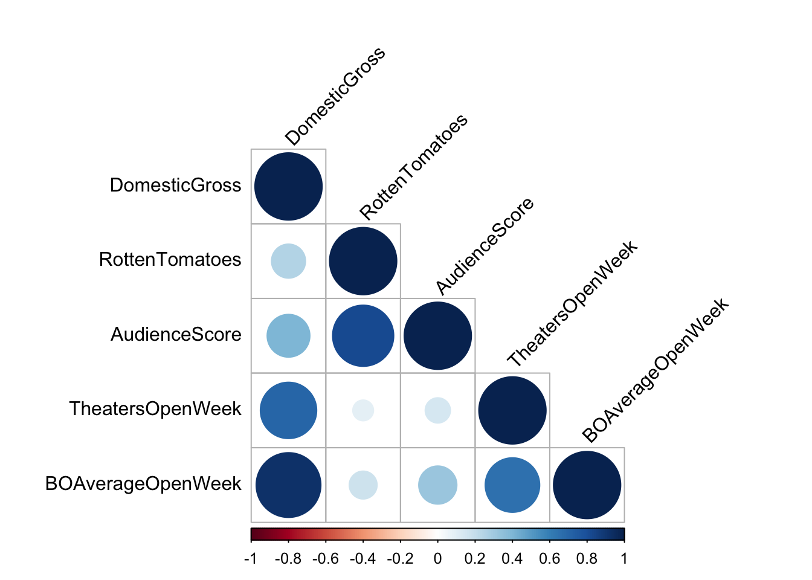

The matrix suggests a strong relationship between the domestic gross and almost all the other scores provided, especially the number of theaters showing the film in its opening week. We can examine this in more detail (and include the profitability categorical variable) through looking at the individual scatterplots.


```r
# remove the names variable
ggpairs(movies[,-1])
```

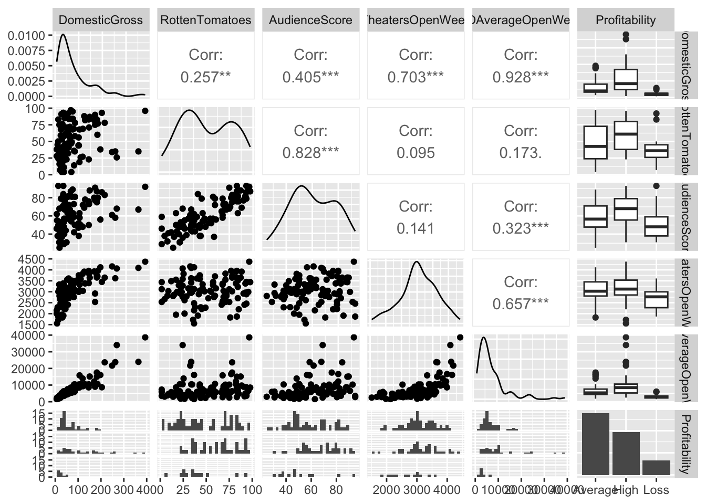

Here we can see that, for most predictors, there is a somewhat complex relationship with domestic gross profits. It seems that profitability also might play a role.

<br><br>

## Single Predictor models {.unnumbered}

As requested, we shall now compute and compare two single predictor, simple linear regression models. Also as requested, I have chosen two predictor variables I consider to be 'interesting' from my summary analysis above:

1.  **The number of theaters showing the film in its opening week (`TheatersOpenWeek`).** I chose this because it has the highest correlation out of all the predictor variables.

2.  **Average box office revenue per theater opening weekend, in dollars (`BOAverageOpenWeek`).** I chose this because of a reasonably strong positive correlation, and from looking at the ggpairs matrix, the potential that investigating some outliers might increase the predictability further.

<br><br>

### Model 1a: TheatersOpenWeek {.unnumbered}


```r
# Scatterplot 
myplot <- ggplot(movies, aes(x=TheatersOpenWeek, y=DomesticGross)) + 
    geom_point() + 
    xlab("Number of theaters") + ylab("Domestic Gross Profit")+
    geom_smooth(method=lm , color="blue", se=TRUE) +
    theme_ipsum()
ggplotly(myplot)
```

```{=html}
<div class="plotly html-widget html-fill-item" id="htmlwidget-db71f24f32037e371377" style="width:672px;height:480px;"></div>
<script type="application/json" data-for="htmlwidget-db71f24f32037e371377">{"x":{"data":[{"x":[2003,2150,1552,2290,2273,1869,1719,3002,2996,3328,3114,2806,2296,3017,2661,3117,2769,2473,2787,2760,2816,2555,2986,2405,1952,3118,2864,2703,1826,2985,3276,3376,2875,2886,2458,1910,2973,3033,3122,2614,2888,2913,2534,2802,3030,3305,3295,2535,2199,3155,2214,2950,2940,3549,3167,2408,2961,3154,2926,3606,2707,2817,2840,3043,3440,3339,3438,3018,3507,2993,3367,3222,2756,3482,3112,3417,3440,3020,3584,2994,3750,3049,3548,3321,3579,3816,3040,3917,3379,3952,3395,3826,3641,3925,2918,2534,3715,3648,3703,3955,4115,3448,3644,4155,3615,4061,4088,4375],"y":[6.9299999999999997,7.1699999999999999,8.3100000000000005,10.720000000000001,13.07,13.66,13.84,14.01,16.93,17.690000000000001,18.300000000000001,18.879999999999999,19.489999999999998,20.25,21.300000000000001,21.390000000000001,21.600000000000001,23.18,23.199999999999999,24.050000000000001,24.800000000000001,24.82,25.120000000000001,26.690000000000001,27.870000000000001,28.07,29.140000000000001,29.199999999999999,31.18,33,33.039999999999999,33.700000000000003,34.039999999999999,34.68,34.899999999999999,35.060000000000002,35.609999999999999,36.390000000000001,36.490000000000002,36.670000000000002,37.049999999999997,37.079999999999998,37.299999999999997,37.409999999999997,37.659999999999997,38.18,38.539999999999999,40.259999999999998,40.490000000000002,42.590000000000003,43.850000000000001,45.060000000000002,48.5,51.159999999999997,52.700000000000003,54.009999999999998,54.710000000000001,55.100000000000001,55.799999999999997,57.310000000000002,58.009999999999998,58.710000000000001,62.5,63.689999999999998,66.629999999999995,68.219999999999999,68.909999999999997,70.599999999999994,71.079999999999998,74.209999999999994,74.5,75.640000000000001,79.25,80.359999999999999,80.489999999999995,83.549999999999997,83.609999999999999,84.340000000000003,98.799999999999997,99.969999999999999,100.23999999999999,100.29000000000001,103.03,103.66,108.09,116.59999999999999,117.54000000000001,123.26000000000001,127,142.09,142.61000000000001,143.62,146.41,165.25,169.11000000000001,169.22,176.65000000000001,176.69999999999999,179.03999999999999,181.03,191.44999999999999,197.80000000000001,209.83000000000001,241.06999999999999,254.46000000000001,260.80000000000001,352.38999999999999,381.00999999999999],"text":["TheatersOpenWeek: 2003<br />DomesticGross:   6.93","TheatersOpenWeek: 2150<br />DomesticGross:   7.17","TheatersOpenWeek: 1552<br />DomesticGross:   8.31","TheatersOpenWeek: 2290<br />DomesticGross:  10.72","TheatersOpenWeek: 2273<br />DomesticGross:  13.07","TheatersOpenWeek: 1869<br />DomesticGross:  13.66","TheatersOpenWeek: 1719<br />DomesticGross:  13.84","TheatersOpenWeek: 3002<br />DomesticGross:  14.01","TheatersOpenWeek: 2996<br />DomesticGross:  16.93","TheatersOpenWeek: 3328<br />DomesticGross:  17.69","TheatersOpenWeek: 3114<br />DomesticGross:  18.30","TheatersOpenWeek: 2806<br />DomesticGross:  18.88","TheatersOpenWeek: 2296<br />DomesticGross:  19.49","TheatersOpenWeek: 3017<br />DomesticGross:  20.25","TheatersOpenWeek: 2661<br />DomesticGross:  21.30","TheatersOpenWeek: 3117<br />DomesticGross:  21.39","TheatersOpenWeek: 2769<br />DomesticGross:  21.60","TheatersOpenWeek: 2473<br />DomesticGross:  23.18","TheatersOpenWeek: 2787<br />DomesticGross:  23.20","TheatersOpenWeek: 2760<br />DomesticGross:  24.05","TheatersOpenWeek: 2816<br />DomesticGross:  24.80","TheatersOpenWeek: 2555<br />DomesticGross:  24.82","TheatersOpenWeek: 2986<br />DomesticGross:  25.12","TheatersOpenWeek: 2405<br />DomesticGross:  26.69","TheatersOpenWeek: 1952<br />DomesticGross:  27.87","TheatersOpenWeek: 3118<br />DomesticGross:  28.07","TheatersOpenWeek: 2864<br />DomesticGross:  29.14","TheatersOpenWeek: 2703<br />DomesticGross:  29.20","TheatersOpenWeek: 1826<br />DomesticGross:  31.18","TheatersOpenWeek: 2985<br />DomesticGross:  33.00","TheatersOpenWeek: 3276<br />DomesticGross:  33.04","TheatersOpenWeek: 3376<br />DomesticGross:  33.70","TheatersOpenWeek: 2875<br />DomesticGross:  34.04","TheatersOpenWeek: 2886<br />DomesticGross:  34.68","TheatersOpenWeek: 2458<br />DomesticGross:  34.90","TheatersOpenWeek: 1910<br />DomesticGross:  35.06","TheatersOpenWeek: 2973<br />DomesticGross:  35.61","TheatersOpenWeek: 3033<br />DomesticGross:  36.39","TheatersOpenWeek: 3122<br />DomesticGross:  36.49","TheatersOpenWeek: 2614<br />DomesticGross:  36.67","TheatersOpenWeek: 2888<br />DomesticGross:  37.05","TheatersOpenWeek: 2913<br />DomesticGross:  37.08","TheatersOpenWeek: 2534<br />DomesticGross:  37.30","TheatersOpenWeek: 2802<br />DomesticGross:  37.41","TheatersOpenWeek: 3030<br />DomesticGross:  37.66","TheatersOpenWeek: 3305<br />DomesticGross:  38.18","TheatersOpenWeek: 3295<br />DomesticGross:  38.54","TheatersOpenWeek: 2535<br />DomesticGross:  40.26","TheatersOpenWeek: 2199<br />DomesticGross:  40.49","TheatersOpenWeek: 3155<br />DomesticGross:  42.59","TheatersOpenWeek: 2214<br />DomesticGross:  43.85","TheatersOpenWeek: 2950<br />DomesticGross:  45.06","TheatersOpenWeek: 2940<br />DomesticGross:  48.50","TheatersOpenWeek: 3549<br />DomesticGross:  51.16","TheatersOpenWeek: 3167<br />DomesticGross:  52.70","TheatersOpenWeek: 2408<br />DomesticGross:  54.01","TheatersOpenWeek: 2961<br />DomesticGross:  54.71","TheatersOpenWeek: 3154<br />DomesticGross:  55.10","TheatersOpenWeek: 2926<br />DomesticGross:  55.80","TheatersOpenWeek: 3606<br />DomesticGross:  57.31","TheatersOpenWeek: 2707<br />DomesticGross:  58.01","TheatersOpenWeek: 2817<br />DomesticGross:  58.71","TheatersOpenWeek: 2840<br />DomesticGross:  62.50","TheatersOpenWeek: 3043<br />DomesticGross:  63.69","TheatersOpenWeek: 3440<br />DomesticGross:  66.63","TheatersOpenWeek: 3339<br />DomesticGross:  68.22","TheatersOpenWeek: 3438<br />DomesticGross:  68.91","TheatersOpenWeek: 3018<br />DomesticGross:  70.60","TheatersOpenWeek: 3507<br />DomesticGross:  71.08","TheatersOpenWeek: 2993<br />DomesticGross:  74.21","TheatersOpenWeek: 3367<br />DomesticGross:  74.50","TheatersOpenWeek: 3222<br />DomesticGross:  75.64","TheatersOpenWeek: 2756<br />DomesticGross:  79.25","TheatersOpenWeek: 3482<br />DomesticGross:  80.36","TheatersOpenWeek: 3112<br />DomesticGross:  80.49","TheatersOpenWeek: 3417<br />DomesticGross:  83.55","TheatersOpenWeek: 3440<br />DomesticGross:  83.61","TheatersOpenWeek: 3020<br />DomesticGross:  84.34","TheatersOpenWeek: 3584<br />DomesticGross:  98.80","TheatersOpenWeek: 2994<br />DomesticGross:  99.97","TheatersOpenWeek: 3750<br />DomesticGross: 100.24","TheatersOpenWeek: 3049<br />DomesticGross: 100.29","TheatersOpenWeek: 3548<br />DomesticGross: 103.03","TheatersOpenWeek: 3321<br />DomesticGross: 103.66","TheatersOpenWeek: 3579<br />DomesticGross: 108.09","TheatersOpenWeek: 3816<br />DomesticGross: 116.60","TheatersOpenWeek: 3040<br />DomesticGross: 117.54","TheatersOpenWeek: 3917<br />DomesticGross: 123.26","TheatersOpenWeek: 3379<br />DomesticGross: 127.00","TheatersOpenWeek: 3952<br />DomesticGross: 142.09","TheatersOpenWeek: 3395<br />DomesticGross: 142.61","TheatersOpenWeek: 3826<br />DomesticGross: 143.62","TheatersOpenWeek: 3641<br />DomesticGross: 146.41","TheatersOpenWeek: 3925<br />DomesticGross: 165.25","TheatersOpenWeek: 2918<br />DomesticGross: 169.11","TheatersOpenWeek: 2534<br />DomesticGross: 169.22","TheatersOpenWeek: 3715<br />DomesticGross: 176.65","TheatersOpenWeek: 3648<br />DomesticGross: 176.70","TheatersOpenWeek: 3703<br />DomesticGross: 179.04","TheatersOpenWeek: 3955<br />DomesticGross: 181.03","TheatersOpenWeek: 4115<br />DomesticGross: 191.45","TheatersOpenWeek: 3448<br />DomesticGross: 197.80","TheatersOpenWeek: 3644<br />DomesticGross: 209.83","TheatersOpenWeek: 4155<br />DomesticGross: 241.07","TheatersOpenWeek: 3615<br />DomesticGross: 254.46","TheatersOpenWeek: 4061<br />DomesticGross: 260.80","TheatersOpenWeek: 4088<br />DomesticGross: 352.39","TheatersOpenWeek: 4375<br />DomesticGross: 381.01"],"type":"scatter","mode":"markers","marker":{"autocolorscale":false,"color":"rgba(0,0,0,1)","opacity":1,"size":5.6692913385826778,"symbol":"circle","line":{"width":1.8897637795275593,"color":"rgba(0,0,0,1)"}},"hoveron":"points","showlegend":false,"xaxis":"x","yaxis":"y","hoverinfo":"text","frame":null},{"x":[1552,1587.7341772151899,1623.4683544303798,1659.2025316455697,1694.9367088607596,1730.6708860759493,1766.4050632911392,1802.1392405063291,1837.873417721519,1873.6075949367089,1909.3417721518988,1945.0759493670885,1980.8101265822784,2016.5443037974683,2052.2784810126582,2088.0126582278481,2123.746835443038,2159.4810126582279,2195.2151898734178,2230.9493670886077,2266.6835443037976,2302.4177215189875,2338.1518987341769,2373.8860759493673,2409.6202531645567,2445.3544303797471,2481.0886075949365,2516.8227848101264,2552.5569620253164,2588.2911392405063,2624.0253164556962,2659.7594936708861,2695.493670886076,2731.2278481012659,2766.9620253164558,2802.6962025316457,2838.4303797468356,2874.164556962025,2909.8987341772154,2945.6329113924048,2981.3670886075952,3017.1012658227846,3052.835443037975,3088.5696202531644,3124.3037974683543,3160.0379746835442,3195.7721518987341,3231.506329113924,3267.2405063291139,3302.9746835443038,3338.7088607594937,3374.4430379746836,3410.1772151898736,3445.9113924050635,3481.6455696202529,3517.3797468354433,3553.1139240506327,3588.8481012658231,3624.5822784810125,3660.3164556962024,3696.0506329113923,3731.7848101265822,3767.5189873417721,3803.253164556962,3838.9873417721519,3874.7215189873418,3910.4556962025317,3946.1898734177216,3981.9240506329115,4017.6582278481014,4053.3924050632913,4089.1265822784812,4124.8607594936711,4160.5949367088606,4196.32911392405,4232.0632911392404,4267.7974683544307,4303.5316455696202,4339.2658227848096,4375],"y":[-54.38392443872857,-51.27333390978805,-48.16274338084753,-45.05215285190701,-41.94156232296649,-38.830971794025999,-35.720381265085479,-32.609790736144959,-29.499200207204439,-26.388609678263919,-23.278019149323399,-20.167428620382907,-17.056838091442387,-13.946247562501867,-10.835657033561347,-7.7250665046208269,-4.6144759756803353,-1.5038854467398153,1.6067050822007047,4.7172956111412248,7.8278861400817448,10.938476669022265,14.049067197962756,17.159657726903305,20.270248255843796,23.380838784784345,26.491429313724808,29.602019842665328,32.712610371605848,35.823200900546368,38.933791429486888,42.044381958427408,45.154972487367928,48.265563016308448,51.376153545248968,54.486744074189488,57.597334603130008,60.707925132070471,63.818515661011048,66.92910618995154,70.03969671889206,73.150287247832523,76.2608777767731,79.371468305713563,82.482058834654083,85.592649363594603,88.703239892535123,91.813830421475643,94.924420950416163,98.035011479356683,101.1456020082972,104.25619253723772,107.36678306617824,110.47737359511876,113.58796412405923,116.6985546529998,119.80914518194027,122.91973571088084,126.03032623982131,129.14091676876183,132.25150729770235,135.36209782664287,138.47268835558339,141.58327888452391,144.69386941346443,147.80445994240495,150.91505047134547,154.02564100028599,157.13623152922651,160.24682205816703,163.35741258710755,166.46800311604807,169.57859364498859,172.68918417392905,175.79977470286951,178.91036523181009,182.02095576075067,185.13154628969113,188.24213681863159,191.35272734757217],"text":["TheatersOpenWeek: 1552.000<br />DomesticGross: -54.383924","TheatersOpenWeek: 1587.734<br />DomesticGross: -51.273334","TheatersOpenWeek: 1623.468<br />DomesticGross: -48.162743","TheatersOpenWeek: 1659.203<br />DomesticGross: -45.052153","TheatersOpenWeek: 1694.937<br />DomesticGross: -41.941562","TheatersOpenWeek: 1730.671<br />DomesticGross: -38.830972","TheatersOpenWeek: 1766.405<br />DomesticGross: -35.720381","TheatersOpenWeek: 1802.139<br />DomesticGross: -32.609791","TheatersOpenWeek: 1837.873<br />DomesticGross: -29.499200","TheatersOpenWeek: 1873.608<br />DomesticGross: -26.388610","TheatersOpenWeek: 1909.342<br />DomesticGross: -23.278019","TheatersOpenWeek: 1945.076<br />DomesticGross: -20.167429","TheatersOpenWeek: 1980.810<br />DomesticGross: -17.056838","TheatersOpenWeek: 2016.544<br />DomesticGross: -13.946248","TheatersOpenWeek: 2052.278<br />DomesticGross: -10.835657","TheatersOpenWeek: 2088.013<br />DomesticGross:  -7.725067","TheatersOpenWeek: 2123.747<br />DomesticGross:  -4.614476","TheatersOpenWeek: 2159.481<br />DomesticGross:  -1.503885","TheatersOpenWeek: 2195.215<br />DomesticGross:   1.606705","TheatersOpenWeek: 2230.949<br />DomesticGross:   4.717296","TheatersOpenWeek: 2266.684<br />DomesticGross:   7.827886","TheatersOpenWeek: 2302.418<br />DomesticGross:  10.938477","TheatersOpenWeek: 2338.152<br />DomesticGross:  14.049067","TheatersOpenWeek: 2373.886<br />DomesticGross:  17.159658","TheatersOpenWeek: 2409.620<br />DomesticGross:  20.270248","TheatersOpenWeek: 2445.354<br />DomesticGross:  23.380839","TheatersOpenWeek: 2481.089<br />DomesticGross:  26.491429","TheatersOpenWeek: 2516.823<br />DomesticGross:  29.602020","TheatersOpenWeek: 2552.557<br />DomesticGross:  32.712610","TheatersOpenWeek: 2588.291<br />DomesticGross:  35.823201","TheatersOpenWeek: 2624.025<br />DomesticGross:  38.933791","TheatersOpenWeek: 2659.759<br />DomesticGross:  42.044382","TheatersOpenWeek: 2695.494<br />DomesticGross:  45.154972","TheatersOpenWeek: 2731.228<br />DomesticGross:  48.265563","TheatersOpenWeek: 2766.962<br />DomesticGross:  51.376154","TheatersOpenWeek: 2802.696<br />DomesticGross:  54.486744","TheatersOpenWeek: 2838.430<br />DomesticGross:  57.597335","TheatersOpenWeek: 2874.165<br />DomesticGross:  60.707925","TheatersOpenWeek: 2909.899<br />DomesticGross:  63.818516","TheatersOpenWeek: 2945.633<br />DomesticGross:  66.929106","TheatersOpenWeek: 2981.367<br />DomesticGross:  70.039697","TheatersOpenWeek: 3017.101<br />DomesticGross:  73.150287","TheatersOpenWeek: 3052.835<br />DomesticGross:  76.260878","TheatersOpenWeek: 3088.570<br />DomesticGross:  79.371468","TheatersOpenWeek: 3124.304<br />DomesticGross:  82.482059","TheatersOpenWeek: 3160.038<br />DomesticGross:  85.592649","TheatersOpenWeek: 3195.772<br />DomesticGross:  88.703240","TheatersOpenWeek: 3231.506<br />DomesticGross:  91.813830","TheatersOpenWeek: 3267.241<br />DomesticGross:  94.924421","TheatersOpenWeek: 3302.975<br />DomesticGross:  98.035011","TheatersOpenWeek: 3338.709<br />DomesticGross: 101.145602","TheatersOpenWeek: 3374.443<br />DomesticGross: 104.256193","TheatersOpenWeek: 3410.177<br />DomesticGross: 107.366783","TheatersOpenWeek: 3445.911<br />DomesticGross: 110.477374","TheatersOpenWeek: 3481.646<br />DomesticGross: 113.587964","TheatersOpenWeek: 3517.380<br />DomesticGross: 116.698555","TheatersOpenWeek: 3553.114<br />DomesticGross: 119.809145","TheatersOpenWeek: 3588.848<br />DomesticGross: 122.919736","TheatersOpenWeek: 3624.582<br />DomesticGross: 126.030326","TheatersOpenWeek: 3660.316<br />DomesticGross: 129.140917","TheatersOpenWeek: 3696.051<br />DomesticGross: 132.251507","TheatersOpenWeek: 3731.785<br />DomesticGross: 135.362098","TheatersOpenWeek: 3767.519<br />DomesticGross: 138.472688","TheatersOpenWeek: 3803.253<br />DomesticGross: 141.583279","TheatersOpenWeek: 3838.987<br />DomesticGross: 144.693869","TheatersOpenWeek: 3874.722<br />DomesticGross: 147.804460","TheatersOpenWeek: 3910.456<br />DomesticGross: 150.915050","TheatersOpenWeek: 3946.190<br />DomesticGross: 154.025641","TheatersOpenWeek: 3981.924<br />DomesticGross: 157.136232","TheatersOpenWeek: 4017.658<br />DomesticGross: 160.246822","TheatersOpenWeek: 4053.392<br />DomesticGross: 163.357413","TheatersOpenWeek: 4089.127<br />DomesticGross: 166.468003","TheatersOpenWeek: 4124.861<br />DomesticGross: 169.578594","TheatersOpenWeek: 4160.595<br />DomesticGross: 172.689184","TheatersOpenWeek: 4196.329<br />DomesticGross: 175.799775","TheatersOpenWeek: 4232.063<br />DomesticGross: 178.910365","TheatersOpenWeek: 4267.797<br />DomesticGross: 182.020956","TheatersOpenWeek: 4303.532<br />DomesticGross: 185.131546","TheatersOpenWeek: 4339.266<br />DomesticGross: 188.242137","TheatersOpenWeek: 4375.000<br />DomesticGross: 191.352727"],"type":"scatter","mode":"lines","name":"fitted values","line":{"width":3.7795275590551185,"color":"rgba(0,0,255,1)","dash":"solid"},"hoveron":"points","showlegend":false,"xaxis":"x","yaxis":"y","hoverinfo":"text","frame":null},{"x":[1552,1587.7341772151899,1623.4683544303798,1659.2025316455697,1694.9367088607596,1730.6708860759493,1766.4050632911392,1802.1392405063291,1837.873417721519,1873.6075949367089,1909.3417721518988,1945.0759493670885,1980.8101265822784,2016.5443037974683,2052.2784810126582,2088.0126582278481,2123.746835443038,2159.4810126582279,2195.2151898734178,2230.9493670886077,2266.6835443037976,2302.4177215189875,2338.1518987341769,2373.8860759493673,2409.6202531645567,2445.3544303797471,2481.0886075949365,2516.8227848101264,2552.5569620253164,2588.2911392405063,2624.0253164556962,2659.7594936708861,2695.493670886076,2731.2278481012659,2766.9620253164558,2802.6962025316457,2838.4303797468356,2874.164556962025,2909.8987341772154,2945.6329113924048,2981.3670886075952,3017.1012658227846,3052.835443037975,3088.5696202531644,3124.3037974683543,3160.0379746835442,3195.7721518987341,3231.506329113924,3267.2405063291139,3302.9746835443038,3338.7088607594937,3374.4430379746836,3410.1772151898736,3445.9113924050635,3481.6455696202529,3517.3797468354433,3553.1139240506327,3588.8481012658231,3624.5822784810125,3660.3164556962024,3696.0506329113923,3731.7848101265822,3767.5189873417721,3803.253164556962,3838.9873417721519,3874.7215189873418,3910.4556962025317,3946.1898734177216,3981.9240506329115,4017.6582278481014,4053.3924050632913,4089.1265822784812,4124.8607594936711,4160.5949367088606,4196.32911392405,4232.0632911392404,4267.7974683544307,4303.5316455696202,4339.2658227848096,4375,4375,4375,4339.2658227848096,4303.5316455696202,4267.7974683544307,4232.0632911392404,4196.32911392405,4160.5949367088606,4124.8607594936711,4089.1265822784812,4053.3924050632913,4017.6582278481014,3981.9240506329115,3946.1898734177216,3910.4556962025317,3874.7215189873418,3838.9873417721519,3803.253164556962,3767.5189873417721,3731.7848101265822,3696.0506329113923,3660.3164556962024,3624.5822784810125,3588.8481012658231,3553.1139240506327,3517.3797468354433,3481.6455696202529,3445.9113924050635,3410.1772151898736,3374.4430379746836,3338.7088607594937,3302.9746835443038,3267.2405063291139,3231.506329113924,3195.7721518987341,3160.0379746835442,3124.3037974683543,3088.5696202531644,3052.835443037975,3017.1012658227846,2981.3670886075952,2945.6329113924048,2909.8987341772154,2874.164556962025,2838.4303797468356,2802.6962025316457,2766.9620253164558,2731.2278481012659,2695.493670886076,2659.7594936708861,2624.0253164556962,2588.2911392405063,2552.5569620253164,2516.8227848101264,2481.0886075949365,2445.3544303797471,2409.6202531645567,2373.8860759493673,2338.1518987341769,2302.4177215189875,2266.6835443037976,2230.9493670886077,2195.2151898734178,2159.4810126582279,2123.746835443038,2088.0126582278481,2052.2784810126582,2016.5443037974683,1980.8101265822784,1945.0759493670885,1909.3417721518988,1873.6075949367089,1837.873417721519,1802.1392405063291,1766.4050632911392,1730.6708860759493,1694.9367088607596,1659.2025316455697,1623.4683544303798,1587.7341772151899,1552,1552],"y":[-81.649365651721155,-77.972974572704587,-74.298393808526015,-70.625743131451003,-66.955152650094561,-63.286763890787782,-59.620731008675186,-55.95722214542451,-52.29642095262318,-48.638528302360498,-44.983764209139281,-41.332369990104553,-37.684610693568402,-34.040777828858396,-30.401192433474343,-26.76620851617599,-23.136216916596375,-19.511649622778773,-15.892984586947456,-12.280751075827894,-8.6755355835337795,-5.0779883205395713,-1.4888302690514887,2.0911392400623665,5.6610345247657605,9.2198752917305331,12.766578384766813,16.299949937877301,19.818678494910991,23.321329861015514,26.806344686808316,30.272040039200714,33.716616452120064,37.138172123820105,40.534725958505334,43.904250940612144,47.244718774990275,50.554155742965783,53.830708299611779,57.072715180613699,60.278780966324469,63.447844581796261,66.579235570723981,69.672711546034805,72.728472093351698,75.747147308542409,78.72976247133461,81.677683333672107,84.592548493827678,87.47619602060054,90.330590954943816,93.157758907419677,95.959729163174686,98.738488928515494,101.49594888900307,104.23391922178565,106.9540946110339,109.658046576865,112.34722144035349,115.02294241057585,117.68641451520328,120.33873134950305,122.98088285689077,125.61376356090094,128.23818083799705,130.85486295388225,133.46446668703783,136.06758443750124,138.66475077184154,141.25644839180799,143.84311353834144,146.42514085786155,149.00288776655435,151.5766783527277,154.14680685862422,156.71354078242513,159.27712363929544,161.83777741773108,164.39570476453002,166.95109092866156,166.95109092866156,215.75436376648278,212.08856887273316,208.42531516165118,204.76478788220589,201.10718968119505,197.45274254711481,193.8016899951304,190.15429952342282,186.51086537423458,182.87171163587365,179.23719572452606,175.60771228661147,171.98369756307073,168.36563425565311,164.75405693092765,161.1495579889318,157.55279420814688,153.96449385427599,150.38546430378267,146.8166000802014,143.25889112694779,139.71343103928911,136.18142484489667,132.66419575284664,129.16319008421394,125.67997935911538,122.21625826172203,118.7738369691818,115.35462616705577,111.96061306165059,108.59382693811283,105.25629340700465,101.94997750927918,98.676717313735637,95.438151418646797,92.235645575956468,89.070225065392322,85.942519982822219,82.852729913868785,79.800612471459658,76.785497199289381,73.806323022410311,70.861694521175153,67.949950431269741,65.069237207766832,62.217581131992603,59.392953908796791,56.593328522615792,53.816723877654098,51.06123817216546,48.325071940077223,45.606542248300705,42.904089747453355,40.216280242682799,37.541802277838158,34.879461986921832,32.228176213744241,29.586964664977003,26.954941658584101,24.331307863697269,21.715342298110343,19.106394751348866,16.503878729299142,13.907264965235704,11.316075506934336,8.7298783663516488,6.1482827038546652,3.5709345106836317,0.99751274933874257,-1.5722740895075198,-4.1386910541673423,-6.7019794617857009,-9.2623593268654041,-11.820031521495771,-14.375179697264219,-16.927971995838416,-19.478562572363021,-22.027092953169053,-24.57369324687151,-27.118483225735989,-81.649365651721155],"text":["TheatersOpenWeek: 1552.000<br />DomesticGross: -54.383924","TheatersOpenWeek: 1587.734<br />DomesticGross: -51.273334","TheatersOpenWeek: 1623.468<br />DomesticGross: -48.162743","TheatersOpenWeek: 1659.203<br />DomesticGross: -45.052153","TheatersOpenWeek: 1694.937<br />DomesticGross: -41.941562","TheatersOpenWeek: 1730.671<br />DomesticGross: -38.830972","TheatersOpenWeek: 1766.405<br />DomesticGross: -35.720381","TheatersOpenWeek: 1802.139<br />DomesticGross: -32.609791","TheatersOpenWeek: 1837.873<br />DomesticGross: -29.499200","TheatersOpenWeek: 1873.608<br />DomesticGross: -26.388610","TheatersOpenWeek: 1909.342<br />DomesticGross: -23.278019","TheatersOpenWeek: 1945.076<br />DomesticGross: -20.167429","TheatersOpenWeek: 1980.810<br />DomesticGross: -17.056838","TheatersOpenWeek: 2016.544<br />DomesticGross: -13.946248","TheatersOpenWeek: 2052.278<br />DomesticGross: -10.835657","TheatersOpenWeek: 2088.013<br />DomesticGross:  -7.725067","TheatersOpenWeek: 2123.747<br />DomesticGross:  -4.614476","TheatersOpenWeek: 2159.481<br />DomesticGross:  -1.503885","TheatersOpenWeek: 2195.215<br />DomesticGross:   1.606705","TheatersOpenWeek: 2230.949<br />DomesticGross:   4.717296","TheatersOpenWeek: 2266.684<br />DomesticGross:   7.827886","TheatersOpenWeek: 2302.418<br />DomesticGross:  10.938477","TheatersOpenWeek: 2338.152<br />DomesticGross:  14.049067","TheatersOpenWeek: 2373.886<br />DomesticGross:  17.159658","TheatersOpenWeek: 2409.620<br />DomesticGross:  20.270248","TheatersOpenWeek: 2445.354<br />DomesticGross:  23.380839","TheatersOpenWeek: 2481.089<br />DomesticGross:  26.491429","TheatersOpenWeek: 2516.823<br />DomesticGross:  29.602020","TheatersOpenWeek: 2552.557<br />DomesticGross:  32.712610","TheatersOpenWeek: 2588.291<br />DomesticGross:  35.823201","TheatersOpenWeek: 2624.025<br />DomesticGross:  38.933791","TheatersOpenWeek: 2659.759<br />DomesticGross:  42.044382","TheatersOpenWeek: 2695.494<br />DomesticGross:  45.154972","TheatersOpenWeek: 2731.228<br />DomesticGross:  48.265563","TheatersOpenWeek: 2766.962<br />DomesticGross:  51.376154","TheatersOpenWeek: 2802.696<br />DomesticGross:  54.486744","TheatersOpenWeek: 2838.430<br />DomesticGross:  57.597335","TheatersOpenWeek: 2874.165<br />DomesticGross:  60.707925","TheatersOpenWeek: 2909.899<br />DomesticGross:  63.818516","TheatersOpenWeek: 2945.633<br />DomesticGross:  66.929106","TheatersOpenWeek: 2981.367<br />DomesticGross:  70.039697","TheatersOpenWeek: 3017.101<br />DomesticGross:  73.150287","TheatersOpenWeek: 3052.835<br />DomesticGross:  76.260878","TheatersOpenWeek: 3088.570<br />DomesticGross:  79.371468","TheatersOpenWeek: 3124.304<br />DomesticGross:  82.482059","TheatersOpenWeek: 3160.038<br />DomesticGross:  85.592649","TheatersOpenWeek: 3195.772<br />DomesticGross:  88.703240","TheatersOpenWeek: 3231.506<br />DomesticGross:  91.813830","TheatersOpenWeek: 3267.241<br />DomesticGross:  94.924421","TheatersOpenWeek: 3302.975<br />DomesticGross:  98.035011","TheatersOpenWeek: 3338.709<br />DomesticGross: 101.145602","TheatersOpenWeek: 3374.443<br />DomesticGross: 104.256193","TheatersOpenWeek: 3410.177<br />DomesticGross: 107.366783","TheatersOpenWeek: 3445.911<br />DomesticGross: 110.477374","TheatersOpenWeek: 3481.646<br />DomesticGross: 113.587964","TheatersOpenWeek: 3517.380<br />DomesticGross: 116.698555","TheatersOpenWeek: 3553.114<br />DomesticGross: 119.809145","TheatersOpenWeek: 3588.848<br />DomesticGross: 122.919736","TheatersOpenWeek: 3624.582<br />DomesticGross: 126.030326","TheatersOpenWeek: 3660.316<br />DomesticGross: 129.140917","TheatersOpenWeek: 3696.051<br />DomesticGross: 132.251507","TheatersOpenWeek: 3731.785<br />DomesticGross: 135.362098","TheatersOpenWeek: 3767.519<br />DomesticGross: 138.472688","TheatersOpenWeek: 3803.253<br />DomesticGross: 141.583279","TheatersOpenWeek: 3838.987<br />DomesticGross: 144.693869","TheatersOpenWeek: 3874.722<br />DomesticGross: 147.804460","TheatersOpenWeek: 3910.456<br />DomesticGross: 150.915050","TheatersOpenWeek: 3946.190<br />DomesticGross: 154.025641","TheatersOpenWeek: 3981.924<br />DomesticGross: 157.136232","TheatersOpenWeek: 4017.658<br />DomesticGross: 160.246822","TheatersOpenWeek: 4053.392<br />DomesticGross: 163.357413","TheatersOpenWeek: 4089.127<br />DomesticGross: 166.468003","TheatersOpenWeek: 4124.861<br />DomesticGross: 169.578594","TheatersOpenWeek: 4160.595<br />DomesticGross: 172.689184","TheatersOpenWeek: 4196.329<br />DomesticGross: 175.799775","TheatersOpenWeek: 4232.063<br />DomesticGross: 178.910365","TheatersOpenWeek: 4267.797<br />DomesticGross: 182.020956","TheatersOpenWeek: 4303.532<br />DomesticGross: 185.131546","TheatersOpenWeek: 4339.266<br />DomesticGross: 188.242137","TheatersOpenWeek: 4375.000<br />DomesticGross: 191.352727","TheatersOpenWeek: 4375.000<br />DomesticGross: 191.352727","TheatersOpenWeek: 4375.000<br />DomesticGross: 191.352727","TheatersOpenWeek: 4339.266<br />DomesticGross: 188.242137","TheatersOpenWeek: 4303.532<br />DomesticGross: 185.131546","TheatersOpenWeek: 4267.797<br />DomesticGross: 182.020956","TheatersOpenWeek: 4232.063<br />DomesticGross: 178.910365","TheatersOpenWeek: 4196.329<br />DomesticGross: 175.799775","TheatersOpenWeek: 4160.595<br />DomesticGross: 172.689184","TheatersOpenWeek: 4124.861<br />DomesticGross: 169.578594","TheatersOpenWeek: 4089.127<br />DomesticGross: 166.468003","TheatersOpenWeek: 4053.392<br />DomesticGross: 163.357413","TheatersOpenWeek: 4017.658<br />DomesticGross: 160.246822","TheatersOpenWeek: 3981.924<br />DomesticGross: 157.136232","TheatersOpenWeek: 3946.190<br />DomesticGross: 154.025641","TheatersOpenWeek: 3910.456<br />DomesticGross: 150.915050","TheatersOpenWeek: 3874.722<br />DomesticGross: 147.804460","TheatersOpenWeek: 3838.987<br />DomesticGross: 144.693869","TheatersOpenWeek: 3803.253<br />DomesticGross: 141.583279","TheatersOpenWeek: 3767.519<br />DomesticGross: 138.472688","TheatersOpenWeek: 3731.785<br />DomesticGross: 135.362098","TheatersOpenWeek: 3696.051<br />DomesticGross: 132.251507","TheatersOpenWeek: 3660.316<br />DomesticGross: 129.140917","TheatersOpenWeek: 3624.582<br />DomesticGross: 126.030326","TheatersOpenWeek: 3588.848<br />DomesticGross: 122.919736","TheatersOpenWeek: 3553.114<br />DomesticGross: 119.809145","TheatersOpenWeek: 3517.380<br />DomesticGross: 116.698555","TheatersOpenWeek: 3481.646<br />DomesticGross: 113.587964","TheatersOpenWeek: 3445.911<br />DomesticGross: 110.477374","TheatersOpenWeek: 3410.177<br />DomesticGross: 107.366783","TheatersOpenWeek: 3374.443<br />DomesticGross: 104.256193","TheatersOpenWeek: 3338.709<br />DomesticGross: 101.145602","TheatersOpenWeek: 3302.975<br />DomesticGross:  98.035011","TheatersOpenWeek: 3267.241<br />DomesticGross:  94.924421","TheatersOpenWeek: 3231.506<br />DomesticGross:  91.813830","TheatersOpenWeek: 3195.772<br />DomesticGross:  88.703240","TheatersOpenWeek: 3160.038<br />DomesticGross:  85.592649","TheatersOpenWeek: 3124.304<br />DomesticGross:  82.482059","TheatersOpenWeek: 3088.570<br />DomesticGross:  79.371468","TheatersOpenWeek: 3052.835<br />DomesticGross:  76.260878","TheatersOpenWeek: 3017.101<br />DomesticGross:  73.150287","TheatersOpenWeek: 2981.367<br />DomesticGross:  70.039697","TheatersOpenWeek: 2945.633<br />DomesticGross:  66.929106","TheatersOpenWeek: 2909.899<br />DomesticGross:  63.818516","TheatersOpenWeek: 2874.165<br />DomesticGross:  60.707925","TheatersOpenWeek: 2838.430<br />DomesticGross:  57.597335","TheatersOpenWeek: 2802.696<br />DomesticGross:  54.486744","TheatersOpenWeek: 2766.962<br />DomesticGross:  51.376154","TheatersOpenWeek: 2731.228<br />DomesticGross:  48.265563","TheatersOpenWeek: 2695.494<br />DomesticGross:  45.154972","TheatersOpenWeek: 2659.759<br />DomesticGross:  42.044382","TheatersOpenWeek: 2624.025<br />DomesticGross:  38.933791","TheatersOpenWeek: 2588.291<br />DomesticGross:  35.823201","TheatersOpenWeek: 2552.557<br />DomesticGross:  32.712610","TheatersOpenWeek: 2516.823<br />DomesticGross:  29.602020","TheatersOpenWeek: 2481.089<br />DomesticGross:  26.491429","TheatersOpenWeek: 2445.354<br />DomesticGross:  23.380839","TheatersOpenWeek: 2409.620<br />DomesticGross:  20.270248","TheatersOpenWeek: 2373.886<br />DomesticGross:  17.159658","TheatersOpenWeek: 2338.152<br />DomesticGross:  14.049067","TheatersOpenWeek: 2302.418<br />DomesticGross:  10.938477","TheatersOpenWeek: 2266.684<br />DomesticGross:   7.827886","TheatersOpenWeek: 2230.949<br />DomesticGross:   4.717296","TheatersOpenWeek: 2195.215<br />DomesticGross:   1.606705","TheatersOpenWeek: 2159.481<br />DomesticGross:  -1.503885","TheatersOpenWeek: 2123.747<br />DomesticGross:  -4.614476","TheatersOpenWeek: 2088.013<br />DomesticGross:  -7.725067","TheatersOpenWeek: 2052.278<br />DomesticGross: -10.835657","TheatersOpenWeek: 2016.544<br />DomesticGross: -13.946248","TheatersOpenWeek: 1980.810<br />DomesticGross: -17.056838","TheatersOpenWeek: 1945.076<br />DomesticGross: -20.167429","TheatersOpenWeek: 1909.342<br />DomesticGross: -23.278019","TheatersOpenWeek: 1873.608<br />DomesticGross: -26.388610","TheatersOpenWeek: 1837.873<br />DomesticGross: -29.499200","TheatersOpenWeek: 1802.139<br />DomesticGross: -32.609791","TheatersOpenWeek: 1766.405<br />DomesticGross: -35.720381","TheatersOpenWeek: 1730.671<br />DomesticGross: -38.830972","TheatersOpenWeek: 1694.937<br />DomesticGross: -41.941562","TheatersOpenWeek: 1659.203<br />DomesticGross: -45.052153","TheatersOpenWeek: 1623.468<br />DomesticGross: -48.162743","TheatersOpenWeek: 1587.734<br />DomesticGross: -51.273334","TheatersOpenWeek: 1552.000<br />DomesticGross: -54.383924","TheatersOpenWeek: 1552.000<br />DomesticGross: -54.383924"],"type":"scatter","mode":"lines","line":{"width":3.7795275590551185,"color":"rgba(0,0,255,0.4)","dash":"solid"},"fill":"toself","fillcolor":"rgba(153,153,153,0.4)","hoveron":"points","hoverinfo":"x+y","showlegend":false,"xaxis":"x","yaxis":"y","frame":null}],"layout":{"margin":{"t":71.790784557907855,"r":39.850560398505614,"b":86.841012868410147,"l":86.176836861768393},"font":{"color":"rgba(0,0,0,1)","family":"Arial Narrow","size":15.276048152760483},"xaxis":{"domain":[0,1],"automargin":true,"type":"linear","autorange":false,"range":[1410.8499999999999,4516.1499999999996],"tickmode":"array","ticktext":["1500","2000","2500","3000","3500","4000","4500"],"tickvals":[1500,2000,2500,3000,3500,4000,4500],"categoryorder":"array","categoryarray":["1500","2000","2500","3000","3500","4000","4500"],"nticks":null,"ticks":"","tickcolor":null,"ticklen":3.8190120381901207,"tickwidth":0,"showticklabels":true,"tickfont":{"color":"rgba(77,77,77,1)","family":"Arial Narrow","size":15.276048152760483},"tickangle":-0,"showline":false,"linecolor":null,"linewidth":0,"showgrid":true,"gridcolor":"rgba(204,204,204,1)","gridwidth":0.26567040265670405,"zeroline":false,"anchor":"y","title":{"text":"Number of theaters","font":{"color":"rgba(0,0,0,1)","family":"Arial Narrow","size":11.955168119551681}},"hoverformat":".2f"},"yaxis":{"domain":[0,1],"automargin":true,"type":"linear","autorange":false,"range":[-104.78233393430722,404.14296828258603],"tickmode":"array","ticktext":["-100","0","100","200","300","400"],"tickvals":[-100,0,100,199.99999999999997,300,400],"categoryorder":"array","categoryarray":["-100","0","100","200","300","400"],"nticks":null,"ticks":"","tickcolor":null,"ticklen":3.8190120381901207,"tickwidth":0,"showticklabels":true,"tickfont":{"color":"rgba(77,77,77,1)","family":"Arial Narrow","size":15.276048152760483},"tickangle":-0,"showline":false,"linecolor":null,"linewidth":0,"showgrid":true,"gridcolor":"rgba(204,204,204,1)","gridwidth":0.26567040265670405,"zeroline":false,"anchor":"x","title":{"text":"Domestic Gross Profit","font":{"color":"rgba(0,0,0,1)","family":"Arial Narrow","size":11.955168119551681}},"hoverformat":".2f"},"shapes":[{"type":"rect","fillcolor":null,"line":{"color":null,"width":0,"linetype":[]},"yref":"paper","xref":"paper","x0":0,"x1":1,"y0":0,"y1":1}],"showlegend":false,"legend":{"bgcolor":null,"bordercolor":null,"borderwidth":0,"font":{"color":"rgba(0,0,0,1)","family":"Arial Narrow","size":12.220838522208387}},"hovermode":"closest","barmode":"relative"},"config":{"doubleClick":"reset","modeBarButtonsToAdd":["hoverclosest","hovercompare"],"showSendToCloud":false},"source":"A","attrs":{"5e686f958337":{"x":{},"y":{},"type":"scatter"},"5e6840d9c91c":{"x":{},"y":{}}},"cur_data":"5e686f958337","visdat":{"5e686f958337":["function (y) ","x"],"5e6840d9c91c":["function (y) ","x"]},"highlight":{"on":"plotly_click","persistent":false,"dynamic":false,"selectize":false,"opacityDim":0.20000000000000001,"selected":{"opacity":1},"debounce":0},"shinyEvents":["plotly_hover","plotly_click","plotly_selected","plotly_relayout","plotly_brushed","plotly_brushing","plotly_clickannotation","plotly_doubleclick","plotly_deselect","plotly_afterplot","plotly_sunburstclick"],"base_url":"https://plot.ly"},"evals":[],"jsHooks":[]}</script>
```

```r
LM_NumTheatres <- lm(DomesticGross ~ TheatersOpenWeek, data = movies)
```

In this case, as shown in the scatterplot above and the summary below, our model suggests that for this sample:

$$
\widehat{DomesticGross} = -189.48250 + 0.08705 (NumberTheatres)
$$

<br><br>

#### LINE assumptions check {.unnumbered}


```r
# Model Diagnostics 
ols_plot_resid_stud_fit(LM_NumTheatres) 
```

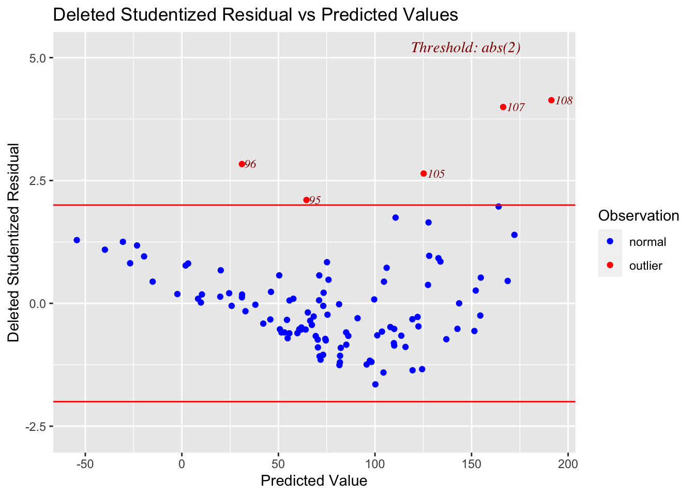

-   **Linearity**: FAIL
-   **Equal variance/normality**: probably fail

As shown in the residual plot, this model has clear issues with non-linearity (e.g. a curve would clearly fit better than a line). Therefore I will apply a transformation to fix the issue before moving on.

<br><br>

#### Transformations {.unnumbered}

I used the code below to assess several transformations on both the predictor and the response. I first applied some predictor transformation to account for the non-linearity. It became increasingly clear that there was also non equal variance, so I applied a transformation to the response and tried transformations of both.


```r
# Make some transformations
# This code-chunk has been set to eval=FALSE, but you can see what I did

# I don't want to mess up my movie dataset, so I'm trying this on a temporary dataset
tmpmovie <- movies

#===============================
# MAKE TRANSFORMATION COLUMNS
#===============================
# Log
 tmpmovie$Log_TheatersOpenWeek  <- log(tmpmovie$TheatersOpenWeek)
 tmpmovie$Log_DomesticGross     <- log(tmpmovie$DomesticGross)

# Sqrt
 tmpmovie$Sqrt_TheatersOpenWeek  <- sqrt(tmpmovie$TheatersOpenWeek)
 tmpmovie$Sqrt_DomesticGross     <- sqrt(tmpmovie$DomesticGross)

# Inverse e.g. 1/x
 tmpmovie$Inv_TheatersOpenWeek  <- 1/(tmpmovie$TheatersOpenWeek)
 tmpmovie$Inv_DomesticGross  <- 1/(tmpmovie$DomesticGross)

# Boxcox, a more detailed combination of log and 1/x  e.g. see equation below 
# I chose the 0.222 from the top of the boxcox plot. (NOT IN EXAM)
 boxcox_result <- MASS::boxcox(LM_NumTheatres)
 tmpmovie$box_TheatersOpenWeek <- (tmpmovie$TheatersOpenWeek^0.222 - 1) / 0.22


#===============================
# TEST SOME MODELS
# I'm just looking at the residual plots to see which works for fixing Linearity & equal variance. I ran each line using contrl-enter. I'm looking for the simplest possible answer that does the job
 
# PREDICTOR TRANSFORMATIONS. 
#=============================== 
 ols_plot_resid_stud_fit(lm(DomesticGross ~ Log_TheatersOpenWeek, data = tmpmovie))
 ols_plot_resid_stud_fit(lm(DomesticGross ~ Sqrt_TheatersOpenWeek,data = tmpmovie))
 ols_plot_resid_stud_fit(lm(DomesticGross ~ Inv_TheatersOpenWeek, data = tmpmovie))
 ols_plot_resid_stud_fit(lm(DomesticGross ~ box_TheatersOpenWeek, data = tmpmovie))
 ols_plot_resid_stud_fit(lm(DomesticGross ~ poly(TheatersOpenWeek,2),data = tmpmovie))
 ols_plot_resid_stud_fit(lm(DomesticGross ~ poly(TheatersOpenWeek,3),data = tmpmovie))
                             
# RESPONSE TRANSFORMATIONS. 
#=============================== 
 ols_plot_resid_stud_fit(lm(Log_DomesticGross ~ TheatersOpenWeek, data = tmpmovie))
 ols_plot_resid_stud_fit(lm(Sqrt_DomesticGross ~ TheatersOpenWeek,data = tmpmovie))
 ols_plot_resid_stud_fit(lm(Inv_DomesticGross ~ TheatersOpenWeek, data = tmpmovie))
 
# BOTH TRANSFORMATIONS. 
#===============================    
 ols_plot_resid_stud_fit(lm(Log_DomesticGross~Log_TheatersOpenWeek, data = tmpmovie))
 ols_plot_resid_stud_fit(lm(Sqrt_DomesticGross~Sqrt_TheatersOpenWeek,data = tmpmovie))
 ols_plot_resid_stud_fit(lm(Inv_DomesticGross~Inv_TheatersOpenWeek, data = tmpmovie))
 
 rm(tmpmovies)
```

There was a clear winner, the log transformation of the response, so I will move forwards from here. This makes sense given how skewed the resonse variable was.


```r
# Log response transformation
 movies$Log_DomesticGross     <- log(movies$DomesticGross)
 ols_plot_resid_stud_fit(lm(Log_DomesticGross ~ TheatersOpenWeek,data=movies))
```

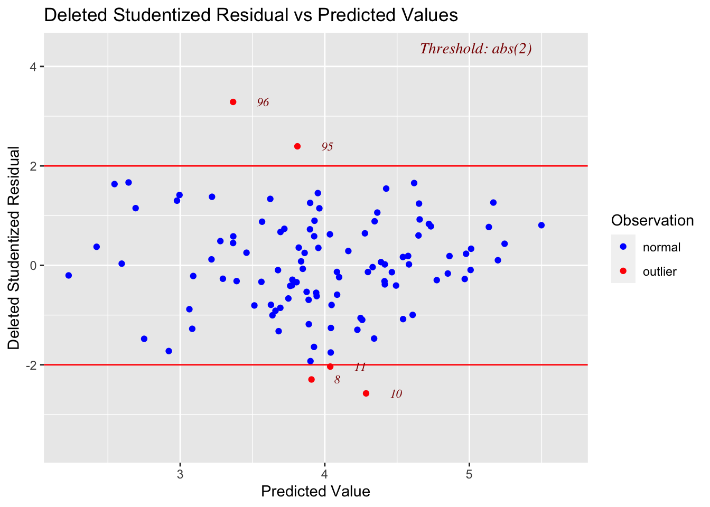

<br><br>

#### Model 1B, Log(Domestic_Gross) {.unnumbered}

Now, let's assess our new and more complex model:


```r
# New scatterplot with theatres open week vs log_domgross
ggplot(movies, aes(x=TheatersOpenWeek, y=Log_DomesticGross)) +
    xlab("Number of Theatres") + ylab("Domestic Gross Profit (million USD)")+
    geom_point() +
    geom_smooth(method="lm")
```

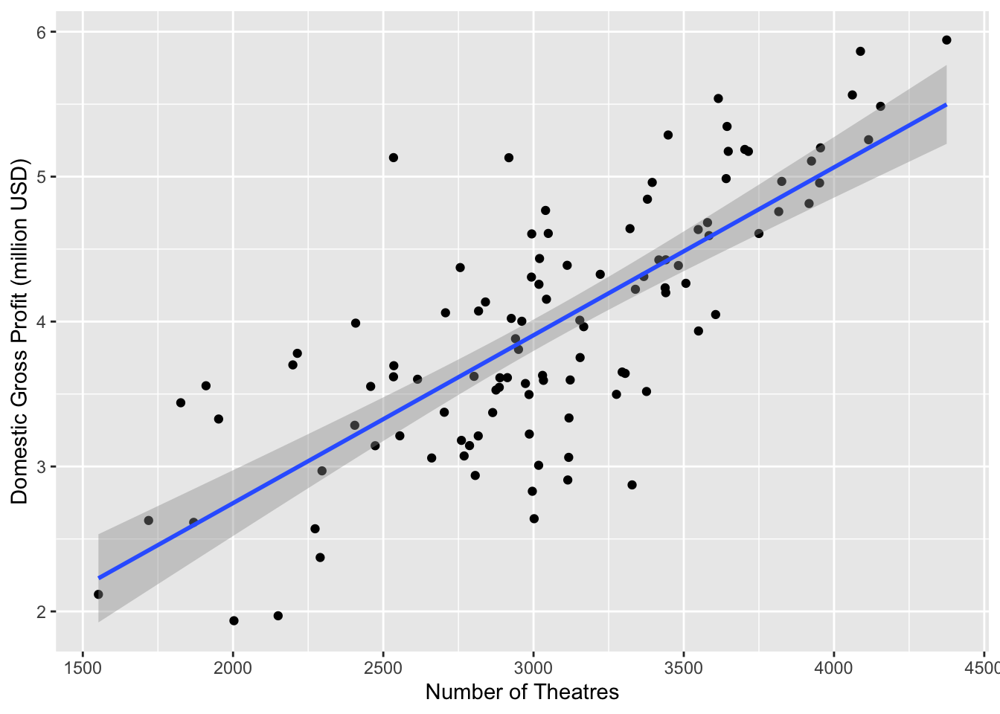

```r
# linear model
LM_Log_NumTheatres <- lm(Log_DomesticGross ~ TheatersOpenWeek,data=movies)
LM_Log_NumTheatres
```

```
## 
## Call:
## lm(formula = Log_DomesticGross ~ TheatersOpenWeek, data = movies)
## 
## Coefficients:
##      (Intercept)  TheatersOpenWeek  
##         0.430433          0.001158
```

In this case, as shown in the scatterplot above and the summary below, our model suggests that for this sample:

$$
\widehat{\ln(DomesticGross)} = 0.430433 + 0.001158(NumberTheatres)
$$

<br><br>

##### LINE assessment {.unnumbered}


```r
residplot1 <- ols_plot_resid_stud_fit(LM_Log_NumTheatres,print_plot=FALSE) 
residplot1$plot +  ggtitle("log transformation of response only")
```

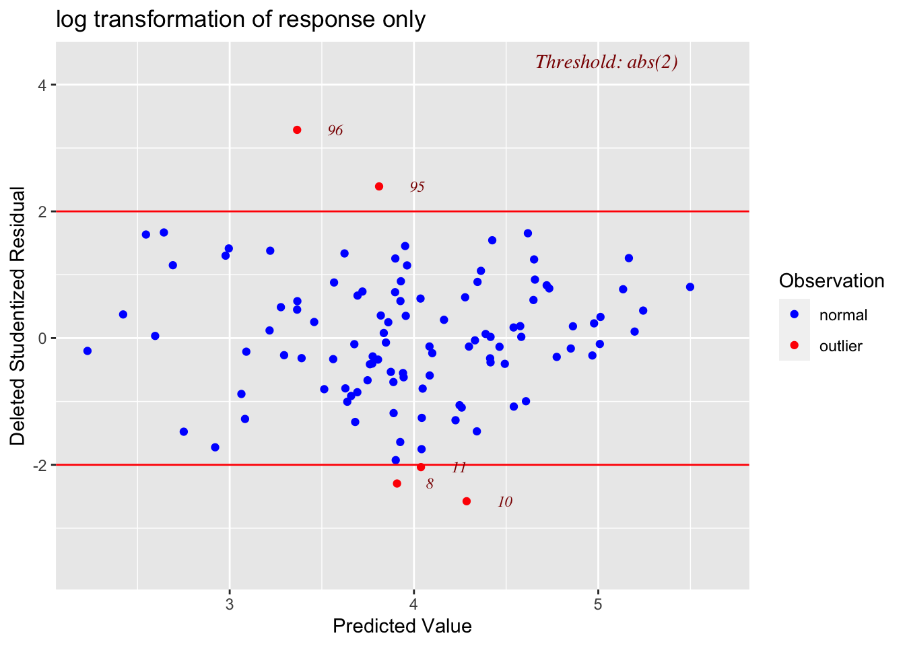


```r
ols_plot_resid_qq(LM_Log_NumTheatres) 
```

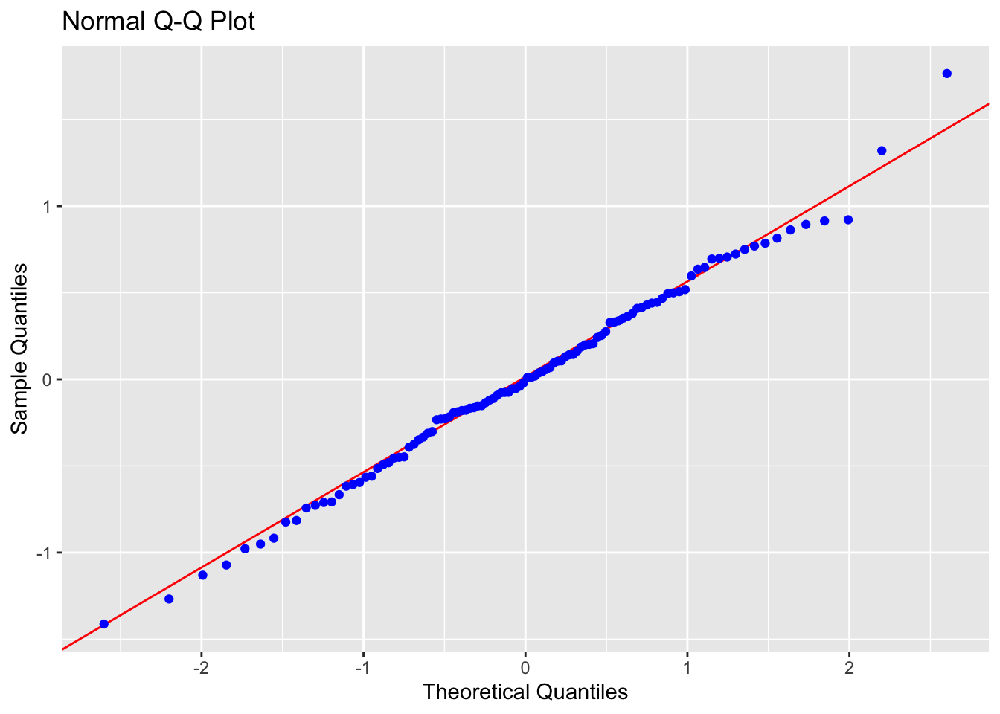


```r
# Normality test
ols_test_normality(LM_Log_NumTheatres) 
```

```
## -----------------------------------------------
##        Test             Statistic       pvalue  
## -----------------------------------------------
## Shapiro-Wilk              0.9944         0.9439 
## Kolmogorov-Smirnov        0.0524         0.9283 
## Cramer-von Mises         11.4842         0.0000 
## Anderson-Darling          0.1465         0.9661 
## -----------------------------------------------
```


```r
# F test for variance
ols_test_f(LM_Log_NumTheatres) 
```

```
## 
##  F Test for Heteroskedasticity
##  -----------------------------
##  Ho: Variance is homogenous
##  Ha: Variance is not homogenous
## 
##  Variables: fitted values of Log_DomesticGross 
## 
##       Test Summary        
##  -------------------------
##  Num DF     =    1 
##  Den DF     =    106 
##  F          =    2.734183 
##  Prob > F   =    0.1011804
```

-   **Linearity**: PASS - No evidence a curve would fit the mean of y\|x better than a line <br>
-   **Independence**: PASS - Hard to assess, but no huge issues I can see <br>
-   **Normality**: PASS - the QQplot looks straight and according to several normality significance tests, there is almost a 95% probability of seeing a result like this if it was sampled from an underlying population which had normal residuals. <br>
-   **Equal variance: PASS** (just) - The residual plot looks relatively random and according there is a 10% chance of seeing a result like this if it was sampled from a population with equal variances in residuals.

<br><br>

##### Check for Influential Outliers {.unnumbered}

Now that model 1B is valid in that it is satisfying the LINE conditions), I will make one final check for influential outliers, as shown below.


```r
ols_plot_resid_lev(LM_Log_NumTheatres)
```

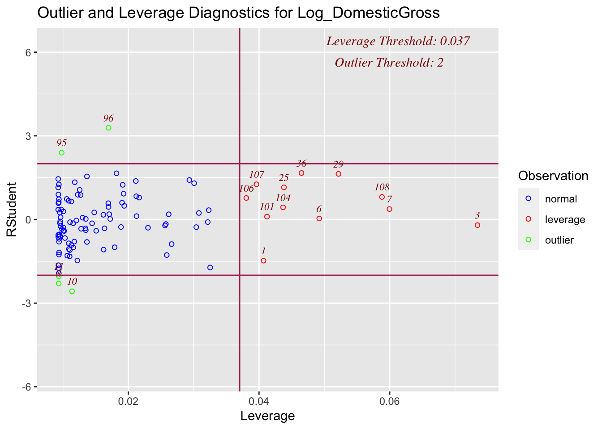

```r
ols_plot_cooksd_bar(LM_Log_NumTheatres,threshold=1)
```

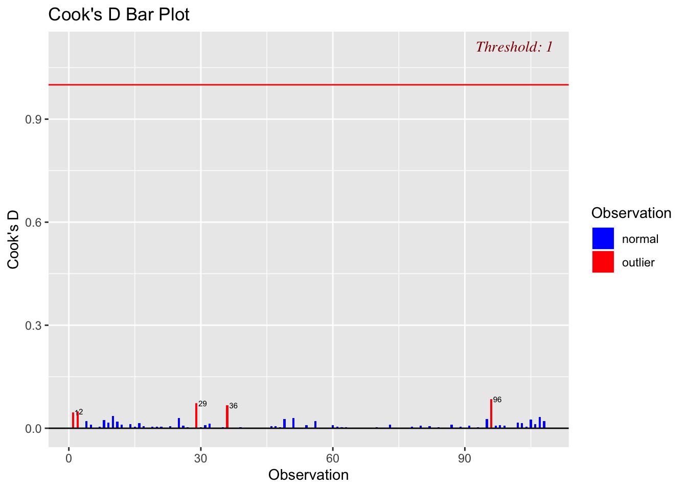

Although there are high leverage points (unusually far from the mean of x in the x direction), and some outliers, none of the outliers are influential, suggesting we can move on to model 2.

<br><br>

### Model 2: BOAverageOpenWeek {.unnumbered}

My second model assesses if Domestic Gross (millions of dollars) can be modelled using the Average box office revenue per theater opening weekend (in dollars), variable `BOAverageOpenWeek`.


```r
# Scatterplot 
ggplot(movies, aes(x=BOAverageOpenWeek, y=DomesticGross)) + 
    geom_point() + 
    xlab("Opening week profit ") + ylab("Domestic Gross Profit (million USD)")+
    geom_smooth(method=lm , color="blue", se=TRUE) +
    theme_ipsum()
```

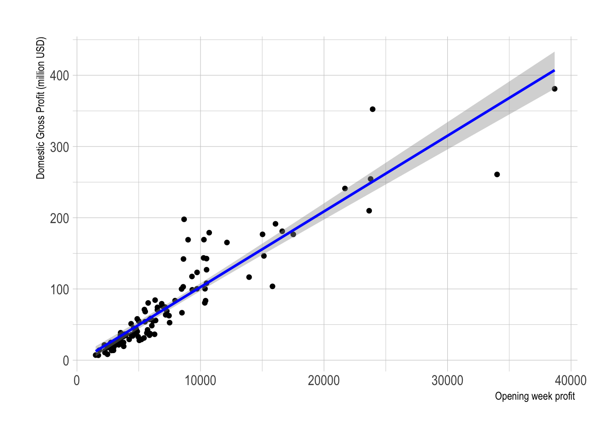

```r
LM_BOAvOpen <- lm(DomesticGross ~ BOAverageOpenWeek, data = movies)
LM_BOAvOpen
```

```
## 
## Call:
## lm(formula = DomesticGross ~ BOAverageOpenWeek, data = movies)
## 
## Coefficients:
##       (Intercept)  BOAverageOpenWeek  
##          -3.56700            0.01062
```

In this case, as shown in the scatterplot above, our model suggests that for this sample:

$$
\widehat{DomesticGross} = -3.56700 + 0.01062 (BO_AverageOpeningWeek)
$$

<br><br>

#### LINE assumptions check {.unnumbered}


```r
# Model Diagnostics 
ols_plot_resid_stud_fit(LM_BOAvOpen) 
```

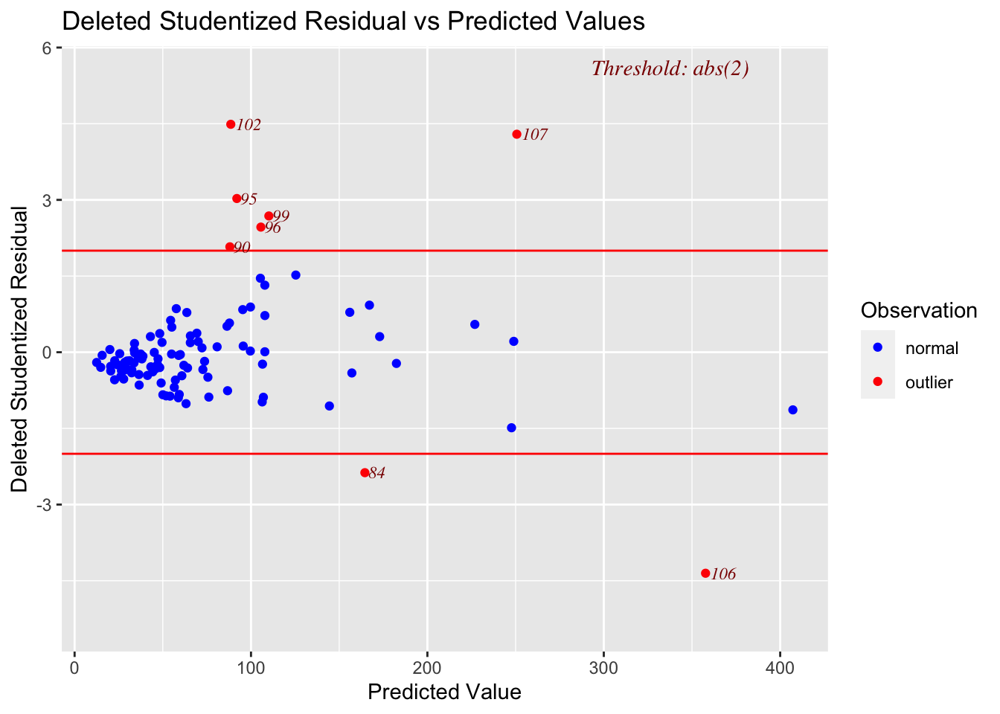

-   **Linearity**: PASS - No evidence a curve would fit the mean of y\|x better than a line <br>
-   **Equal variance: FAIL** - The residual plot shows significant "fanning out" (e.g. the points are close to the line for low predicted values and far from the line for higher ones). <br>

This makes physical sense; there is probably a baseline ticket price for cinemas to break even, so for low profits, there's not much room for variability. But for a very profitable movie or blockbuster, many different types of cinema are showing the film, with different levels of luxury.

<br><br>

#### Model 2B, Log-Log transformation {.unnumbered}

Again, we will try a transformation to fix line - after exploring the issue using the code above, it seems that this model needs a log-log transformation (e.g. both the response and predictor are log transformed).


```r
# Log response transformation
 movies$Log_DomesticGross        <- log(movies$DomesticGross)
 movies$Log_BOAverageOpenWeek    <- log(movies$BOAverageOpenWeek)

 
# Scatterplot 
ggplot(movies, aes(x=Log_BOAverageOpenWeek, y=Log_DomesticGross)) + 
    geom_point() + 
    xlab("Opening week profit") + ylab("Domestic Gross Profit")+
    geom_smooth(method=lm , color="blue", se=TRUE) +
    theme_ipsum()
```

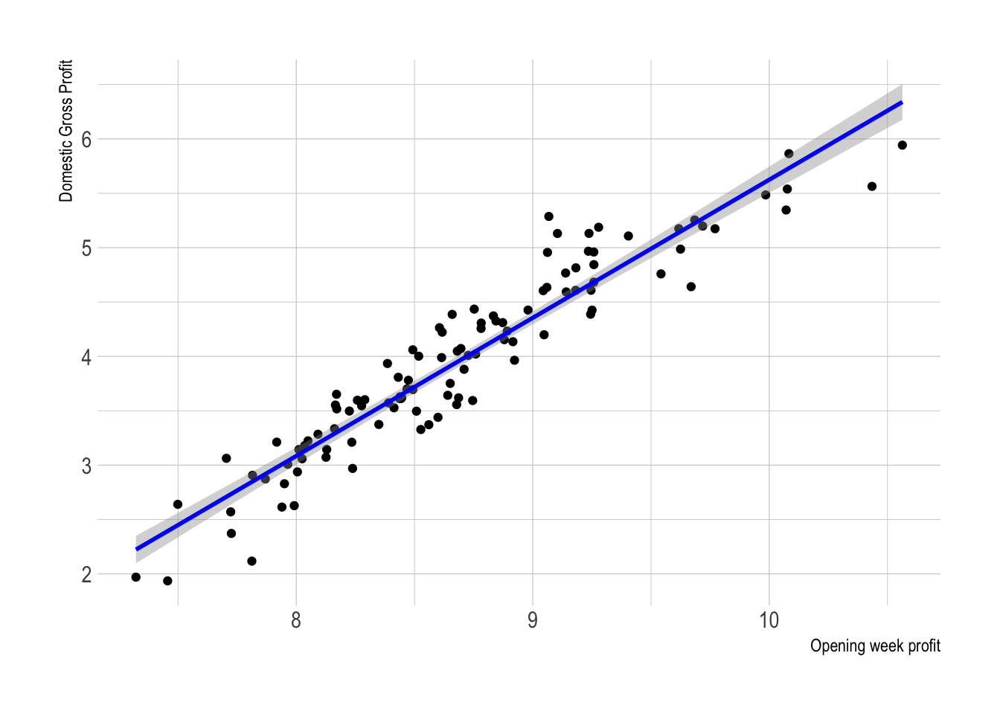

```r
LM_BOAvOpen_loglog <- lm(Log_DomesticGross ~ Log_BOAverageOpenWeek, data = movies)
ols_plot_resid_stud_fit(LM_BOAvOpen_loglog)
```


```r
LM_BOAvOpen_loglog
```

```
## 
## Call:
## lm(formula = Log_DomesticGross ~ Log_BOAverageOpenWeek, data = movies)
## 
## Coefficients:
##           (Intercept)  Log_BOAverageOpenWeek  
##                -7.077                  1.270
```

Our model is now:

$$
\widehat{\ln(DomesticGross)} = -7.077 + 1.270(\ln(BO_AverageOpeningWeek))
$$

<br><br>

##### LINE assessment {.unnumbered}


```r
residplot1 <- ols_plot_resid_stud_fit(LM_BOAvOpen_loglog,print_plot=FALSE) 
residplot1$plot +  ggtitle("log transformation of response only")
```

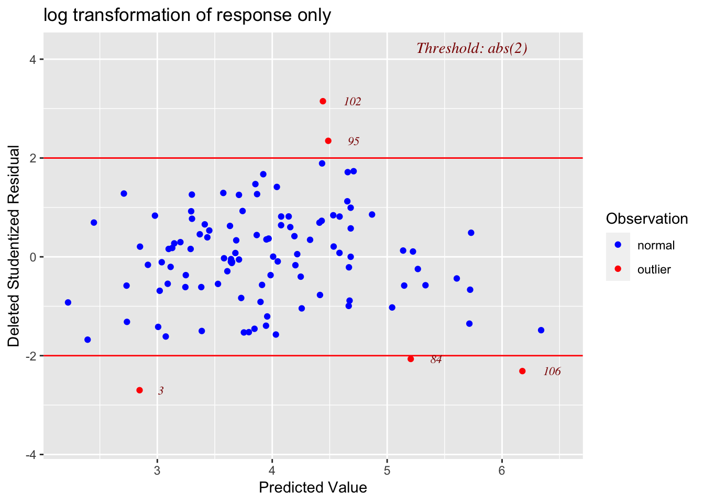


```r
ols_plot_resid_qq(LM_BOAvOpen_loglog) 
```

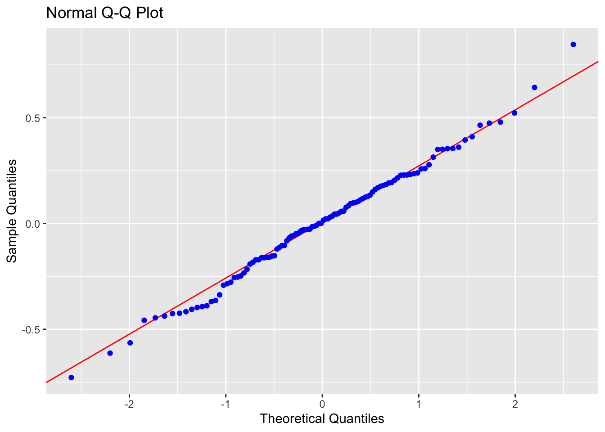


```r
# Normality test
ols_test_normality(LM_BOAvOpen_loglog) 
```

```
## -----------------------------------------------
##        Test             Statistic       pvalue  
## -----------------------------------------------
## Shapiro-Wilk              0.9941         0.9286 
## Kolmogorov-Smirnov        0.0456         0.9781 
## Cramer-von Mises          19.907         0.0000 
## Anderson-Darling          0.231          0.7992 
## -----------------------------------------------
```


```r
# F test for variance
ols_test_f(LM_BOAvOpen_loglog) 
```

```
## 
##  F Test for Heteroskedasticity
##  -----------------------------
##  Ho: Variance is homogenous
##  Ha: Variance is not homogenous
## 
##  Variables: fitted values of Log_DomesticGross 
## 
##       Test Summary        
##  -------------------------
##  Num DF     =    1 
##  Den DF     =    106 
##  F          =    1.222969 
##  Prob > F   =    0.2712824
```

-   **Linearity**: PASS - No evidence a curve would fit the mean of y\|x better than a line <br>
-   **Independence**: PASS - Hard to assess, but no huge issues I can see <br>
-   **Normality**: PASS - the QQplot looks straight and according to several normality significance tests, there is over an 80% probability of seeing a result like this if our sample was taken from an underlying population which had normal residuals. <br>
-   **Equal variance: PASS** - The residual plot looks relatively random and according there is a 27% chance of seeing a result like this if it was sampled from a population with equal variances in residuals

<br><br>

##### Check for Influential Outliers {.unnumbered}

Now that model 1B is valid in that it is satisfying the LINE conditions), I will make one final check for influential outliers, as shown below.


```r
ols_plot_resid_lev(LM_BOAvOpen_loglog)
```

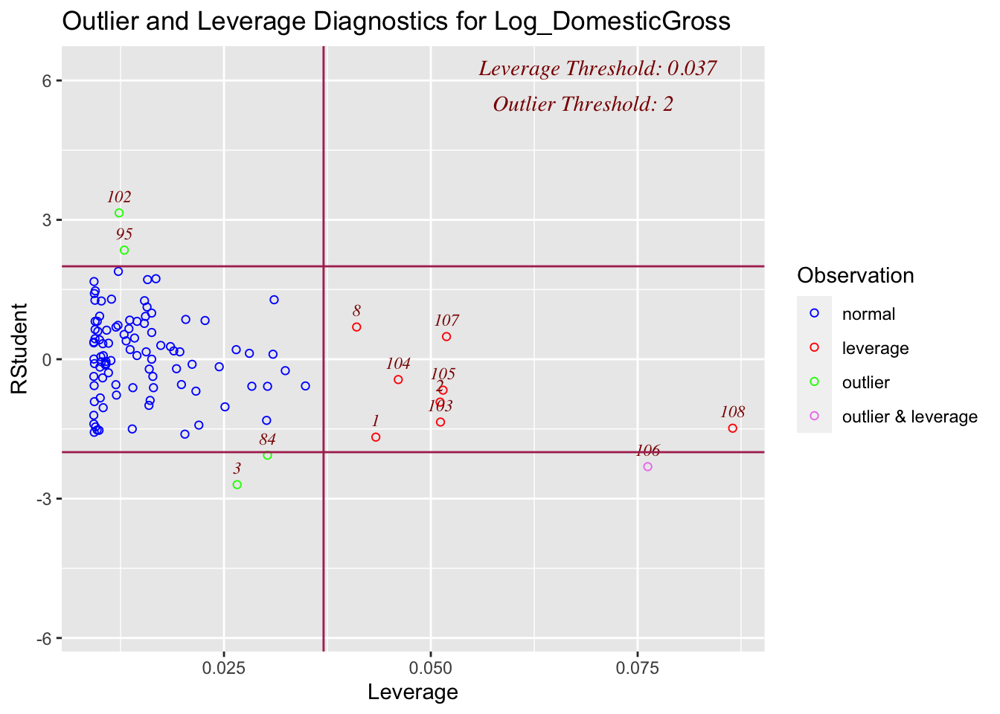

```r
ols_plot_cooksd_bar(LM_BOAvOpen_loglog,threshold=1)
```

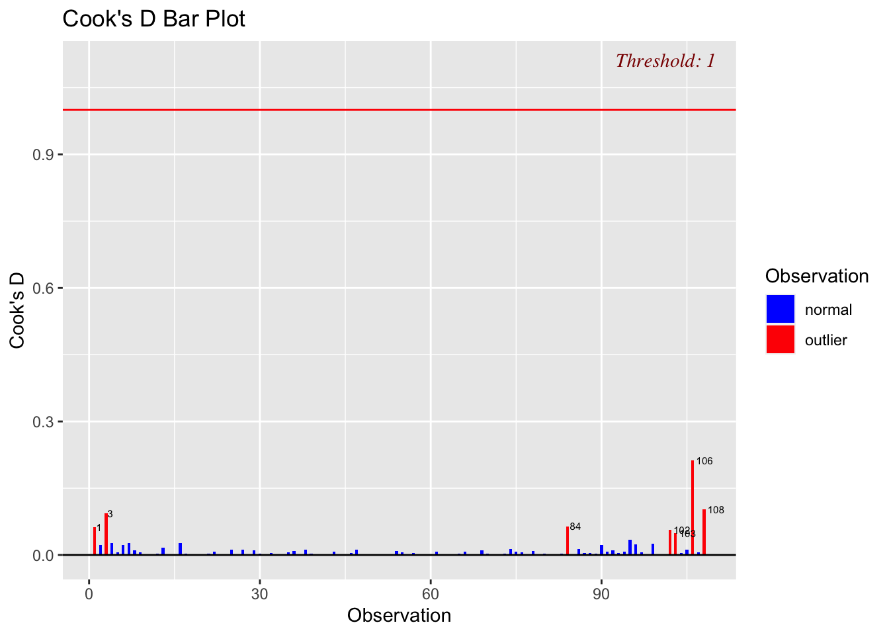

Although there are high leverage points (unusually far from the mean of x in the x direction), and some outliers, none of the outliers are influential, suggesting we can move on to model 2.

<br><br>

### Model comparison {.unnumbered}

We now have two valid models predicting the domestic gross product (`LM_Log_NumTheatres` and `LM_BOAvOpen_loglog`) where:

**Model 1:**

$$
\widehat{\ln(DomesticGross)} = 0.430433 + 0.001158(TheatersOpenWeek)
$$

**Model 2:**

$$
\widehat{\ln(DomesticGross)} = -7.077 + 1.270(\ln(BOAverageOpeningWeek))
$$

Where, DomesticGross is the Gross revenue in the US by the end of 2011, in millions of dollars; *TheatersOpenWeek* is the number of cinemas showing the movie on opening weekend; and BOAverageOpeningWeek is the average box office revenue per theater opening weekend (in dollars).

The model summaries for each model can be seen as follows:


```r
ols_regress(LM_Log_NumTheatres)
```

```
##                          Model Summary                          
## ---------------------------------------------------------------
## R                       0.763       RMSE                 0.561 
## R-Squared               0.581       MSE                  0.321 
## Adj. R-Squared          0.577       Coef. Var           14.267 
## Pred R-Squared          0.566       AIC                187.629 
## MAE                     0.443       SBC                195.675 
## ---------------------------------------------------------------
##  RMSE: Root Mean Square Error 
##  MSE: Mean Square Error 
##  MAE: Mean Absolute Error 
##  AIC: Akaike Information Criteria 
##  SBC: Schwarz Bayesian Criteria 
## 
##                                 ANOVA                                 
## ---------------------------------------------------------------------
##                Sum of                                                
##               Squares         DF    Mean Square       F         Sig. 
## ---------------------------------------------------------------------
## Regression     47.209          1         47.209    147.234    0.0000 
## Residual       33.988        106          0.321                      
## Total          81.197        107                                     
## ---------------------------------------------------------------------
## 
##                                     Parameter Estimates                                     
## -------------------------------------------------------------------------------------------
##            model     Beta    Std. Error    Std. Beta      t        Sig      lower    upper 
## -------------------------------------------------------------------------------------------
##      (Intercept)    0.430         0.297                  1.451    0.150    -0.158    1.019 
## TheatersOpenWeek    0.001         0.000        0.763    12.134    0.000     0.001    0.001 
## -------------------------------------------------------------------------------------------
```

and


```r
ols_regress(LM_BOAvOpen_loglog)
```

```
##                         Model Summary                          
## --------------------------------------------------------------
## R                       0.947       RMSE                0.279 
## R-Squared               0.897       MSE                 0.079 
## Adj. R-Squared          0.896       Coef. Var           7.093 
## Pred R-Squared          0.892       AIC                36.664 
## MAE                     0.220       SBC                44.710 
## --------------------------------------------------------------
##  RMSE: Root Mean Square Error 
##  MSE: Mean Square Error 
##  MAE: Mean Absolute Error 
##  AIC: Akaike Information Criteria 
##  SBC: Schwarz Bayesian Criteria 
## 
##                                 ANOVA                                 
## ---------------------------------------------------------------------
##                Sum of                                                
##               Squares         DF    Mean Square       F         Sig. 
## ---------------------------------------------------------------------
## Regression     72.797          1         72.797    918.681    0.0000 
## Residual        8.400        106          0.079                      
## Total          81.197        107                                     
## ---------------------------------------------------------------------
## 
##                                         Parameter Estimates                                         
## ---------------------------------------------------------------------------------------------------
##                 model      Beta    Std. Error    Std. Beta       t        Sig      lower     upper 
## ---------------------------------------------------------------------------------------------------
##           (Intercept)    -7.077         0.365                 -19.366    0.000    -7.801    -6.352 
## Log_BOAverageOpenWeek     1.270         0.042        0.947     30.310    0.000     1.187     1.353 
## ---------------------------------------------------------------------------------------------------
```

The studio asked us to compare the models against several metrics:

1.  $R^2$ **- How much variation is explained by the model:**

    -   Model LM_Log_NumTheatres: $R^2$ = 0.581.
    -   Model LM_BOAvOpen_loglog: $R^2$ = 0.897
    -   So the second model performs better in terms of R2; AKA the average box office revenue per theater opening weekend (in dollars) is able to explain nearly 90% of the variation in $\ln(DomesticGross)$ in our sample <br><br>\

2.  $MSE$ **- The mean squared error** - Model LM_Log_NumTheatres: MSE = 0.321 - Model LM_BOAvOpen_loglog: MSE = 0.079 - So the second model performs better in terms of the mean squared error, as it has smaller errors than the first (possible as both models have a response variable in the same units) <br><br>\

3.  ***LINE Assumptions/residuals*** **- Is the model valid**

    -   We spent some time finding transformations that make the model valid in both cases.
    -   Each model performs equally well using this metric <br><br>\

4.  *AIC **- Aikikes Information Criterion*** - This is a modification to the sum of squares error which takes into account the number of predictors (p) and the number of objects (n).

$$
  n\ln{SSE}-n\ln{n}+2p
$$

Given that in both our cases n=108 and p=1, it would stand to reason that this result would reflect the SSE.


```r
AIC(LM_Log_NumTheatres,LM_BOAvOpen_loglog)
```

```
##                    df       AIC
## LM_Log_NumTheatres  3 187.62881
## LM_BOAvOpen_loglog  3  36.66406
```

So this metric also suggests that the second model is better, as it has a lower value of AIC. <br><br>

<br><br>

## Multiple regression {.unnumbered}

### Best Subsets model selection {.unnumbered}

Finally, we move onto the use of multiple predictors, specifically using the stepwise best subsets model selection approach. Given that both of my individual models use $\ln(DomesticGross)$, I will also use this as my response variable here.


```r
# apply a model to all the variables 
fullmodel <- lm(Log_DomesticGross ~ RottenTomatoes+ AudienceScore+TheatersOpenWeek+BOAverageOpenWeek+Profitability, data=movies)

# Now run the stepwise regression
ols_step_best_subset(fullmodel)
```

```
##                                   Best Subsets Regression                                   
## --------------------------------------------------------------------------------------------
## Model Index    Predictors
## --------------------------------------------------------------------------------------------
##      1         BOAverageOpenWeek                                                             
##      2         TheatersOpenWeek BOAverageOpenWeek                                            
##      3         TheatersOpenWeek BOAverageOpenWeek Profitability                              
##      4         AudienceScore TheatersOpenWeek BOAverageOpenWeek Profitability                
##      5         RottenTomatoes AudienceScore TheatersOpenWeek BOAverageOpenWeek Profitability 
## --------------------------------------------------------------------------------------------
## 
##                                                     Subsets Regression Summary                                                     
## -----------------------------------------------------------------------------------------------------------------------------------
##                        Adj.        Pred                                                                                             
## Model    R-Square    R-Square    R-Square      C(p)        AIC         SBIC         SBC        MSEP       FPE       HSP       APC  
## -----------------------------------------------------------------------------------------------------------------------------------
##   1        0.6504      0.6471      0.6078    108.5112    168.1788    -140.7628    176.2252    28.9221    0.2728    0.0026    0.3628 
##   2        0.7455      0.7406      0.7121     52.7197    135.9018    -172.5831    146.6303    21.2593    0.2023    0.0019    0.2691 
##   3        0.8006      0.7928      0.7669     23.2289    113.5568    -195.8307    129.6496    16.8192    0.1630    0.0015    0.2148 
##   4        0.8338      0.8256      0.7995      5.0407     95.8839    -211.9276    114.6588    14.1558    0.1384    0.0013    0.1824 
##   5        0.8338      0.8240      0.7948      7.0000     97.8403    -209.8283    119.2974    14.2901    0.1410    0.0013    0.1857 
## -----------------------------------------------------------------------------------------------------------------------------------
## AIC: Akaike Information Criteria 
##  SBIC: Sawa's Bayesian Information Criteria 
##  SBC: Schwarz Bayesian Criteria 
##  MSEP: Estimated error of prediction, assuming multivariate normality 
##  FPE: Final Prediction Error 
##  HSP: Hocking's Sp 
##  APC: Amemiya Prediction Criteria
```

I am also going to try one with Log_BOAverageOpenWeek, as that seemed to improve my individual model skill


```r
# apply a model to all the variables 
fullmodel.log <- lm(Log_DomesticGross ~ RottenTomatoes+ AudienceScore+TheatersOpenWeek+Log_BOAverageOpenWeek+Profitability, data=movies)

# Now run the stepwise regression
ols_step_best_subset(fullmodel.log)
```

```
##                                     Best Subsets Regression                                     
## ------------------------------------------------------------------------------------------------
## Model Index    Predictors
## ------------------------------------------------------------------------------------------------
##      1         Log_BOAverageOpenWeek                                                             
##      2         TheatersOpenWeek Log_BOAverageOpenWeek                                            
##      3         AudienceScore TheatersOpenWeek Log_BOAverageOpenWeek                              
##      4         AudienceScore TheatersOpenWeek Log_BOAverageOpenWeek Profitability                
##      5         RottenTomatoes AudienceScore TheatersOpenWeek Log_BOAverageOpenWeek Profitability 
## ------------------------------------------------------------------------------------------------
## 
##                                                   Subsets Regression Summary                                                  
## ------------------------------------------------------------------------------------------------------------------------------
##                        Adj.        Pred                                                                                        
## Model    R-Square    R-Square    R-Square     C(p)        AIC        SBIC         SBC       MSEP      FPE       HSP      APC  
## ------------------------------------------------------------------------------------------------------------------------------
##   1        0.8966      0.8956      0.8918    59.2926    36.6641    -271.4104    44.7105    8.5581    0.0807    8e-04    0.1074 
##   2        0.9145      0.9129      0.9086    32.9461    18.0718    -289.6967    28.8004    7.1405    0.0679    6e-04    0.0904 
##   3        0.9301      0.9281      0.9232    10.3262    -1.6830    -308.3433    11.7276    5.8944    0.0566    5e-04    0.0753 
##   4        0.9357      0.9325      0.9267     5.5001    -6.6882    -314.5467    12.0867    5.4760    0.0536    5e-04    0.0705 
##   5        0.9360      0.9322      0.9258     7.0000    -5.2217    -312.8903    16.2354    5.5030    0.0543    5e-04    0.0715 
## ------------------------------------------------------------------------------------------------------------------------------
## AIC: Akaike Information Criteria 
##  SBIC: Sawa's Bayesian Information Criteria 
##  SBC: Schwarz Bayesian Criteria 
##  MSEP: Estimated error of prediction, assuming multivariate normality 
##  FPE: Final Prediction Error 
##  HSP: Hocking's Sp 
##  APC: Amemiya Prediction Criteria
```

Out of all the tables above, it seems that first, by using Log_BOAverageOpenWeek, we can improve the skill, and that also other variables do appear to be important.

<br><br>

### Final model {.unnumbered}

The analysis above suggests that the following model has the highest adjusted $R^2$ (0.9325) and the lowest AIC (-6.6882).

$$
\widehat{\ln(DomesticGross)} = \beta_0 + \beta_1(AudienceScore)+\beta_2(TheatersOpenWeek)+\beta_3(BOAverageOpenWeek)+\beta_4(Profitability)
$$

<br><br>


```r
finalmodel <- lm(Log_DomesticGross ~ AudienceScore+TheatersOpenWeek+Log_BOAverageOpenWeek+Profitability, data=movies)
finalmodel
```

```
## 
## Call:
## lm(formula = Log_DomesticGross ~ AudienceScore + TheatersOpenWeek + 
##     Log_BOAverageOpenWeek + Profitability, data = movies)
## 
## Coefficients:
##           (Intercept)          AudienceScore       TheatersOpenWeek  
##            -5.5944812              0.0066017              0.0003627  
## Log_BOAverageOpenWeek      ProfitabilityHigh      ProfitabilityLoss  
##             0.9244820              0.0910764             -0.1571944
```

Therefore, we see the following relationships.

**For movies that made a loss:**

$$
\widehat{\ln(DomesticGross)} = -5.594 + 0.0066(AudienceScore)+0.00036(TheatersOpenWeek)+0.9244820(\ln(BOAverageOpenWeek))-0.1572
$$

which can be simplified to:

$$
\widehat{\ln(DomesticGross)} = -5.752 + 0.0066(AudienceScore)+0.00036(TheatersOpenWeek)+0.9244820(\ln(BOAverageOpenWeek))
$$

------------------------------------------------------------------------

**For movies with an average level of profit:**

$$
\widehat{\ln(DomesticGross)} = -5.594 + 0.0066(AudienceScore)+0.00036(TheatersOpenWeek)+0.9244820(\ln(BOAverageOpenWeek))-0.1572
$$

------------------------------------------------------------------------

**and for movies that made a high level of profit**

$$
\widehat{\ln(DomesticGross)} = -5.594 + 0.0066(AudienceScore)+0.00036(TheatersOpenWeek)+0.9244820(\ln(BOAverageOpenWeek))+0.091
$$

which can be simplified to

$$
\widehat{\ln(DomesticGross)} = -5.5034 + 0.0066(AudienceScore)+0.00036(TheatersOpenWeek)+0.9244820(\ln(BOAverageOpenWeek))+0.091
$$

<br><br>

#### LINE assessment {.unnumbered}


```r
residplot1 <- ols_plot_resid_stud_fit(finalmodel) 
```

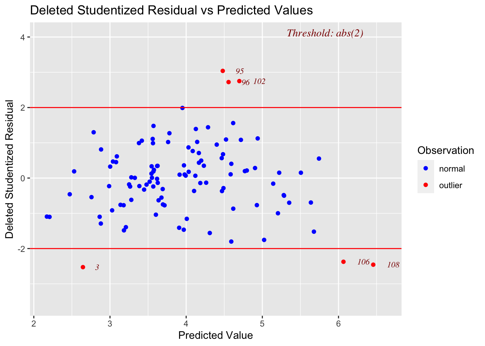


```r
ols_plot_resid_qq(finalmodel) 
```

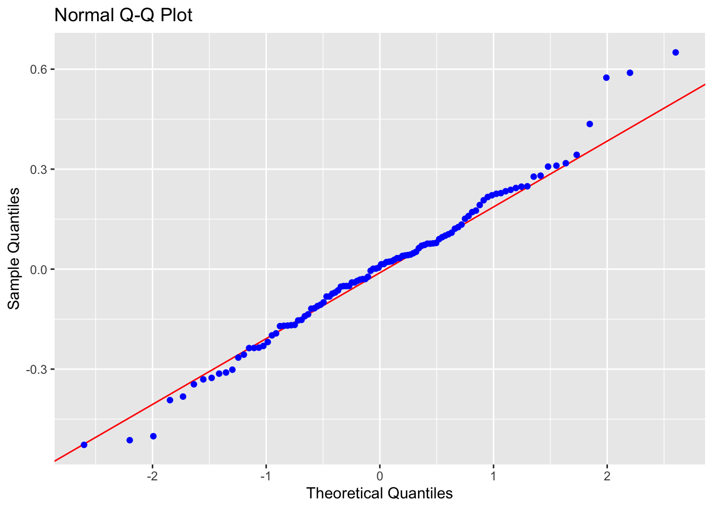


```r
# Normality test
ols_test_normality(finalmodel) 
```

```
## -----------------------------------------------
##        Test             Statistic       pvalue  
## -----------------------------------------------
## Shapiro-Wilk              0.9867         0.3652 
## Kolmogorov-Smirnov        0.0555         0.8935 
## Cramer-von Mises         22.9808         0.0000 
## Anderson-Darling          0.3394         0.4935 
## -----------------------------------------------
```


```r
# F test for variance
ols_test_f(finalmodel) 
```

```
## 
##  F Test for Heteroskedasticity
##  -----------------------------
##  Ho: Variance is homogenous
##  Ha: Variance is not homogenous
## 
##  Variables: fitted values of Log_DomesticGross 
## 
##        Test Summary        
##  --------------------------
##  Num DF     =    1 
##  Den DF     =    106 
##  F          =    5.367239 
##  Prob > F   =    0.02244135
```

-   **Linearity**: PASS - No evidence a curve would fit the mean of y\|x better than a line <br>
-   **Independence**: PASS - Hard to assess, but no huge issues I can see <br>
-   **Normality**: PASS, The QQ plot does show a few tiny issues around the tails, but the significance tests suggest that this could easily be explained by random chance<br>
-   **Equal variance: PASS** (just..)- The residual plot looks relatively random, but the F-test does suggest only a 2% chance of seeing a result like this if it was sampled from a population with equal variances in residuals. I wonder if this is due to the two potential outliers (line 108: (Harry Potter and the Deathly Hallows II) and line 106 (The Thing)).

<br><br>

#### Check for Influential Outliers {.unnumbered}

Now that model 1B is valid in that it is satisfying the LINE conditions), I will make one final check for influential outliers, as shown below:


```r
ols_plot_resid_lev(finalmodel)
```

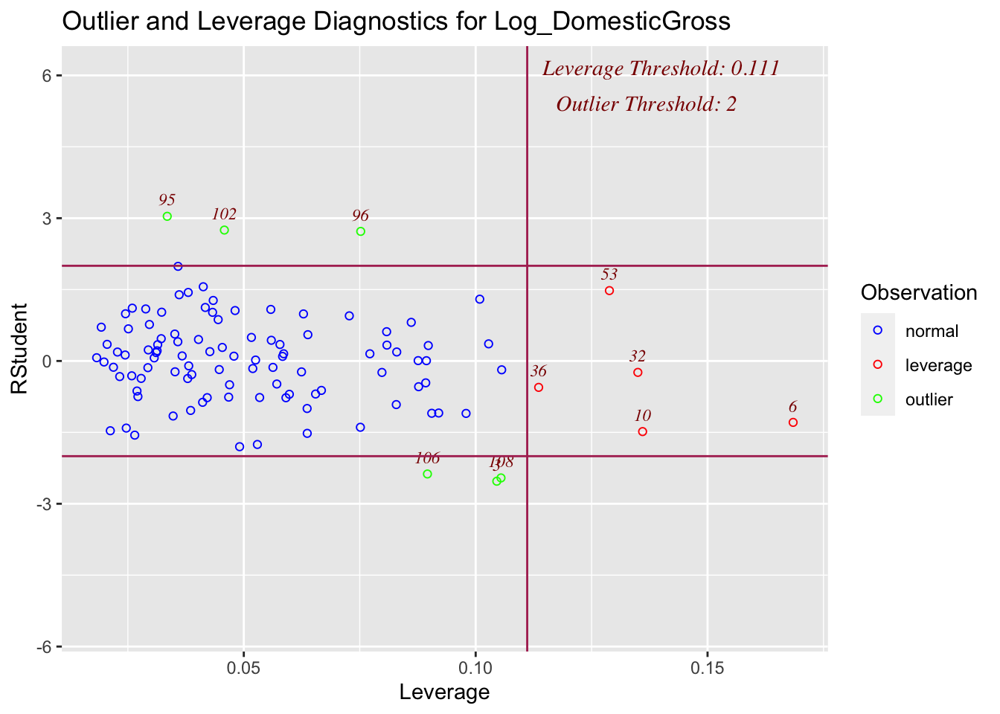

```r
ols_plot_cooksd_bar(finalmodel,threshold=1)
```

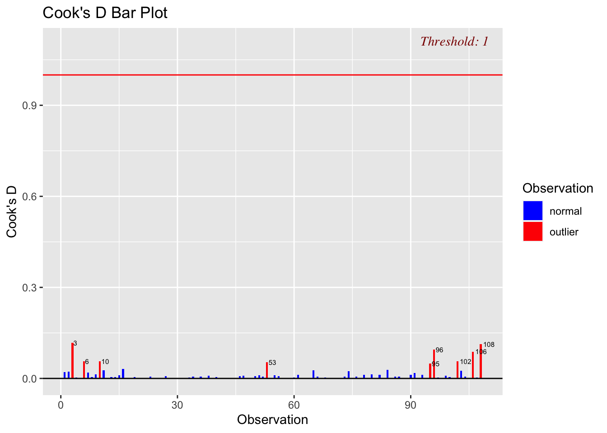

This shows that although there are several outliers and high leverage points, none are influential enough to especially capture the fit.

<br><br>

## Studio questions {.unnumbered}

The studio had several questions about the new model, which I answer below:

#### 1. Show your final model is more skillful than the other models you made {.unnumbered}

We can do this simply by using AIC, where the smallest value indicates the most skillful model (assuming LINE assumptions). Note, I only included models where the response was ln(DomesticGross), as this technique requires the response variable to be identical across the model comparisons. As you can see below, our final model has the lowest value of AIC.


```r
AIC(finalmodel,fullmodel.log, fullmodel, LM_BOAvOpen_loglog, LM_Log_NumTheatres)
```

```
##                    df        AIC
## finalmodel          7  -6.688178
## fullmodel.log       8  -5.221659
## fullmodel           8  97.840334
## LM_BOAvOpen_loglog  3  36.664060
## LM_Log_NumTheatres  3 187.628806
```

<br><br>

#### 2. Conduct a partial F test to assess if your final model is significantly better than your best 'single variable' model {.unnumbered}


```r
anova(finalmodel, LM_BOAvOpen_loglog)
```

```
## Analysis of Variance Table
## 
## Model 1: Log_DomesticGross ~ AudienceScore + TheatersOpenWeek + Log_BOAverageOpenWeek + 
##     Profitability
## Model 2: Log_DomesticGross ~ Log_BOAverageOpenWeek
##   Res.Df    RSS Df Sum of Sq      F   Pr(>F)    
## 1    102 5.2210                                 
## 2    106 8.3996 -4   -3.1785 15.524 5.97e-10 ***
## ---
## Signif. codes:  0 '***' 0.001 '**' 0.01 '*' 0.05 '.' 0.1 ' ' 1
```

-   H0: The Reduced model is all we need (one predictor)

-   H1: The full model (finalmodel) expains so much more variability that this is appropriate to use

-   Test statistic: F-test: 15.524

-   P-value: very small

This suggests that the full model reduces the model error by such a large amount that we think it would be *very* unlikely to see this by chance. Therefore we have enough evidence to reject H0 and choose the full model.

<br><br>

#### 3. In your final model, which predictors have the highest effect size and significance? {.unnumbered}

We can answer this by looking at the table of coefficients


```r
ols_regress(finalmodel)
```

```
##                         Model Summary                          
## --------------------------------------------------------------
## R                       0.967       RMSE                0.220 
## R-Squared               0.936       MSE                 0.051 
## Adj. R-Squared          0.933       Coef. Var           5.700 
## Pred R-Squared          0.927       AIC                -6.688 
## MAE                     0.169       SBC                12.087 
## --------------------------------------------------------------
##  RMSE: Root Mean Square Error 
##  MSE: Mean Square Error 
##  MAE: Mean Absolute Error 
##  AIC: Akaike Information Criteria 
##  SBC: Schwarz Bayesian Criteria 
## 
##                                 ANOVA                                 
## ---------------------------------------------------------------------
##                Sum of                                                
##               Squares         DF    Mean Square       F         Sig. 
## ---------------------------------------------------------------------
## Regression     75.976          5         15.195    296.858    0.0000 
## Residual        5.221        102          0.051                      
## Total          81.197        107                                     
## ---------------------------------------------------------------------
## 
##                                         Parameter Estimates                                         
## ---------------------------------------------------------------------------------------------------
##                 model      Beta    Std. Error    Std. Beta       t        Sig      lower     upper 
## ---------------------------------------------------------------------------------------------------
##           (Intercept)    -5.594         0.372                 -15.039    0.000    -6.332    -4.857 
##         AudienceScore     0.007         0.001        0.128      4.630    0.000     0.004     0.009 
##      TheatersOpenWeek     0.000         0.000        0.239      6.524    0.000     0.000     0.000 
## Log_BOAverageOpenWeek     0.924         0.057        0.689     16.358    0.000     0.812     1.037 
##     ProfitabilityHigh     0.091         0.050        0.050      1.808    0.074    -0.009     0.191 
##     ProfitabilityLoss    -0.157         0.075       -0.059     -2.106    0.038    -0.305    -0.009 
## ---------------------------------------------------------------------------------------------------
```

The variable with the largest effect size is Log_BOAverage_OpenWeek. If we increase that value by 1, then LogDomesticGross goes up by 0.924. Of course the fact that both are log transformed makes this harder to interpret.

All the variables appear to be significant predictors of gross domestic profit (p \< 0.05), apart from "ProfitabilityHigh". So this suggests that perhaps the profitability should simply be coded as "loss" or "profit" - and the model could be improved further.

<br><br>

#### 4. We have a new film that has been released, what does your model suggest its gross domestic profit will be? What is the 95% uncertainty interval on your estimate {.unnumbered}

The movie is:

-   Kung Fu Panda 4

-   RottenTomatoes: 78

-   Audience Score: 88

-   Open week profits: 5400 USD per cinema

-   Number of theatres: 3300 cinemas showed the film in week 1

-   Profitability: Average

OK - we can use our model to predict the gross domestic profit:


```r
newdata <- data.frame (Name="Kung Fu Panda 4", RottenTomatoes=78,
                       AudienceScore=88, TheatersOpenWeek = 3300,
                       Log_BOAverageOpenWeek=log(5400),
                       Profitability = "Average")
newdata$Profitability <- as.factor(newdata$Profitability)


Ln_DomesticGross <- predict(finalmodel,newdata=newdata,
                            interval="prediction",level = 0.95)

# Back transform
DomesticGross <- exp(Ln_DomesticGross)

DomesticGross
```

```
##        fit      lwr      upr
## 1 62.09127 39.11226 98.57078
```

Our model suggests that the film will make \$62,091,270 USD during its year of release. Or to put it in terms of confidence intervals, we are 95% certain that KungFu Panda 4 will make between \$39.1 Million and \$98.5 Million USD during its year of release.
