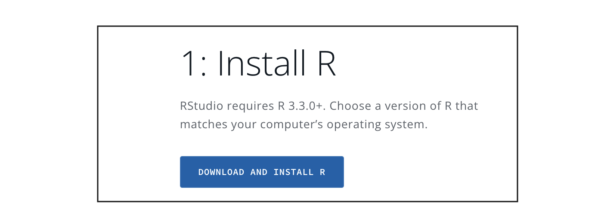
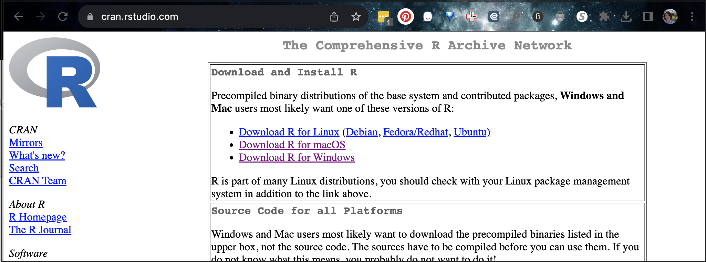
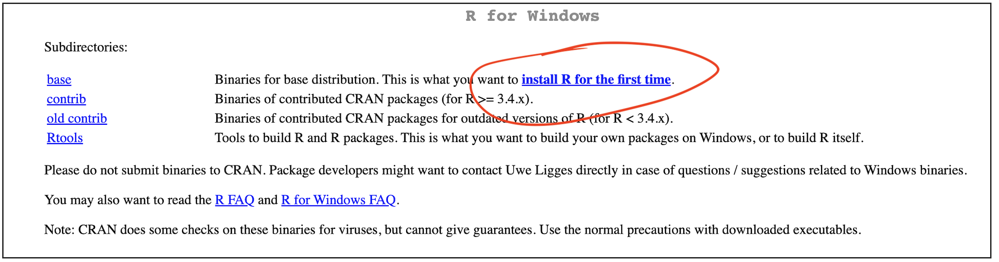

# (PART\*) [.]{style="color: white;"} {.unnumbered}
# (PART\*) **Getting Started** {.unnumbered}

```{r, include=FALSE,echo=FALSE,warning=FALSE,message=FALSE}
library(tidyverse)
library(knitr)
library(kableExtra)
```

# Installing R/R-Studio on your computer for the first time {#Setup_Desktop .unnumbered}

<br>

If you are brand new, consider skimming through [What are R and R-Studio](#WhatIsR)

To use it on your own computer we need to do two things. <br>

-   First, teach the computer to 'speak R'.

-   Secondly download the RStudio software.<br><br>

In this section, I first include a video where I go through it - and then written instructions going over the same thing.

<br>

------------------------------------------------------------------------

### Video instructions {#Setup_DesktopVideo .unnumbered}

Here's a video where I install R/R-Studio on my mac. It should take less than 10 minutes to follow along & there are subtitles. I will try to also put up another for my windows machine.

<details>

<summary>[Click to expand & watch]{style="color: #1388aa;"}</summary>

<br>

::: {style="max-width:640px"}
::: {style="position:relative;padding-bottom:100%"}
<iframe id="kaltura_player" src="https://cdnapisec.kaltura.com/p/2356971/sp/235697100/embedIframeJs/uiconf_id/41416911/partner_id/2356971?iframeembed=true&amp;playerId=kaltura_player&amp;entry_id=1_009n7kh8&amp;flashvars[streamerType]=auto&amp;flashvars[localizationCode]=en&amp;flashvars[sideBarContainer.plugin]=true&amp;flashvars[sideBarContainer.position]=left&amp;flashvars[sideBarContainer.clickToClose]=true&amp;flashvars[chapters.plugin]=true&amp;flashvars[chapters.layout]=vertical&amp;flashvars[chapters.thumbnailRotator]=false&amp;flashvars[streamSelector.plugin]=true&amp;flashvars[EmbedPlayer.SpinnerTarget]=videoHolder&amp;flashvars[dualScreen.plugin]=true&amp;flashvars[hotspots.plugin]=1&amp;flashvars[Kaltura.addCrossoriginToIframe]=true&amp;&amp;wid=1_i392r73r" width="640" height="640" allowfullscreen webkitallowfullscreen mozAllowFullScreen allow="autoplay *; fullscreen *; encrypted-media *" sandbox="allow-downloads allow-forms allow-same-origin allow-scripts allow-top-navigation allow-pointer-lock allow-popups allow-modals allow-orientation-lock allow-popups-to-escape-sandbox allow-presentation allow-top-navigation-by-user-activation" frameborder="0" title="R-Tutorials Video 1. Installing R and R studio on a mac" style="position:absolute;top:0;left:0;width:100%;height:100%;border:0">

</iframe>
:::
:::

<br>

</details>

------------------------------------------------------------------------

## Written Instructions

If you're not a video sort of person, here are written instructions:

### 1. Installing R. {#Setup_R .unnumbered}

First, we teach the computer to 'speak R'.

Go here: <https://posit.co/download/rstudio-desktop/>. Click the Install R button <br>

```{r, Setup_Fig1, echo=FALSE, fig.cap = "Click here!",fig.align='center'}

```

Click the link and you will go to a terrifying website called CRAN R.

```{r, Setup_Fig2, echo=FALSE, fig.cap = "*Choose your computer type*",fig.align='center'}

```

#### If you are on a WINDOWS/PC computer {#Setup_R_PC .unnumbered}

<details>

<summary>[Click to expand]{style="color: #1388aa;"}</summary>

<br>

```{r, Setup_Fig3, echo=FALSE, fig.cap = "*Choose your computer type*",fig.align='center'}

```

Click the "install for the first time" link and follow through to install R - EVEN IF YOU ALREADY HAVE R AND R STUDIO INSTALLED. <br><br>

Say yes to all the default options. Send Dr G a message if you get stuck <br>

<br>

</details>

#### If you are on a MAC/AppleMac {#Setup_R_Mac .unnumbered}

<details>

<summary>[Click to expand]{style="color: #1388aa;"}</summary>

<br>

If you are a MAC user, you will need [EITHER]{.underline} one of these two files. If your computer is new, try the top one, if it's older try the second - the wrong one simply won't work.

```{r, Setup_Fig4, echo=FALSE, fig.cap = "*Choose your computer type*",fig.align='center'}
knitr::include_graphics('./index_images/im_02Setup_7MAC.png')
```

1.  Click the filename to download <br>

2.  MOVE THE DOWNLOAD OUTSIDE YOUR DOWNLOAD FOLDER (they have a weird bug.) Put it on your desktop

3.  Open the download and follow the instructions. <br>

4.  You can delete the download.

If you have issues, try watching my video at the top and see if that solves it. Or talk to Dr G

<br>

</details>

### 2. Installing R studio {#Setup_RStudio .unnumbered}

Go back here: <https://posit.co/download/rstudio-desktop/>. Click the Install R-Studio button

```{r, Setup_Fig5, echo=FALSE, fig.align='center'}
knitr::include_graphics('./index_images/im_02Setup_8InstallRstudio.png')
```

#### If you are on a WINDOWS/PC computer {#Setup_RStudio_PC .unnumbered}

<details>

<summary>[Click to expand]{style="color: #1388aa;"}</summary>

<br>

Install the same way you install any new software

<br>

</details>

#### If you are on a Mac computer {#Setup_RStudio_Mac .unnumbered}

<details>

<summary>[Click to expand]{style="color: #1388aa;"}</summary>

<br>

```{r, Setup_Fig6, echo=FALSE, fig.cap = "*Will look different for windows*",fig.align='center'}
knitr::include_graphics('./index_images/im_02Setup_9RstudioMacinstall.png')
```

-   Download the dmg file, click to open, then DRAG it over to applications.

-   If it asks to overwrite, say yes.

It might get angry at this stage if your mac is very out of date. Your choices are probably to backup your computer, update your operating system and reinstall R. OR! Just use RStudio online rather than downloading it at all. Feel free to chat with Dr G about options.

<br>

</details>

<br>
