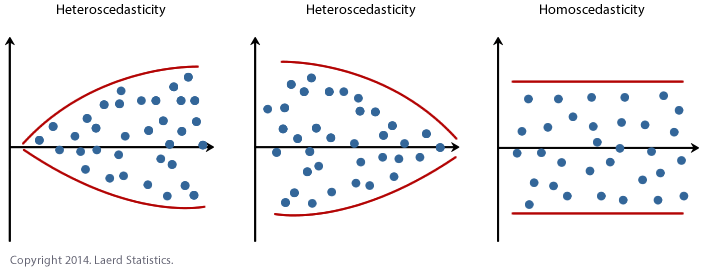
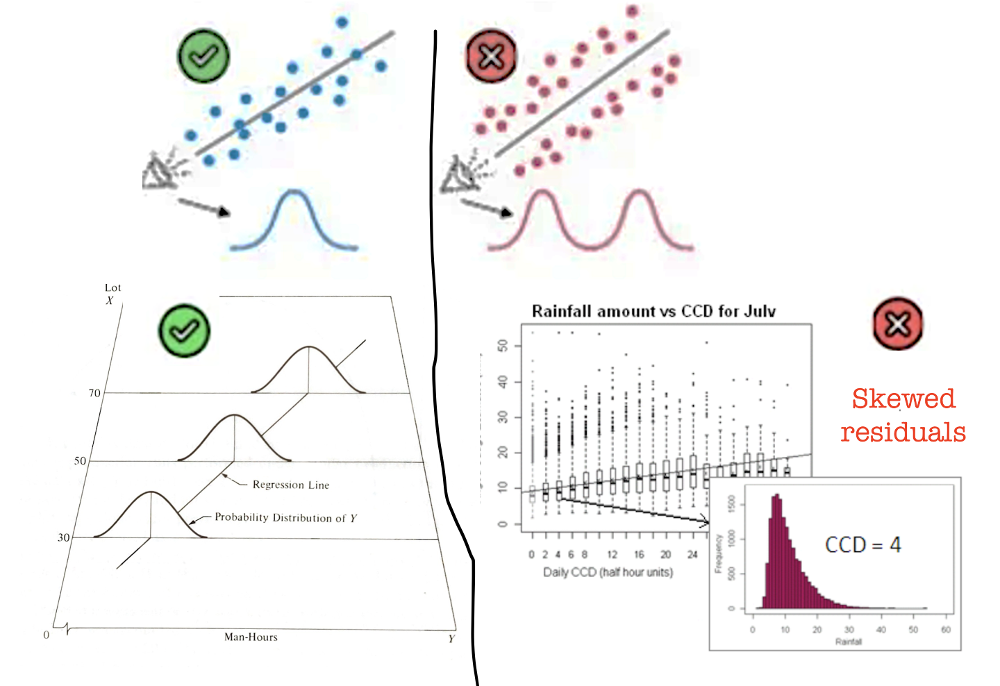

```{r setup, include=FALSE,message=FALSE,warning=FALSE}
# OPTIONS -----------------------------------------------
knitr::opts_chunk$set(echo = TRUE, 
                      warning=FALSE, 
                      message = FALSE)

# PACKAGES-----------------------------------------------
# Tutorial packages
library(vembedr)
library(skimr)
library(yarrr)
library(RColorBrewer)
library(GGally) 
library(tidyverse)
library(plotly)
library(readxl)
library(rvest)
library(biscale)
library(tidycensus)
library(cowplot)
library(units)
library(olsrr)
library(hrbrthemes)

data("HousesNY", package = "Stat2Data")

```

# Assessing LINE {#T10_diagnostics}

We know from the lectures that there are multiple assumptions underpinning whether a regression is a good model or not - especially LINE assumptions (as described in [Online STAT-462 - Lesson 4](https://online.stat.psu.edu/stat501/lesson/4/)). Regression diagnostics are a set of tools we can use to assess these assumptions. All the example datasets are from the online textbook and can be downloaded there.

<br><br>

## What are residuals? {#T10_residuals}

It can be difficult looking at the raw data to assess whether many of the assumptions are true or not. So in this case we can look at residual plots.

{width="80%"}

{width="50%"}

Still confused? See

-   <https://www.khanacademy.org/math/ap-statistics/bivariate-data-ap/xfb5d8e68:residuals/v/regression-residual-intro>)

-   or <https://www.displayr.com/learn-what-are-residuals/>

<br><br>

### Printing out residuals

We can extract these from the model.

Imagine you are interested in determining whether or not alcohol consumption was linearly related to muscle strength. You measured the total lifetime consumption of alcohol (x) on a random sample of n = 50 alcoholic men. They also measured the strength (y) of the deltoid muscle in each person's left arm, then created a linear model to forecast strength.

The predicted value is the y-value at the line for each point, strength is the actual measured strength and residual is the difference between the two.

```{r}
alcoholdata <- read.csv("alcoholstrength.csv")
mymodel <- lm(strength~alcohol,data=alcoholdata)

# now add in the predicted and residual values
alcoholdata$strength_predicted <- mymodel$fitted.values
alcoholdata$residuals          <- mymodel$residuals
head(alcoholdata)
```

See if you can match the point in red to the first value above and understand the numbers.

```{r,collapse=TRUE}
# and make a quick plot
plot(alcoholdata$strength ~ alcoholdata$alcohol,xlab="Alcohol",ylab="Strength",col="dark grey",ylim=c(900,3000))
# plot the first point in red
lines(alcoholdata$strength[1] ~ alcoholdata$alcohol[1],col="red",type="p",lwd=2)
# add the line of best fit
abline(mymodel)

abline(h=alcoholdata$strength[1],lty="dotted")
abline(v=alcoholdata$alcohol[1],lty="dotted")
lines(c(alcoholdata$alcohol[1],alcoholdata$alcohol[1]),
      c(alcoholdata$strength[1],alcoholdata$strength_predicted[1]),
      lty="dashed",col="red",lwd=2)


```

<br><br>

## Checking linearity {#T10.Linearity}

**THE AIM HERE IS TO SEE IF A CURVE (or pattern) WOULD FIT THE DATA BETTER THAN A LINE. JUST RANDOM POINTS IS OK, A CURVE/DINOSAUR IS BAD.**

{width="90%"}

<br>

The goal of data-science is often to find the 'best' model that fits your data AKA the one with the smallest residuals. If your underlying dataset is not linear, then we probably want to choose a different model than linear data.

However, in real life, it can often be difficult to assess whether the fit is linear by looking at the scatterplot alone. For example, using another dataset from the textbook, your mind might think this is linear.

```{r, fig.cap="This looks relatively linear, but...."}
treadwear <- read.csv("treadwear.csv")

# make a linear model
tread_model <- lm(mileage~groove,data=treadwear)

# and make a plot, using ggplot this time
ggplot(treadwear, aes(x=groove, y=mileage)) + 
    geom_point() + 
    ggtitle("How much trainers wear down by walking") +
    xlab("Mileage walked") + ylab("Groove depth (mm)")+
    geom_smooth(method=lm , color="red", se=FALSE) +
    theme_ipsum()
```

<br><br>

### Residual vs fits plot for linearity

Instead, we plot at the *residuals* vs the fitted values, which often show a pattern much more clearly. If you're not sure what I mean by these words, go back and read from "what are residuals"

```{r,fig.cap="A parabola would clearly fit the data better than a straight line"}
# using the olsrr package
ols_plot_resid_fit(tread_model)
```

Let's compare this residual plot to the strength/alcohol example from the section above (I include all the code for completeness). You can see in the treadwear data, the residuals depart from 0 in a very systematic manner. They are clearly positive for small x values, negative for medium x values, and positive again for large x values. Clearly, a non-linear model would better describe the relationship between the two variables. In future classes we will touch upon polynomial models that you might use to deal with this.

```{r}

par(mfrow = c(2, 2))

ggplot(alcoholdata, aes(x=alcohol, y=strength)) + 
    geom_point() + 
    xlab("Alcohol consumed") + ylab("Strength")+
    geom_smooth(method=lm , color="red", se=FALSE) +
    theme_ipsum()

alcohol_model <- lm(strength~alcohol,data=alcoholdata)
ols_plot_resid_fit(alcohol_model)


ggplot(treadwear, aes(x=groove, y=mileage)) + 
    geom_point() + 
    xlab("Mileage walked") + ylab("Groove depth (mm)")+
    geom_smooth(method=lm , color="red", se=FALSE) +
    theme_ipsum()

tread_model <- lm(mileage~groove,data=treadwear)
ols_plot_resid_fit(tread_model)


```

\*\*IF IT'S LINEAR, WE SHOULD SEE A GENERAL CLOUD OF POINTS WITH NO CLEAR PATTERN. IF IT'S NOT LINEAR, YOU MIGHT SEE A CURVE OR A PATTERN (or a dinosaur..)

<br><br>

## Checking Equal Variance/homoscadisity {#T10.Variance}

**Look at the cloud of points - they should stay roughly the same distance away either side of your line**

{width="90%"}

<br>

### Residual vs fits plots for equal variance checks

This can also be hard to see in the raw scatterplot, so again we use the residual vs fits plot. Look for the dots "fanning out" or bow-tie shapes vs a random cloud.

Heres how some data appears in the raw scatterplot and the residual fits plot.

```{r, fig.cap="This data breaks equal variance"}

alphapluto <- read.table("alphapluto.txt",sep="\t",header=TRUE)

# make a linear model
alpha_model <- lm(alpha~pluto,data=alphapluto)

# and make a plot, using ggplot this time
ggplot(alphapluto, aes(x=pluto, y=alpha)) + 
    geom_point() + 
    xlab("alpha") + ylab("pluto")+
    geom_smooth(method=lm , color="red", se=FALSE) 
```

```{r}
ols_plot_resid_fit(alpha_model)
```

You can clearly see here that for low values of the fitted data, there is not much variance - but there is a lot of variance as the data expands.

### Statistical Tests for non-equal variance

You can also run statistical tests, explained in more detail here: <https://rpubs.com/tskam/Session06>

```{r}
# F test - assumes residuals are  independent and identically distributed (i.i.d.)
ols_test_f(alpha_model)
```

In this case, we can see that perhaps we need to worry less about unequal variance,

There is also another test available, the Breusch Pagan Test - but this relies on the residuals being normally distributed.

<br><br>

## Checking Normality {#T10.Normality}

**Again, we are testing whether the RESIDUALS are normal around the regression line**

{width="90%"}

To get the best estimates of parameters such as B0 and B1, the residuals must be normally distributed around the regression line. However, this has a much smaller effect typically than non-linearity or breaking assumptions of independence.

Breaking normality is only important in the calculation of p values for significance testing and confidence intervals, but this is only a problem when the sample size is small. When the sample size is larger (\>200), the Central Limit Theorem ensures that the distribution of residuals will approximate normality when calculating parameters.

So never throw away your data if it breaks normality. But it's good to take a look.

First, read this to see how the different tests look: <https://online.stat.psu.edu/stat501/lesson/4/4.6>

Let's go back to our original test data:

```{r}
mymodel <- lm(strength~alcohol,data=alcoholdata)
plot(alcoholdata$alcohol,alcoholdata$strength,xlab="Alcohol",ylab="Strength",pch=16)
abline(mymodel)
```

To test normality, we can use OLSRR to:

```{r}
#Create a QQ plot of the residuals
ols_plot_resid_qq(mymodel)
#Create a histogram of the residuals
ols_plot_resid_hist(mymodel)
#Run a Wilks-Shapiro test for normality
ols_test_normality(mymodel)
```

In this case, our residuals look very normal.

There are several tests available, look at papers such as these to understand why and which is best - <https://www.ncbi.nlm.nih.gov/pmc/articles/PMC3693611/>

<br><br>

## Testing for independence

To come in Lab 6

<br><br>

## Tests for outliers


There are three key things to know when it comes to outliers:

We use the word **outlier** to describe an observation (point on the scatterplot) that has a very different response from the predicted response from the model 

 - e.g. it does not follow the trend determined by the rest of the dataset. We consider it an outlier *only* if it is an extreme "y" value e.g. an extreme response.
 
 <br>

If a data point has an x-value that is extremely different (either too high or too low) from the rest of the data points, we call this a **high leverage** point.  

 - It might, or might not be an outlier.
 
 <br>

We call a data point an **influential point** if that data point has a considerable impact on the regression model.  It likely has an unusual X AND an unusual Y

 - For instance, if the model fit changes considerably by removing a point, such data point is called an influential point. Influential points tend to be further from the mean. We know the regression lines goes through the mean of x and the mean of y, they tent to tilt like a see-saw. 

Both outliers and the leverage points can be influential depending on where they located in a scatterplot. We can easily see them using a fits vs residuals plot (we'll get to this below)

For more details here, see <https://online.stat.psu.edu/stat501/lesson/11/11.1>

<br><br>

### Assessing outliers via visual inspection

The first way we can check for simple linear regression is to plot the data and take a look. Here are some examples that we can assess by eye which show the different effects.

<br>

##### No outliers, influential or high leverage points {.unnumbered}

```{r,echo=FALSE,message=FALSE,fig.cap="No outliers, influential values or high leverage points"}
data <- read.csv("neither.csv")
layout(matrix(c(1,2), 1, 2, byrow = TRUE))
plot(data$x,data$y,pch=16,xlab="x",ylab="y",main="Dataset A")
plot(data$x,data$y,pch=16,xlab="x",ylab="y",main="Dataset A"); abline(lm(y~x,data=data))

```

In the figure above, all of the data points follow the general trend of the rest of the data, so there are no outliers (in the y direction). And, none of the data points are extreme with respect to x, so there are no high leverage points. Overall, none of the data points would appear to be influential with respect to the location of the best fitting line. e.g. if we removed any one point, the line would probably be the same.

<br>

#### An outlier with no leverage {.unnumbered}

```{r,echo=FALSE,message=FALSE,fig.cap="One outlier. The red-dashed line is the model including all the points. The black-solid line is the model with the red point removed "}
data1 <- read.csv("outlier.csv")
data1b <- data1[-21,]

layout(matrix(c(1,2), 1, 2, byrow = TRUE))
plot(data1$x,data1$y,pch=16,xlab="x",ylab="y",main="Dataset B",col="red")
lines(data1b$x,data1b$y,pch=16,xlab="x" ,ylab="y",main="Dataset B",type="p")
plot(data1$x,data1$y,pch=16,xlab="x",ylab="y",main="Dataset B",col="red")
lines(data1b$x,data1b$y,pch=16,xlab="x",ylab="y",main="DatasetB",type="p")
abline(lm(y~x,data=data1b))
abline(lm(y~x,data=data1),col="red",lty="dashed")

```

In the figure above, most of the data points follow the general trend of the rest of the data, but there is one clear outlier (one point that is unusual in the y direction). However, no point has an extreme x value, so there are no high leverage points. Overall, none of the data points would appear to be influential with respect to the location of the best fitting line. e.g.when we removed the red point,the line of best fit remains relatively stable.

<br>

#### A high leverage point that isn't an outlier {.unnumbered}

```{r,echo=FALSE,message=FALSE,fig.cap="No outliers,but one high leverage point. The red-dashed line is the model including all the points. The black-solid line is the model with the red point removed"}
data2 <- read.csv("leverage.csv")
data2b <- data2[-25,]

layout(matrix(c(1,2), 1, 2, byrow = TRUE))
plot(data2$x,data2$y,pch=16,xlab="x",ylab="y",main="Dataset C",col="red",ylim=c(0,120))
lines(data2b$x,data2b$y,pch=16,xlab="x" ,ylab="y",main="Dataset C",type="p")
plot(data2$x,data2$y,pch=16,xlab="x",ylab="y",main="Dataset C",col="red",ylim=c(0,120))
lines(data2b$x,data2b$y,pch=16,xlab="x",ylab="y",main="DatasetC",type="p")
abline(lm(y~x,data=data2b))
abline(lm(y~x,data=data2),col="red",lty="dashed")

```

In the figure above, most of the data points follow the general trend of the rest of the data, so there are no outliers (in the y direction). But one data points is extreme with respect to x. Overall, none of the data points would appear to be influential with respect to the location of the best fitting line. e.g.when we removed the red point,the line of best fit remained relatively stable.

<br>

#### An influential high leverage outlier {.unnumbered}

```{r,echo=FALSE,message=FALSE,fig.cap="One influential high leverage outlier. The red-dashed line is the model including all the points. The black-solid line is the model with the red point removed" }
data2 <- read.csv("influential.csv")
data2b <- data2[-25,]

layout(matrix(c(1,2), 1, 2, byrow = TRUE))
plot(data2$x,data2$y,pch=16,xlab="x",ylab="y",main="Dataset D",col="red",ylim=c(0,120))
lines(data2b$x,data2b$y,pch=16,xlab="x" ,ylab="y",main="Dataset D",type="p")
plot(data2$x,data2$y,pch=16,xlab="x",ylab="y",main="Dataset D",col="red",ylim=c(0,120))
lines(data2b$x,data2b$y,pch=16,xlab="x",ylab="y",main="Dataset D",type="p")
abline(lm(y~x,data=data2b))
abline(lm(y~x,data=data2),col="red",lty="dashed")

```

In the figure above, most of the data points follow the general trend of the rest of the data, with one clear outlier. This point also has high leverage abd appears to be very influential. e.g.when we removed the red point,the line of best fit changes hugely,

Here with a simple regression, we can easily see outliers. This is much harder when we have many predictors. So as well as examining the data by eye, we can use diagnostic plots.


#### An important distinction! {.unnumbered}

There is such an important distinction between a data point that has high leverage and one that has high influence that it is worth saying it one more time:

-   The leverage merely quantifies the potential for a data point to exert strong influence on the regression analysis.
-   The leverage depends only on the predictor values.
-   Whether the data point is influential or not also depends on the observed value of the reponse.

## Detecting outliers

In lab 5, we mentioned two measures that we use to help identify outliers. They are:

-   Residuals
-   Studentized residuals (or internally studentized residuals) (often called standardized residuals)

First, briefly review these measures using this page: <https://online.stat.psu.edu/stat501/lesson/11/11.3>

OLSRR also offers several more plots and tests including :

-   Cook's D Bar Plot
-   Cook's D Chart
-   DFBETAs Panel
-   DFFITs Plot
-   Studentized Residual Plot
-   Standardized Residual Chart
-   Studentized Residuals vs Leverage Plot
-   Deleted Studentized Residual vs Fitted Values Plot
-   Hadi Plot
-   Potential Residual Plot

For now, we will focus on one of the most effective ways to assess residuals, the studentized residual/fits plot.

For example for our test data:

```{r,message=FALSE}
# read the data
data <- read.csv("neither.csv")

#calculate the model
model <- lm(y~x,data=data)
leverage <- ols_leverage(model) 

# plot 1 (left hand side)
plot(data$x,data$y,pch=16,xlab="x",ylab="y",main="Dataset C"); 
abline(model)

# plot 2 (right hand side). Remember to choose your own ylim
ols_plot_resid_stud(model)

```

There should be no absolute cut-off here (around 2-3 is a warning sign). Instead, take these as an opportunity to explore those points further. For example here is our plot with the residual:

```{r,message=FALSE}
# read the data
data1 <- read.csv("outlier.csv")

#calculate the model
model1 <- lm(y~x,data=data1)

# plot 1 (left hand side)
plot(data1$x,data1$y,pch=16,xlab="x",ylab="y",main="Dataset B"); 
abline(model1)

# plot 2 (right hand side). Remember to choose your own ylim
ols_plot_resid_stand(model1)

```

Here the plot is telling me that it thinks row 21 of the dataset might be an outlier

```{r}
data1[21,]
```

<br><br>

## Detecting influential points 

If a point is both an outlier AND has leverage, chances are it will be influential over the fit.

OLSRR has a nice way of summarising both statistics. For example here are our four plots together:

```{r,message=FALSE,fig.cap="Our four examples"}
# read the data
data <- read.csv("neither.csv")
data2 <- read.csv("outlier.csv")
data2b <- data2[-21,]
data3 <- read.csv("leverage.csv")
data3b <- data3[-25,]
data4 <- read.csv("influential.csv")
data4b <- data4[-25,]

#calculate the model
model <- lm(y~x,data=data)
model2 <- lm(y~x,data=data2)
model3 <- lm(y~x,data=data3)
model4 <- lm(y~x,data=data4)

# Set up 4 sub-plots one next to each other
layout(matrix(c(1,2,3,4), 2, 2, byrow = TRUE))

plot(data$x,data$y,pch=16,xlab="x",ylab="y",main="Dataset A",col="black") 
abline(model)

plot(data2$x,data2$y,pch=16,xlab="x",ylab="y",main="Dataset B",col="red") 
lines(data2b$x,data2b$y,pch=16,type="p")
abline(model2)

plot(data3$x,data3$y,pch=16,xlab="x",ylab="y",main="Dataset C",col="red") 
lines(data3b$x,data3b$y,pch=16,type="p")
abline(model3)

plot(data4$x,data4$y,pch=16,xlab="x",ylab="y",main="Dataset D",col="red",ylim=c(0,100)) 
lines(data4b$x,data4b$y,pch=16,type="p")
abline(model4)

```

```{r}
# model A
ols_plot_resid_lev(model)
# model B
ols_plot_resid_lev(model2)
# model C
ols_plot_resid_lev(model3)
# model D
ols_plot_resid_lev(model4)
```
