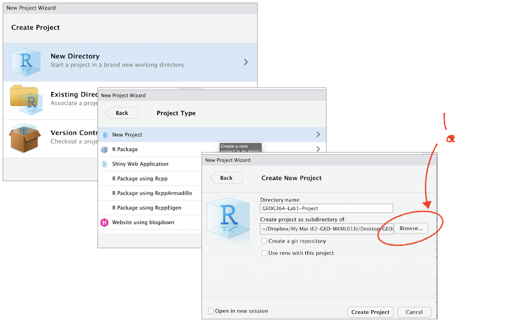

# (PART\*) [.]{style="color: white;"} {.unnumbered}
# (PART\*) **TUTORIALS** {.unnumbered}

```{r setup, include=FALSE,message=FALSE,warning=FALSE}
# OPTIONS -----------------------------------------------
knitr::opts_chunk$set(echo = TRUE, 
                      warning=FALSE, 
                      message = FALSE)

# Tutorial packages
library(vembedr)
library(skimr)
library(yarrr)
library(RColorBrewer)
library(GGally) 
library(tidyverse)
library(plotly)
library(readxl)
library(rvest)
library(biscale)
library(tidycensus)
library(cowplot)
library(units)


```

# Projects/Starting a lab {#T1_Projects}

An R project typically refers to a collection of files, data, and code organized within the R programming language environment for a specific analysis, research, or statistical project.

-   On the Posit Cloud, a new project means a 'new version of R opens'

-   On the Desktop, you will have a single folder for each lab. Inside that will be your code, your data/images etc and a special .RProj file that you will use to open R.

Watch this short video to learn why we are using them (4 minutes)

{width="600"}*(link here if it's not working: <https://www.linkedin.com/learning/learning-the-r-tidyverse/why-should-you-use-projects-in-rstudio?u=76811570>, you will need to log into Penn State)*

<br>

[WE WILL BE MAKING A NEW PROJECT FOR EACH LAB]{.underline}

------------------------------------------------------------------------

## Projects using posit Cloud {#T1_ProjectsCloud}

1.  **Go to this webpage. <https://login.posit.cloud/login>**
    -   You can get here from any web-browser and you do not need a special computer.
    -   When you log in, you should see a dashboard like the one below.\
2.  **Make a new project by clicking the button on the top right. This will open a window containing R-Studio.**
    -   You can open different projects in different tabs on your browser.
3.  **Returning to your lab projects on the cloud is very easy. Just go back to** <https://posit.cloud/content/yours>

```{r, im_T1_ProjectCloud, echo=FALSE, fig.cap = "*The Cloud dashboard*",out.width='90',fig.align='center'}
knitr::include_graphics('./index_images/im_T1_ProjectCloud.png')
```

<br>

------------------------------------------------------------------------

## Projects on your desktop {#T1_ProjectsDesktop}

1.  Make a folder called STAT462 in an easy to access location on your computer.
    -   This is where all of your labs will live for this course.\
2.  Now open R-studio (NOT R!). You should have updated to the most recent version <br>

```{r,im_T1_StartupLogos, echo=FALSE, out.width="80%",fig.align='center'}
knitr::include_graphics('./index_images/im_T1_StartupLogos.png')
```

Steps 3-7 are shown graphically in the figure below. If you are new to this, follow them slowly.

3.  Go to the Main File menu at the [very top left]{.underline} and click `New Project` <br>\

4.  Select `New Directory`, then `New Project`<br>\

5.  Name your project *STAT462-Lab1* (or whatever lab it us) <br>\

6.  **IMPORTANT.**

    -   Under "create project as a subdirectory of", hit the browse button and find your STAT462 folder

    -   (you just need to navigate to inside the folder, you don't need to have selected anything).

    -   Press open <br>\

7.  Finally, press `Create Project`<br>\

```{r, im_T1_Projectcreation, echo=FALSE}

```

### How to check you are running your project

If you have any errors, this will be the first thing I check, so you may as well check first!

-   R will change slightly. If you look at the top of the screen in the title bar, it should say something like *STAT462-Lab1 - R Studio*.

-   The Files tab should have gone to your project folder. Essentially, R-Studio is now "looking" inside your Lab 1 folder, making it easier to find your data and output your results.

```{r, im_T1_Projectcheck, echo=FALSE, fig.cap="How to check you are in a project"}
knitr::include_graphics('./index_images/im_T1_Projectcheck.png')
```

<br>

-   If you want one final check, try typing this command into the console (INCLUDING THE EMPTY PARANTHESES/BRACKETS), press enter and see if it prints out the location of Lab 1 on your computer. If not, talk to an instructor.

```{r, eval=FALSE}
getwd()
```

<br><br>

### Returning to your lab project

OK, let's imagine that you get halfway through your lab and your computer dies. How do you get back to your Lab work? Try this now. Close down R-Studio.

To reopen a lab:

1.  **DO NOT RE-OPEN R-STUDIO! (if you do, go to File/Open Project)**

2.  Instead navigate on your computer to your *STAT462/STAT462-Lab1* folder.

3.  Double click on the *STAT462-Lab1*.RProj file. Look for the RPROJ data type!

This will reopen R-Studio for that specific lab, so you can continue where you left off. It means you can also open several versions of R studio for multiple labs, which can be very useful in staying sane

```{r, im_T1_Projectopen, echo=FALSE}
knitr::include_graphics('./index_images/im_T1_Projectopen.png')
```
