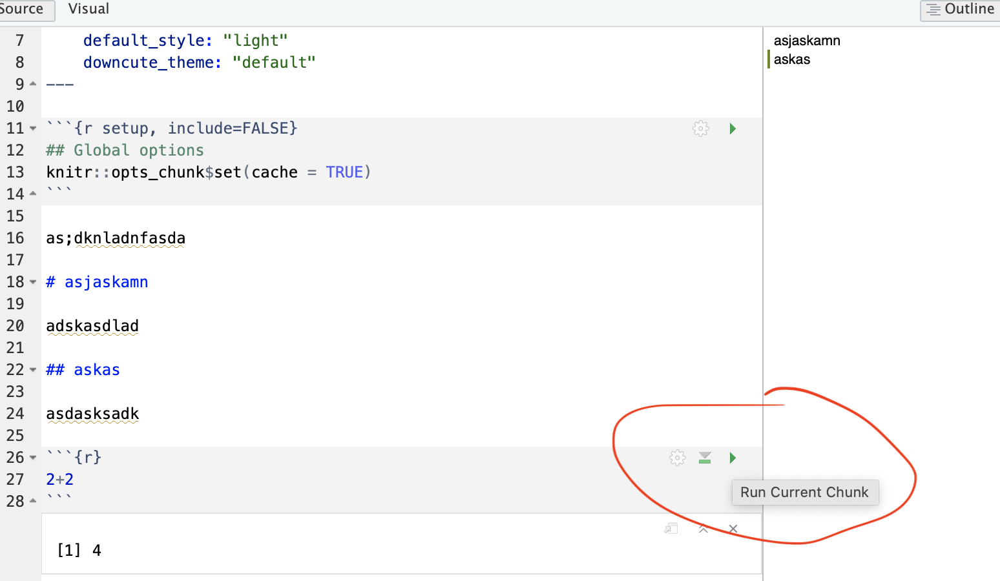

```{r setup, include=FALSE,message=FALSE,warning=FALSE}
# OPTIONS -----------------------------------------------
knitr::opts_chunk$set(echo = TRUE, 
                      warning=FALSE, 
                      message = FALSE)

# Tutorial packages
library(vembedr)
library(skimr)
library(yarrr)
library(RColorBrewer)
library(GGally) 
library(tidyverse)
library(plotly)
library(readxl)
library(rvest)
library(biscale)
library(tidycensus)
library(cowplot)
library(units)


```

# R-Markdown {#T3_Markdown}

## What is markdown?

Remind yourself of what Rmarkdown is here <https://rmarkdown.rstudio.com>, or via this short video

```{r,echo=FALSE,fig.align='center'}
embed_url("https://vimeo.com/178485416?embedded=true&source=video_title&owner=22717988")
```

<br>

------------------------------------------------------------------------

## Markdown basics

For Lab 1, we will be using a custom template that I made using the package `rmdformats`.

You should have downloaded and renamed the lab script from Canvas (see lab 1). You should also be running your project. Click the .RmD file name to open.

<br> A new file should appear on your screen:

```{r, im_T3_Markdown, echo=FALSE,fig.align='center',out.width="80%"}
knitr::include_graphics('./index_images/im_T3_Markdown.png')
```

We have some space for text (white), some space for code (grey), and a space at the top of the file where we can add information about themes/styles etc called "YAML".

<br>

------------------------------------------------------------------------

## THREE IMPORTANT BUTTONS - READ THIS

### Visual mode

It is MUCH easier to edit markdown documents in the new visual mode. Essentially instead of having to remember text short cuts like \* for bold, you can edit the text part as though you were using a word processor. NOTE HEADERS where it says "Normal", this allows you to make auto tables of contents.


#### Inserting images/tables and formatting

In visual mode, look at the menu at the top. It's very easy to insert images, tables and other formatting. Pay special attention to the Normal/Heading 1/Heading 2 buttons..

<br>

------------------------------------------------------------------------

### Code chunks

Code chunks are mini consoles where you can run R commands. We will talk more about them in the next tutorial.

```{r, im_T3_CodeChunkCreat, echo=FALSE,fig.align='center'}
knitr::include_graphics('./index_images/im_T3_CodeChunkCreate.png')
```

On the top right there are a suite of buttons for adding a new code chunk, running code etc. The green one adds a new code chunk. To run an individual code chunk you will press the green arrow on its top right e.g.

```{r, im_T3_RunCodeChunk ,echo=FALSE,fig.align='center'}

```

<br>

------------------------------------------------------------------------

### Knitting

```{r, im_T3_knit, echo=FALSE,fig.align='center'}
knitr::include_graphics('./index_images/im_T3_knit.png')
```

The file on your screen isn't the finished article. To see how it will look as a final version, we need to "knit" it. Go to the top of the .Rmd file, find the `knit` button. Press it (you might have to first save your script if you haven't already, then press it again)

You should see that the Markdown tab "builds" your document and you get an output as a website. The html should also be saved into your project folder.

**Yours will not knit if you haven't yet installed the rmdformats package**

For example, here is a file with markdown and knitted output.

```{r, fig25, echo=FALSE,fig.align='center'}
knitr::include_graphics('./index_images/im_T3_AllMarkdownElements.png')
```

<br> <br>
